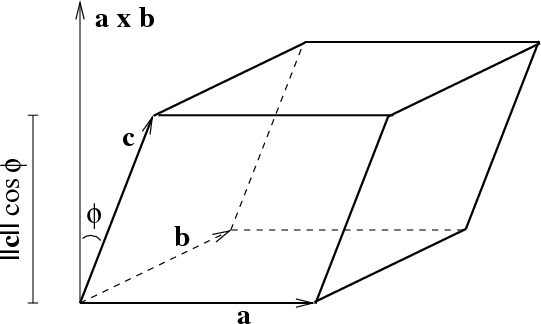

Wyznacznik jako objętość.
---
# Równoległościan

## Definicja
Podprzestrzeń generowaną przez wektory $v_1, \ldots, v_n$ oznaczamy przez $\text{Lin}(v_1,\ldots,v_n)$.

Pojęcie równoległoboku i równoległościanu można uogólnić na wyższe wymiary.  Równoległościan n-wymiarowy $[v_1, ... , v_n]$ rozpięty na wektorach $v_1, ... , v_n$ przestrzeni euklidesowej $\mathbb{V}$ to zbiór $[v_1, ... , v_n] = \{\sum_{i=1}^{n} \alpha_iv_i : 0 \le \alpha_i \le 1\}$ - zauważmy, że dla $\alpha_i \in \{0, 1\}$ otrzymalibyśmy wierzchołki równoległościanu, czyli dla $\alpha_i \in [0, 1]$ otrzymamy całą bryłe wyznaczoną przez te wierzchołki.

Objętość równoległościanu $[v_1, ... , v_n]$ to liczba $Vol[v_1,\ldots,v_n]$ określona indukcyjnie:
* $Vol[v_1] = ||v_i||$
* Niech $v_n'$ będzie rzutem wektora $v_n$ na podprzestrzeń $\text{Lin}(v_1,\ldots,v_{n-1})$, czyli $v_n'= \Pi_{\text{Lin}(v_1,\ldots,v_{n-1})}(v_n)$. Zdefiniujmy teraz wysokość równoległościanu jako $h = ||v_n - v_n'||$, wtedy objętość równoległościanu wyraża się wzorem:

$$Vol[v_1,...,v_n] = Vol[v_1,...,v_{n-1}] \cdot h$$

Zauważmy, że dla tak zdefiniowanej objętości:
* $Vol[a]$ to długość wektora $a$
* $Vol[a, b]$ to pole równoległoboku rozpiętego przez wektory $a, b$

## Wzór na objętość jako wyznacznik
* jeśli wektory $v_1,\ldots, v_n$ są liniowo zależne to $Vol[v_1,\ldots, v_n] = 0$ (mamy figurę o mniejszej liczbie wymiarów niż $n$)
* jeśli wektory $v_1,\ldots, v_n$ są liniowo niezależne to $Vol[v_1,\ldots, v_n] = |\text{det}[<b_i,v_j>]_{n \times n}|$, gdzie $\{b_1,\ldots,b_n\}$ jest bazą ortonormalną przestrzeni $\text{Lin}(v_1,\ldots,v_n)$ ($<b_i,v_j>$ to współrzędne wektora $v_j$ w bazie $B$)

Jeśli wektory kolumnowe są liniowo zależne, zarówno wyznacznik, jak i objętość są równe zero. Załóżmy więc liniową niezależność. Wyznacznik pozostaje niezmieniony podczas dodawania wielokrotności jednej kolumny do drugiej. Odpowiada to translacji równoległościanu, co nie wpływa na jego objętość. Skończoną sekwencją takich operacji można przekształcić macierz w formę ukośną, w której uwidacznia się zależność między wyznacznikiem (= iloczynem wpisów po przekątnej) a objętością „prostokąta” (= iloczyn długości boków).

## Przypadek trójwymiarowy

### Definicja

W przestrzeni trójwymiarowej wektor $a \times b$ nazywamy iloczynem wektorowym. Iloczyn wektorowy ma następujące własności:
1. $||a \times b|| = ||a|| \cdot ||b||\ \text{sin}\ \alpha  =Vol[a,b]$
2. Wektor $a \times b$ jest prostopadły do wektorów $a$ i $b$

### Wzór na objętość
W przestrzeni trójwymiarowej objętość równoległościanu to z powyższej definicji:
$$Vol[a, b, c] = Vol[a,b] \cdot h$$
$$Vol[a,b, c] = ||a \times b|| \cdot h$$

Zauważmy, że wysokość równoległościanu $h$ jest równa składowej wektora $c$ w kierunku wektora $a \times b$. Możemy obliczyć tę składową za pomocą iloczynu skalarnego $h =\frac{a \times b}{||a \times b||} \cdot c$, czyli

$$
Vol[a,b,c] = ||a \times b|| \cdot  h = ||a \times b|| \cdot \frac{a \times b}{||a \times b||} \cdot c = (a \times b) \cdot c
$$
