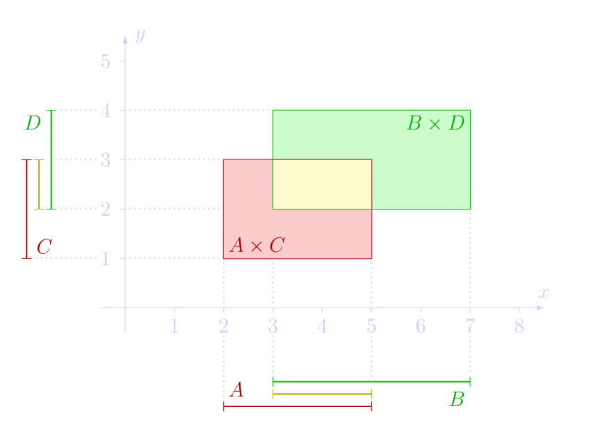
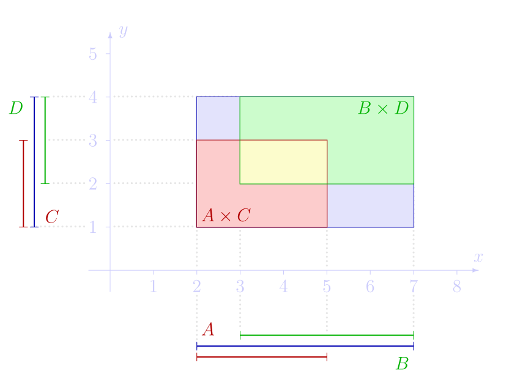

Iloczyn kartezjański i jego własności. Pojęcia relacji, złożenia, relacji odwrotnej, własności tych pojęć.

---

# Para uporządkowana
Oznaczana jako $(a, b)$, jest to po prostu zbiór $\{ \{a\}, \{a,b\}\}$.

# Iloczyn kartezjański
Produkt kartezjański zbiorów $A$ i $B$ to wszystkie **pary uporządkowane** $(a, b)$, gdzie $a\in A$ i $b\in B$. Formalnie:

$$A\times B = \{\,(a,b)\mid a\in A, \ b \in B\,\}$$

## Własności

### Nie jest przemienny
Pary są uporządkowane, więc istnieją takie zbiory, że $A \times B \neq B \times A$. To mogłoby zadziałać jedynie dla $A = B$ lub gdy co najmniej jeden z tych zbiorów jest zbiorem pustym $\emptyset$.

### Nie jest łączny
W ogólności $(A \times B) \times C \neq A \times (B \times C)$.

#### Przykład
Gdy $A = \{ 1 \}$, to:
* $(A \times A) \times A = \{\ ((1,\ 1),\ 1)\ \}$
* $A \times (A \times A) = \{\ (1,\ (1,\ 1))\ \}$

### Produkt iloczynów
Produkt iloczynów jest tym samym co iloczyn produktów:
$$(A \cap B) \times (C \cap D) = (A \times C) \cap (B \times D)$$

### Produkt sum
Natomiast produkt sum nie jest (z reguły) sumą produktów: $$(A \cup B) \times (C \cup D) \neq (A \times C) \cup (B \times D)$$

### Rozdzielność
* $A \times (B \cup C) = (A \times B) \cup (A \times C)$
* $A \times (B \cap C) = (A \times B) \cap (A \times C)$
* $A \times (B \backslash C) = (A \times B) \backslash (A \times C)$

### Podzbiór
* $A \subseteq B \implies (A \times C) \subseteq (B \times C)$

# Relacja
Dowolny podzbiór iloczynu kartezjańskiego skończonej liczby zbiorów.

# Złożenie relacji
Niech $R \subseteq A\times B$ oraz $S\subseteq B \times C$. Złożenie tych dwóch relacji to: $$S \circ R = \left\{(a, c)\in A\times C\ \mid\ \,\exists_{b\in B}\,a R b\ \wedge\ bSc\right\}$$

Symbolicznie, $$a \ (S\circ R)\ c\iff a\,R\,b\,S\,c$$

Przypadkiem szczególnym złożenia relacji jest złożenie funkcji.

## Przykład
Niech $R$ i $S$ będą takimi relacjami w zbiorze $\mathbb{N}$, że:
* $R=\{(2,1),(3,1),(4,2),(4,5),(5,3)\}$
* $S=\{(1,3),(4,1),(3,6),(6,8),(6,7)\}$

Wtedy odpowiednio złożeniem relacji będą:
* $S\circ R=\{(2,3),(3,3),(5,6)\}$
* $R\circ S=\{(1,1)\}$

## Własności
* Operacja złożenia relacji jest **łączna**, tj.: $S\circ (R\circ T) = (S\circ R)\circ T$.
* Operacja złożenia relacji nie jest **przemienna**, tj.: nie dla wszystkich relacji $S$ i $R$ zachodzi $S\circ R = R\circ S$.

# Relacja odwrotna
Relacja odwrotna $R^{-1}$ do pewnej relacji binarnej $R \subset A \times B$ to relacja powstała przez zmianę kolejności jej argumentów. Czyli zbiór $\{(b,a) \in B \times A : (a,b) \in R\}$.

## Własności
Niech $R \subset A \times B$, $S \subset B \times C$.

* $(R \circ S)^{-1} = S^{-1} \circ R^{-1}$
* $(R^{-1})^{-1} = R$
