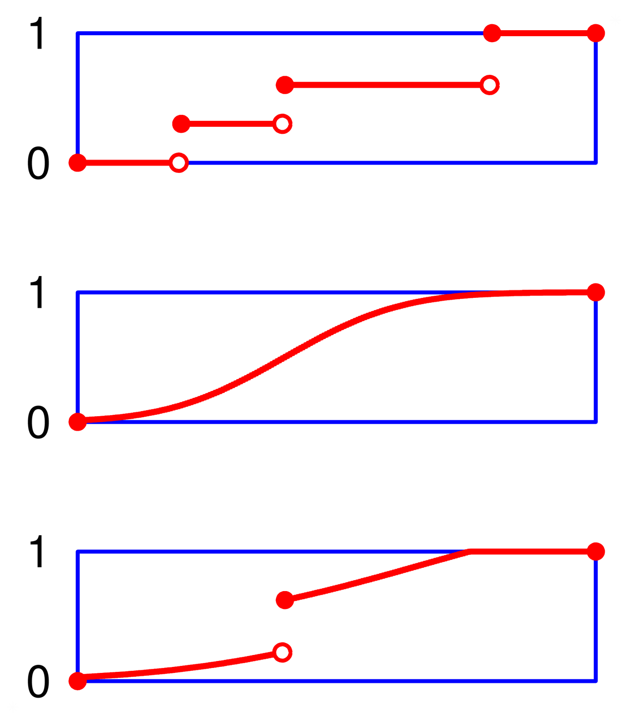

Dystrybuanta, wartość oczekiwana i wariancja zmiennych losowych.

---

# Wartość oczekiwana
Patrz pytanie [I.3.6](Wartość oczekiwana.md).

# Dystrybuanta
Niech $\mathbb{P}$ będzie rozkładem prawdopodobieństwa na prostej. Funkcję $F \colon\mathbb R \to \mathbb R$ daną wzorem
$$F(x)=\mathbb{P}((-\infty, x]) = \mathbb{P}(X \leqslant x) = \mathbb{P}(\{\omega: X(\omega) \leq x\})$$
nazywamy **dystrybuantą** rozkładu $\mathbb P$.

## Własność
Funkcja $F$ jest dystrybuantą pewnego rozkładu prawdopodobieństwa wtedy i tylko wtedy, gdy jest ona niemalejąca, prawostronnie ciągła oraz $$\lim _{x\to -\infty }~F(x)=0, \quad \lim_{x\to \infty}F(x)=1$$

Powyższe twierdzenie podaje warunek konieczny i wystarczający na to, by funkcja była dystrybuantą, dlatego czasami to właśnie je przyjmuje się jako definicję. Podejście takie może być korzystniejsze z tego względu, iż nie trzeba odwoływać się do pojęcia rozkładu. Wówczas taka definicja zawiera ciche założenie, że istnieje rozkład, którego ta funkcja jest dystrybuantą.

## Punkty skokowe
Punkt skokowy dystrybuanty to punkt $x_k$, dla którego dystrybuanta $F(x)$ spełnia warunek:

$$F(x_k) - \lim_{x \rightarrow x_{k}^{-}}{F(x)} > 0$$

tzn. jest to jej punkt nieciągłości. W przypadku dyskretnego rozkładu prawdopodobieństwa punkty skokowe występują dla każdej wartości zmiennej losowej, dla której ma ona dodatnie prawdopodobieństwo i tylko tam. W przypadku ciągłego rozkładu prawdopodobieństwa nie ma punktów skokowych dystrybuanty.

Od góry: dystrybuanta pewnego dyskretnego rozkładu, rozkładu ciagłego, oraz rozkładu mającego zarówno ciągłą, jak i dyskretną część.

# Wariancja
Klasyczna miara zmienności. Jest średnią arytmetyczną kwadratów odchyleń (różnic) poszczególnych wartości zmiennej losowej od wartości oczekiwanej.

Wariancja zmiennej losowej $X$, oznaczana jako $\operatorname{Var}[X]$ lub $D^2 (X)$, zdefiniowana jest wzorem:
$$\operatorname{Var}[X]=\mathbb{E}[(X- \mathbb{E}[X])^2]$$

Innym, często prostszym sposobem wyznaczania wariancji jest wzór:
$$D^2(X)=\mathbb{E}[X^2]-(\mathbb{E}[X])^2$$

## Odchylenie standardowe
Wariancja to odchylenie standardowe podniesione do kwadratu. Należy zauważyć, że gdybyśmy chcieli wyliczyć średnią arytmetyczną z różnic *niepodniesionych* do kwadratu to mielibyśmy wynik prawie zawsze zbliżony do zera. Różnice o wartości ujemnej (wynik niższy od średniej) oraz o wartości dodatniej (wynik wyższy od średniej) znosiłyby się. Dlatego też, aby wyeliminować taką sytuację, podnosimy wyniki do kwadratu, a po ich zsumowaniu wyciągamy pierwiastek.

# Przykład
Wykonujemy rzut monetą z równym prawdopodobieństwem wyników: orzeł, reszka. Niech zmienna losowa $X$ zwraca $1$ w przypadku orła, $0$ w przypadku reszki. Wówczas dystrubuantą rozkładu zmiennej losowej $X$ jest:

$$F(x) = \left\{ \begin{array}{rcl}
0 & \mbox{:}
& x < 0 \\ 1/2 & \mbox{:} & 0\leq x < 1 \\
1 & \mbox{:} & x \geq 1
\end{array}\right.$$

Wartością oczekiwaną jest $\frac{1}{2}$. Wariancja to zatem:
$$D^2(X)=
\mathbb{E}[X^2]-(\mathbb{E}[X])^2=
\frac{1}{2}-\frac{1}{4}=
\frac{1}{4}$$

Z czego wynika, że odchylenie standardowe wynosi $\frac{1}{2}$.
