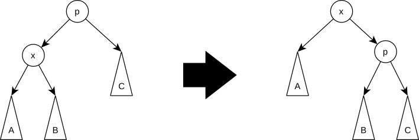
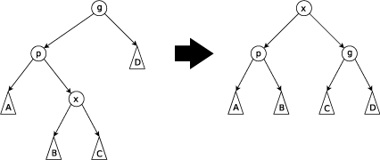
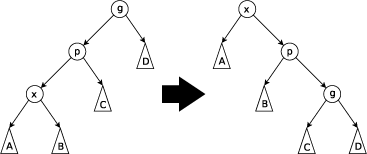
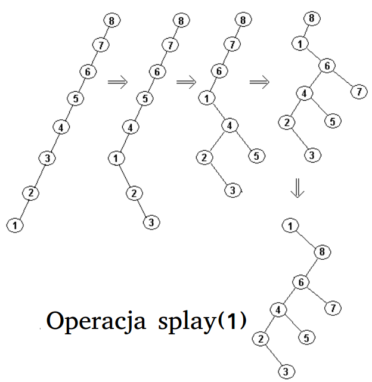
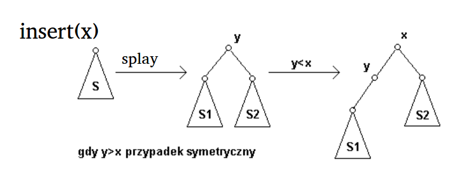
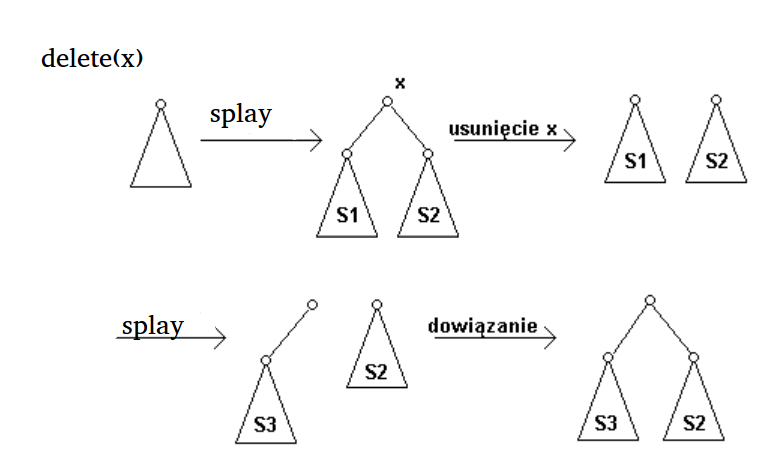

Analiza amortyzowana, nietrywialny przykład zastosowania.

---

# Szablon metody
Celem analizy amortyzowanej jest obliczenie kosztu zamortyzowanego danej operacji w wykonanym ciągu operacji na strukturze danych. Może się bowiem zdarzyć, że wykonanie całego ciągu jest mniej kosztowne niż wskazywałaby na to złożoność obliczeniowa jednej operacji, ponieważ tylko niektóre ciągi operacji są możliwe.

Koszt zamortyzowany operacji jest średnim czasem wykonania przypadającym na jedną operację w pesymistycznym ciągu operacji.

# Metody analizy amortyzowanej
## 1. Metoda kosztu sumarycznego
W tej metodzie obliczamy sumaryczny pesymistyczny koszt wykonania całego ciągu $n$ operacji równy $T(n)$, a następnie dzielimy go przez liczbę operacji. Koszt zamortyzowany wykonania jednej operacji jest równy $\frac{T(n)}{n}$.

### Przykład
Multistos - struktura danych, na której można wykonać następujące operacje:
* $push(v)$ wrzuca $v$ na stos.
* $pop()$ ściąga element ze stosu.
* $multipop(k)$ ściąga $k$ elementów ze stosu. Jeśli na stosie jest niej niż $k$ elementów, ściąga wszystkie i kończy działanie.

Czas wykonania operacji $push$ oraz $pop$ to oczywiście $O(1)$. Operacja $multipop(k)$ działa w czasie $O(k)$. Zatem jeśli na stosie wykonamy łącznie $n$ operacji grube oszacowanie czasu wykonania $n$ operacji to $O(nk) = O(n^2)$.

Jednak analiza ciągu operacji daje dużo lepsze wyniki. Zauważmy, że każdy element na stosie pojawia się i jest z niego ściągany dokładnie jeden raz.  

Skoro wykonalismy $n$ operacji, to na pewno było $\leq n$ operacji wstawienia elementu $push$  i $\leq n$ operacji usunięcia elementu - $pop$ i $multipop$. Ponieważ wstawienie jednego elementu i jego usunięcie kosztuje $O(1)$, to koszt ciągu operacji wynosi $O(n)$.

Z tego wynika, że amortyzowany koszt wykonania każdej operacji będzie stały.

## 2. Metoda księgowania
W tej metodzie przypisujemy (być może różne) koszty amortyzowane dla różnych typów operacji. Oznacza to tyle, że dana operacja *płaci* ten koszt za jej wykonanie. Jeżeli koszt przewyższa koszt rzeczywisty, będzie on zapamiętywany jako kredyt, który będziemy mogli wykorzystać do ewentualnego zapłacenia za operacje, które będą trwały dłużej, niż przypisany do nich koszt. Należy dodatkowo wykazać, że nigdy nie zabraknie kredytu na pokrycie wykonywanych operacji.

### Przykład
Ponownie rozważamy multistos, jak w przykładzie wyżej.

Koszty faktyczne operacji wynoszą:
* $push$: $1$
* $pop$: $1$
* $multipop$: $\min(k, n)$, gdzie $n$ to liczba elementów na stosie.

Przpisujemy następujące koszty amortyzowane do operacji:
* $push$: $2$,
* $pop$: $0$,
* $multipop$: $0$.

Analizujemy wykonanie ciągu $n$ operacji..  Przy operacji $push$ element płaci $2$, z czego $1$ zużywamy na doanie go na stos - koszt rzeczywisty, a $1$ zapamiętujemy w strukturze jako kredyt. Przy ewentualnym usuwaniu tego elementu pokrywamy koszt tej operacji biorąc $1$ z kredytu, który ten element zapłacił przy wstawianiu. Każdy element aby móc go usunąć, musi zostać najpierw wstawiony i zapłacić $2$, więc zawsze mamy kredyt na pokrycie kosztu jego usunięcia i nigdy nie zabraknie nam kredytu. 

Ponieważ łączny koszt zamortyzowany można oszacować przez $O(n)$, tak więc znowu okazuje się, że wszystkie operacje wykonały się w amortyzowanym czasie stałym.

## 3. Metoda potencjału
W tej metodzie przypisujemy do  struktury danych po wykonaniu $i$ -tej operacji liczbę rzeczywistą $\Phi _{i}$ , która reprezentuje **potencjał** struktury danych. Wykonywane operacje mogą zwiększać lub zmniejszać potencjał struktury.

Początkowy stan struktury (przed wykonaniem jakiejkolwiek operacji) oznaczamy $D_0$.  Dla każdego $i = 1 .. n$ niech $c_i$ oznacza koszt faktyczny $i$-tej operacji, a $D_i$ stan struktury po $i$-tej operacji. 

Zdefiniujmy funkcję potencjału $\Phi$, która strukturze w stanie $D_i$ przypisje liczbę rzeczywistą $\phi(D_i)$ zwaną dalej potencjałem
struktury w stanie $D_i$.  Koszt zamortyzowany $i$-tej operacji $\widehat{c_i} = c_i + \Phi(D_i) - \Phi(D_{i-1})$.

Zatem koszt amortyzowany wykonania $n$ operacji będzie wynosił:

$$\sum_{i=1}^n \widehat{c_i} = \sum_{i=1}^n c_i + \Phi(D_i) - \Phi(D_{i-1})$$
$$= \sum_{i=1}^n (c_i) + \Phi(D_n) - \Phi(D_0)$$

Należy tak zdefiniować funkcję potencjału, żeby potencjał $\Phi(D_n)$ po wykonaniu ciągu $n$ operacji był nie mniejszy od potencjału początkowego, tzn. $\Phi(D_n) \geq \Phi(D_0)$. Wygodnie jest tak zdefiniować funkcję potencjału, aby $\Phi(D_0) = 0$ i wtedy wystarczy pokazać, że $\Phi(D_n) \geq 0$.

### Przykład
Ponownie rozważamy strukturę multistosu omawianą wyżej.

Tym razem zdefiniujmy sobie $\phi(D_0) := 0$ oraz $\phi(D_i) := \text{liczba elementów na stosie}$.

Operacja $push$ zwiększa potencjał o $1$, $pop$ zmniejsza o $1$ a $multipop$ zmniejsza o $\min(k,n)$, gdzie $n$ to liczba elementów na stosie.

Z wcześniejszych wzorów otrzymujemy, że dla operacji $push$ zachodzi $\widehat{c_i} = c_i + \Phi(D_i) - \Phi(D_{i-1}) = 1 + 1 = 2$.  dla operacji $pop$ zachodzi $\widehat{c_i} = 1 - 1 = 0$.  Dla operacji $multipop$ analogicznie: $\widehat{c_i} = k - k = 0$.

Oczywistym jest, że po wykonaniu ciągu $n$ operacji zachodzi $\Phi(D_n) \geq \Phi(D_0)$, zatem analiza jest poprawna. Czas wykonania ciągu $n$ operacji można oszacować zatem przez $O(n)$.

# Drzewa splay
Drzewo splay to drzewo *BST* umożliwiające wykonanie podstawowych operacji słownika: dodanie, usunięcie i wyszukanie elementu. Wszystkie operacje opierają się na operacji $splay$. Wykonanie operacji $splay(x)$ która powoduje taką zmianę struktury drzewa, że węzeł $x$ zostaje umieszczony w korzeniu przy zachowaniu porządku charakterystycznego dla drzewa BST. Operacja splay jest wykonywana przy pomocy rotacji.

## Rotacje w drzewie splay
### Zig
Wykonywany kiedy $p$ jest korzeniem, polega na rotacji drzewa względem krawędzi $(p, x)$. Ten krok może być wykonany tylko jako ostatni krok procedury $splay$.

### Zig-Zag
Wykonywany kiedy $p$ nie jest korzeniem, oraz $x$ jest lewym synem $p$, a $p$ – prawym synem $g$ lub symetrycznie. W tym kroku najpierw wykonuje się rotację względem krawędzi $(p, x)$, a następnie względem krawędzi $(g, x)$, która powstaje w wyniku pierwszej rotacji.

### Zig-Zig
Wykonywany kiedy $p$ nie jest korzeniem, a $(p, x)$ i $(g, p)$ są krawędziami w jedną stronę, tj. $x$ jest lewym synem $p$, który jest lewym synem $g$, albo $x$ jest prawym synem $p$, a $p$ – prawym synem $g$.

## Operacje słownika w drzewie splay

### Splay(v)
Czyli wyniesienie wierzchołka $v$ do korzenia.  Polega na wykonaniu ciągu rotacji $zig-zig$, $zig-zag$ oraz $zig$.

### Insert(v)
* Wyszukujemy $v$ jak w *BST*.
* Jeśli znaleźliśmy $v$, wykonujemy $splay(v)$ i kończymy.
* Jesli $v$ nie ma w drzewie, w wyszukiwaniu zatrzymujemy się na węźle $x$ będącym ostatnim niepustym węzłem na ścieżce wyszukiwania węzła $v$. 
* Wykonujemy $splay(x)$.  
* Niech $T_1$, $T_2$ - lewe i prawe poddrzewo węzła $x$.
* $v$ staje się korzeniem.
* Jeśli $x < v$, to $x$ staje się lewym dzieckiem $v$, drzewo $T_1$ lewym poddrzewem $x$ a drzewo $T_2$ prawym poddrzewem $v$. Jeśli $x > v$ to symetrycznie. 

### Delete(v)
* Wykonujemy $splay(v)$.
* Jeśli $root \neq v$ to koniec.
* Usuwamy korzeń.
* Niech $T_1$, $T_2$ - lewe i prawe poddrzewo korzenia $v$. Załóżmy bez straty ogólności, że $T_1$ niepuste. 
* Wykonujemy $splay(v)$ w $T_1$. Zauważmy że prawe poddrzewo w $T_1$ będzie puste.
* Podpinamy $T_2$ jako prawe poddrzewo $T_1$.

## Analiza złożoności
Dowód metodą potencjału.  Zdefiniujmy sobie najpierw:
* $\text{size}(r) :=$ rozmiar drzewa zaczepionego w wierzchołku $r$.
* $\text{rank}(r) := \lfloor \lg(\text{size}(r)) \rfloor$.
* $\Phi := \sum_{v \in T} \text{rank}(v)$.

Zauważmy, że $\Phi$ będzie duże dla słabo zbalansowanych drzew i małe dla
dobrze zbalansowanych.

Wszystkie operacje operają się na $splay$, więc wystarczy osacować koszt amortyzowany dla tej operacji.

### Twierdzenie
> Koszt amortyzowany operacji $splay$ wynosi $\leq 3 \log n + 1$, gdzie $n$ jest liczbą węzłów w drzewie.

W dowodzie rozbija sie operacje splay na ciąg rotacji i szacuje się pojedynczo ich koszty zamortyzowane przez różnicę rzędów wierzchołka przesuwanego do góry przed i po rotacji. Suma kosztów zamortyzowanych ciagu rotacji jest kosztem zamortyzowanym operacji `splay` którą one tworzą.

Uwaga. Zaletą drzew *splay* jest optymalizowanie czasu dostępu do elementów przez przesuwanie wartości, do których ostatnio uzyskiwano dostęp, blisko korzenia, co powoduje ich dużą przydatność w implementacji pamięci cache i algorytmów odśmiecania. Jednak w przypadku jednakowych prawdopodobieństw dostępu do poszczególnych elementów, drzewa *splay* działają w praktyce (choć nie asymptotycznie) wolniej niż inne, równowazone drzewa BST, np. czerwono-czarne lub AVL.
