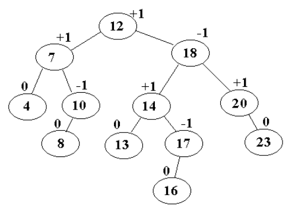
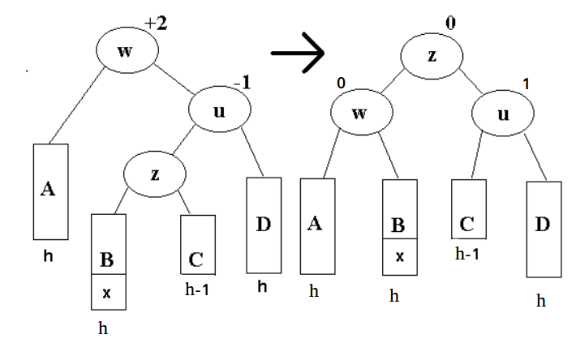

Zrównoważone drzewa wyszukiwań binarnych na przykładzie drzew AVL lub
drzew czerwono-czarnych.

---
# Zrównoważone drzewa *BST*
Binarne drzewo poszukiwań *(BST)* to drzewo binarne, w którym lewe poddrzewo każdego węzła $x$ zawiera wyłącznie elementy o kluczach nie większych niż klucz węzła $x$ a prawe poddrzewo zawiera wyłącznie elementy o kluczach nie mniejszych niż klucz węzła $x$.

Koszt wykonania podstawowych operacji w drzewie BST (wstawienie, wyszukanie, usunięcie węzła) jest proporcjonalny do wysokości drzewa $h$.

Jeżeli drzewo składa się z $n$ kluczy, to jego minimalna wysokość wynosi $\Theta(\log n)$, gdy drzewo jest zrównoważone. Jednak bardzo łatwo jest skonstruować drzewo o większej wysokości, na przykład wstawiając elementy do drzewa w kolejności posortowanej dostajemy drzewo o wysokości liniowej.

Drzewo zrównoważone zapewnia, że niezależnie od wstawianych elementów wysokość drzewa będzie zawsze rzędu $\Theta(\log n)$. Przykładową realizacją drzew zrównoważonych są drzewa AVL.

# Drzewo AVL
Jest to drzewo BST, w którym dla każdego wierzchołka $v$ wysokości drzew $left(v)$ i $right(v)$ różnią się co najwyżej o $1$.

## Reprezentacja w pamięci
* Zawartość węzła, wskaźniki na lewe i prawe dziecko - jak w zwykłym BST.
* $balance(v)$ - współczynnik zrównoważenia wierzchołka
	* $balance(v) = +1$, gdy poddrzewo prawe węzła $v$ jest o $1$ wyższe niż lewe.
	* $balance(v) = 0$, gdy oba poddrzewa węzła $v$ są równej wysokości.
	* $balance(v) = -1$, gdy poddrzewo lewe węzła $v$ jest o $1$ wyższe niż prawe.

## Przykładowe drzewo AVL

## Wysokość drzewa AVL
Uwaga. *Liść zewnętrzny* w drzewie binarnym to puste poddrzewo (pusty wskaźnik NULL).
### Lemat
> W drzewie binarnym o $n$ wierzchołkach jest $n+1$ liści zewnętrznych.

### Twierdzenie
> Wysokość drzewa AVL o $n$ wierzchołkach nie przekracza $1.45 \log n = \Theta(\log n)$.

## Operacje słownika w drzewie AVL
### Wyszukiwanie klucza - search(x)
Tak jak w zwykłym drzewie BST.

### Wstawianie klucza - insert(x)
*  Wstawiamy nowy węzeł tak jak do zwykłego drzewa BST.
*  Przechodzimy ściezkę od nowo wstawionego węzła do korzenia i aktualizujemy współczynniki $balance$ dla wierzchołków na ścieżce. Dodajemy 1 albo odejmujemy $1$, w zależności czy w danym wierzchołku skręcaliśmy w prawo czy w lewo.
* Jeśli nowy współczynnik $balance$ dla wierzchołka wynosi $0$, oznacza to, że można zakończyć operację wstawiania.
* Jeśli natomiast zdarzy się że $balance$ wierzchołka po aktualizacji jest równe $2$ lub $-2$, należy wykonać rotację - o nich poniżej.

### Usuwanie klucza - delete(x)
* Jeśli usuwany węzeł $v$ jest liściem, zostaje usunięty. Następnie przechodzimy drogę do korzenia, aktualizujemy współczynniki $balance$ wierzchołków i  jeśli współczynnik zostanie zmieniony na $-2$ lub $2$, wykonujemy rotację w celu przywrócenia struktury AVL.
*  Jeśli $v$ nie jest liściem, musi zostać zastąpiony największym elementem z jego lewego poddrzewa lub najmniejszym z jego prawego poddrzewa.
* Wyszukany największy lub najmniejszy element (nazwijmy go $w$) jest synem pewnego węzła $p$ i ma co najwyżej jedno dziecko $s$, które zostaje teraz dzieckiem jego rodzica $p$.
* Po usunięciu wyszukanego węzła $w$ należy przejść ścieżkę od jego rodzica $p$ do korzenia i zaktualizować współczynniki $balance$ dla wierzchołków na tej ścieżce. Jeśli współczynnik zostanie zmieniony na $-2$ lub $2$, to należy wykonać rotację w celu przywrócenia struktury AVL.

Złożoność wszystkich operacji słownika na drzewie AVL wynosi $O (\log n)$.

## Rotacje
### Rotacja pojedyncza w lewo
* Węzeł $w$ (oś rotacji) jest najniżej położonym węzłem w którym współczynnik zrównoważenia jest spoza dopuszczalnego zakresu.
* $h$, $h+1$ oznaczają wysokości poddrzew.
* Węzeł $x$ jest elementem którego wstawienie zaburzyło równowagę.

### Rotacja pojedyncza w prawo
Symetrycznie do powyższego.

### Rotacja podwójna
* Nowo dodany węzeł $x$ jest w poddrzewie $B$ (dla $C$ symetrycznie).
* Poddrzewo to jest wysokości $h$, licząc razem z węzłem $x$.

