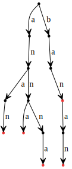
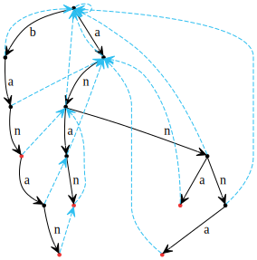

Wyszukiwanie wzorca metodą prefikso-sufiksów (KMP), uogólnienie na wiele wzorców

---

# Algorytm *Knutha-Morrisa-Pratta*

## Problem
Dany jest tekst $T$ oraz wzorzec $w$. Problem polega na określeniu, czy wzorzec znajduje się w tekście. Pierwszym, oczywistym, rozwiązaniem jest oczywiście próba przyłożenia wzorca w każdym możliwym miejscu. Niestety ten, nawet inteligentnie zaimplementowany algorytm, będzie miał złożoność $O(|T|\cdot|w|)$ - przykładem pesymistycznego przypadku może być wzorzec postaci: *aaaa...aaab* oraz tekst złożony z samych liter *a*. Algorytm *KMP* pomoże nam w zbiciu tej złożoności do $O(|T|+|w|)$.


## Definicje
- **Najdłuższy prefikso-sufiks słowa** - najdłuższy prefiks słowa będący jednocześnie jego sufiksem, ale nie będący całym słowem **(słowo nie jest swoim własnym prefikso-sufiksem)**.
- **Tablica prefikso-sufiksowa** - tablica, która dla tekstu $T$ w $i$-tej komórce trzyma rozmiar najdłuższego prefikso-sufiksu słowa $T[0...i]$. W dalszych rozważaniach będę zamiennie używał określenia *tablica KMP*.


## Szkic rozwiązania
Zauważmy, że rozwiązanie zadania jest trywialne jeśli policzymy tablicę prefikso-sufiksową dla słowa postaci: $w\#T$, gdzie $w$ to wzorzec, $\#$ to znak spoza alfabetu (nie występujący ani we wzorcu, ani w tekście), a $T$ to tekst, w którym szukamy wzorca. Największa możliwa wartość w tej tablicy to $|w|$, ponieważ $\#$ jest znakiem spoza alfabetu, więc żaden prefiks zawierający go nie może być prefikso-sufiksem (jest tylko jeden taki znak w słowie), a występuje on na pozycji $|w|+1$. Dlatego mając tę tablicę umiemy stwierdzić w czasie liniowym, czy wzorzec występuje w tekście - wystarczy sprawdzić, czy istnieje takie $i$, że $KMP[i] = |w|$. Wtedy prefikso-sufiks dla tego podsłowa składa się z prefiksu w pełni pokrywającego $w$ oraz sufiksu pokrywającego tę samą sekwencję znaków w $T$. Wystarczy zatem zbudować taką tablicę.


## Algorytm

### Pseudokod
```
KMP_algorithm(w, T)
  W = w + # + T
  KMP = array of size W
  KMP[0] = 0
  d = 0

  for i from 1 to |W|
    while W[i] != W[d] and d > 0
      d = KMP[d-1]

    if W[i] == W[d]
      d++

    KMP[i] = d;
```

### Szkic dowodu poprawności
- Trywialna, ale bardzo istotna obserwacja: $KMP[i] \leq KMP[i-1]+1$. W przeciwnym wypadku, szybko okazuje się, że jesteśmy w stanie znaleźć dłuższy prefikso-sufiks dla słowa $W[0...i-1]$.
- W pierwszym kroku będziemy zatem próbowali po prostu dopasować kolejną literę przedłużając prefikso-sufiks z poprzedniego indeksu.
- Jeśli to zawiedzie będziemy zmniejszać nasze $d$ próbując za każdym razem dopasować ostatnią literę sufiksu do litery znajdującej się tuż za właśnie rozważanym prefiksem.
- $W[0...d-1]==W[i-1-(d-1)...i-1]$. A skoro tak to $KMP[d-1]$ opisuje najdłuższy możliwy prefikso-sufiks krótszy niż $d$ *(o $d$ już wiemy, że jest niepoprawne)*. Aby łatwiej to pokazać przyjmijmy $e=KMP[d-1]$, wtedy: $W[0...e-1]==W[d-1-(e-1)...d-1]$, ale przecież $W[d-1-(e-1)...d-1]==W[i-1-(e-1)...i-1]$, zatem również: $W[0...e-1]==W[i-1-(e-1)...i-1]$, więc istotnie nasze $e$ jest prefikso-sufiksem dla $W[0...i-1]$. Pozostaje pokazać, że jest to faktycznie kolejna największa wartość jaką warto rozważyć. To mamy zapewnione przez fakt iż $KMP[d-1]$ jest rozmiarem najdłuższego prefikso-sufiksu dla słowa $W[0...d-1]$ *(nie będącym całym słowem)*, a ponieważ pokazaliśmy, że to również jest prefikso-sufiks $W[0...i-1]$, to jest to kolejny, największy z mniejszych od $d$, kandydat na zostanie prefikso-sufiksem.
- Jeśli nie udało nam się dopasować prefikso-sufiksu dla żadnej wartości $d$, jedyne, co pozostaje to wpisanie $0$ w $KMP[i]$ *(sprawdzenie $d>0$ w while'u)*.

### Analiza złożoności
Wszystkie operacje wewnątrz pętli *for* "dotykają" zmiennej $d$. Policzmy zatem ile razy w ciągu działania algorytmu te operacje się wykonują. Przypisanie do zmiennej $d$ do komórki w tablicy $KMP$ zdąży się dokładnie |W| razy. Zwiększenie $d$ zdarza się co najwyżej raz na obieg pętli *for*, a więc, co najwyżej |W| razy. Natomiast każde przypisanie w pętli *while* to zmniejszenie wartości zmiennej $d$. Ponieważ zwiększona zostanie maksymalnie $|W|$ razy, a $d$ musi pozostać nieujemne to również ta operacje wykonają się w całkowitym czasie nie większym niż $|W|$. Stąd mamy złożoność $O(|W|)$ co jest równoważne $O(|w|+|T|)$.

### Uwagi
Warto zauważyć, że możemy bardzo łatwo zminimalizować zużycie dodatkowej pamięci przez *KMP*, do liniowego względem długości wzorca. Zauważmy, że ponieważ pomiędzy wzorcem i tekstem znajduje się $\#$, to wartości w tablicy $KMP$ za tym punktem będą zawsze mniejsze lub równe długości wzorca. Następnie zauważmy, że by obliczyć następną wartość w tablicy $KMP$, potrzebujemy znać wartość poprzedniego elementu tablicy i ewentualnie elementów $KMP[KMP[i-1]]$, $KMP[KMP[KMP[i-1]]]$, itd. Jednal wszystkie one, z poprzedniego spostrzeżenia, są mniejsze lub równe długości wzorca! Potrzebujemy zatem pamiętać jedynie tablicę $KMP$ dla wzorca oraz wartość tablicy $KMP$ dla poprzedniego elementu.

## Problemy rozwiązywalne przez *KMP*
- W prosty sposób sprawdzić, czy tekst $T$ jest utworzony z wielokrotnego powtórzenia tego samego słowa $s$ - wystarczy znaleźć najdłuższy prefikso-sufiks $T$ *(oznaczmy długość tego prefikso-sufiksu przez $d$)* i sprawdzić, czy $|T|-d$ dzieli $|T|$. Jeśli zrozumiałe jest jak działa algorytm *KMP* to ten fakt nie powinien wymagać dowodu.
- Algorytm może również służyć do znajdowania wzorca w tekście cyklicznym - zamiast oryginalnego rozwiązania wystarczy zaaplikować je dla słowa: $w\#TT$.


## Uogólnienie algorytmu na wiele wzorców

Uogólnienie algorytmu *KMP* na wiele wzorców to algorytm Aho-Corasic. Po chwili refleksji łatwo zauważyć, że algorytm *KMP* jest szczególnym przypadkiem algorytmu *AC*. *AC* na jednym wzorcu będzie działał dokładnie tak samo, jak *KMP*.

### Wzorce jako drzewo
Pierwszym krokiem w algorytmie *AC* jest zbudowanie z wzorców drzewa *trie*. Poniżej znajduje się drzewo *trie* dla słów: "anna", "banan", "ban", "anan" i "annna".



W takiej reprezentacji, jeśli jakieś dwa słowa mają wspólny prefiks, to mają wspólną ścieżkę w drzewie od korzenia, więc możemy bardzo łatwo zidentyfikować zbiór wszystkich słów, które mają dany prefiks, poprzez odpowiedni wierzchołek w drzewie.

### Funkcja fail
Zastanówmy się, co tak naprawdę daje nam tablica *KMP*. Daje nam ona informację o tym, jakie jest następne miejsce we wzorcu, do którego powinniśmy spróbować dopasować kolejną literę tekstu, jeśli nie udało się przedłużyć aktualnie najdłuższego pasującego prefiksu do dłuższego. Nazwijmy funkcję która ma taką charakterystykę funkcją *fail*. Tak więc tablica *KMP* jest funkcją *fail* dla jednego wzorca.

Okazuje się, że możemy wyznaczyć funkcję *fail*, również w przypadku, gdy operujemy na wielu wzorcach - dla każdego wierzchołka drzewa. Funkcja *fail* dla wierzchołka, wskazuje na inny wierzchołek, który jest najlepszym miejscem, by spróbować przypasować kolejną literę, jeśli nie udało się dołożyć litery do aktualnego miejsca. Przez najlepsze miejsce będziemy rozumieć, analogicznie jak w *KMP*, najdłuższy prefiks w drzewie *trie*, który pasuje do tekstu na rozważanej pozycji.

Poniżej znajduje się drzewo *trie* wraz z obliczoną funkcją fail.



### Algorytm wyszukiwania wielu wzorców
Załóżmy, że mamy już zbudowane drzewo *trie* (możemy je zbudować w czasie liniowym od sumy długości wzorców, po prostu wrzucając kolejne słowa do drzewa *trie*) i wyznaczoną funkcję fail. Szukanie wzorców w tekście, sprowadza się do chodzenia po drzewie *trie* i skakanie funkcją *fail*, jeśli nie możemy iść dalej w głąb.

```
AC_algorithm(T)
  v = root
  for i from 1 to |T|:
    while v != root and v.child[T[i]] == nil:
      v = fail(v)

    if v.child[T[i]] != nil
      v = v.child[T[i]]

    u = v
    while u != root
      if u is end of pattern
        report finding of pattern
      u = fail(u)
```

Wypisywanie znalezionych wzorców, tak jak jest to zaimplementowane w *AC_algorithm*, może być wolne i naprawdę stosuje się dodatkową funkcję *dict*, która dla danego wierzchołka identyfikuje najgłębszy wierzchołek, do którego można dojść funkcją *fail* i jest wzorcem. Funkcję *dict* można liniowo wyznaczyć z funkcji *fail*.

Warto zauważyć, że chodzenie po drzewie *trie* jest tak naprawdę chodzeniem po automacie skończonym. Dla danej litery z danego wierzchołka, zawsze przejdziemy do innego konkretnego wierzchołka. Łatwo jest więc też, zamienić drzewo *trie* z funkcją *fail* na pełny deterministyczny automat skończony.

### Wyznaczanie funkcji fail
Funkcję *fail* buduje się schodząc *BFS*-em w dół drzewa trie. Istotnym spostrzeżeniem jest to, że funkcja *fail* zawsze wskazuje na wierzchołki, które są wyżej.

```
build_fail()
  fail(root) = root
  q = empty queue
  q.push(root)
  while q not empty
    v = q.pop()
    for every v --c--> child
      q.push(child)

      u = fail(v)
      while u != root and u.child[c] == nil
        u = fail(u)

      if u.child[c] != nil
        fail(child) = u.child[c]
      else
        fail(child) = root
```

Tak samo jak w przypadku *KMP*, szukanie wzorca i budowanie funkcji *fail* są do siebie operacjami w pewien sposób podobnymi.

Jeśli mamy stworzone drzewo *trie* dla wzorców i dodamy do niego $\#T$, następnie obliczymy na całości funkcję *fail*, to funkcja *fail* na odnodze $\#T$ będzie wskazywała na dokładnie te wierzchołki drzewa *trie* które były by odwiedzone przez procedurę *AC_algorithm*.

### Szkic analizy algorytmu *Aho-Corasic*

Wyszukiwanie wzorca (pomijając wypisywanie), mając już zbudowane drzewo trie, jest w oczywisty sposób liniowe. Schodzenie funkcją fail do odpowiedniego wierzchołka amortyzyje się podobnie jak schodzenie prefikso-sufiksami w *KMP*. Budowanie funkcji *fail*, też jest liniowe i wynika to z praktycznie tego samego faktu.
