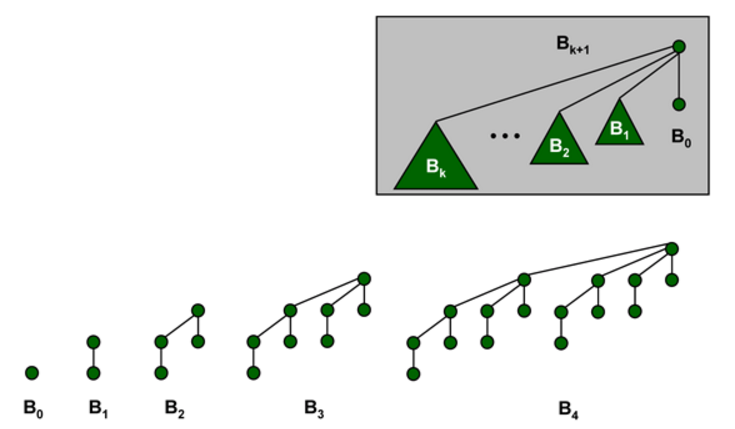

Kolejka priorytetowa, kopiec, zastosowanie do sortowania.

---
# Kopce i kolejki priorytetowe
## Kopiec - definicja ogólna
* Max-kopiec to drzewo, w którym dla każdej pary węzłów postaci $(v, parent(v))$ zachodzi **warunek kopca:** $key(parent(v)) \geq key(v)$. Element największy zawsze znajduje się w korzeniu, na dowolnej ścieżce w dół klucze się zmniejszają, minimum jest w którymś liściu.
* Min-kopiec - analogicznie, $key(parent(v)) \leq key(v)$. Element najmniejszy w korzeniu, na dowolnej ścieżce w dół klucze się zwiększają, maksimum jest w którymś liściu.

**Kopiec binarny**  to drzewo binarne, w którym:
* Dla każdego węzła zachodzi warunek kopca.
* Wszystkie poziomy, za wyjątkiem być może ostatniego, są całkowicie wypełnione.
* Ostatni poziom jest wypełniony od lewej strony.

Wysokość kopca binarnego o $n$ wierzchołkach to $\lfloor lg\, n \rfloor$.

### Kopiec binarny - reprezentacja w tablicy:

* tablica $A[1 \ldots n]$, 
* $A[1]$ - korzeń
* $A[2i], A[2i+1]$ - lewe i prawe dziecko węzła $i$,
* $A[i/2]$ - ojciec węzla $i$

### Przesiewanie w górę (upheap) w kopcu binarnym:
Wartość $A[k]$ zwiększyła się, przywracamy warunek kopca na ścieżce od $A[k]$ do korzenia.

````
upheap(A[1...n], k as integer)
  while k > 1 and A[k] > A[k/2]
    swap A[k], A[k/2]
    k = k/2
````

### Przesiewanie w dół (downheap) w kopcu binarnym:
Wartość $A[k]$ zmniejszyła się, przywracamy warunek kopca w poddrzewie o korzeniu $A[k]$ .

````
downheap(A[1...n], k as integer)
  max_index = k
  if k*2 <= n and A[k*2] > A[max_index]
    max_index = i
  if k*2+1 <= n and A[k*2+1] > A[max_index]
    max_index = i
  if max_index != k
    swap A[k], A[max_index]
    downheap(max_index, n)
````

### Realizacja kolejki priorytetowej przy pomocy kopca
* $Insert(A, e)$ - zwiększ kopiec o $1$, wstaw $A[n] = e$, wykonaj $upheap(A, n)$.
* $DeleteMax(A)$ - $swap A[1], A[n]$, zmniejsz kopiec o $1$, wykonaj $downheap(A, 1)$.
* $GetMax(A)$ - zwróć $A[1]$.

**Uwaga:** kolejkę priorytetową można zrealizować także za pomocą innych struktur danych, np. kopca dwumianowego, kopca Fibonacciego, zwykłej listy, czy drzewa BST.

Ponadto jeśli znalibyśmy zakres elementów, to kolejkę priorytetową można zrealizować za pomocą drzewa przedziałowego z operacją $max$.

## Kopce dwumianowe
### Definicja
**Kopiec dwumianowy** to struktura danych składająca się z ciągu drzew dwumianowych. Drzewa dwumianowe definiujemy rekurencyjnie nastepująco:
* Drzewo dwumianowe $B_0$ składa się z pojedynczego węzła.
* Drzewo dwumianowe $B_1$ jest połączeniem 2 drzew $B_0$.
* $\ldots$
* Drzewo dwumianowe $B_k$ jest połączeniem 2 drzew $B_{k-1}$.

**Uwaga.** Kopce dwumianowe umożliwiają łatwe wykonanie operacji $Union$ polegającej na złączeniu dwóch drzew dwmianowych $B_k$ w jedno drzewo $B_{k+1}$. Jedno drzewo staje się (skrajnie lewym) dzieckiem korzenia drugiego drzewa. W wyniku tej operacji drugie drzewo staje się drzewem $B_{k+1}$. Oczywiście realizujemy operację w czasie $O(1)$.



### Własności
* Drzewo dwumianowe $B_k$ ma $2^k$ węzłów.
* Drzewo dwumianowe $B_k$ ma wysokość $k$.
* Drzewo dwumianowe $B_k$ ma dokładnie ${k}\choose{i}$ węzłów na poziomie $i$, dla $0\le i\le k$.

### Realizacja kolejki priorytetowej przy pomocy kopców dwumianowych
Kolejka priorytetowa w tej realizacji jest zbiorem drzew dwumianowych.

Każde drzewo dwumianowe w zbiorze spełnia warunek kopca - element najmniejszy w korzeniu. Ponadto w zbiorze istnieje zawsze co najwyżej jedno drzewo dwumianowe $B_k$ dla każdego $k$.

Drzewo dwumianowe $B_i$ wchodzi w skład kolejki zawierającej $n$ kluczy wtedy i tylko wtedy, gdy $i$-tym bitem rozwinięcia binarnego liczby $n$ jest $1$. W szczególności łączna liczba drzew to $O(\lg n)$.
#### Realizacja operacji kolejki priorytetowej

1. $GetMin(Q)$ - Skoro w każdym drzewie dwumianowym minimum jest w korzeniu, należy przeglądnąć listę drzew i wybrać element najmniejszy. Złożoność: $O(\lg n)$.
2. $Insert(Q, e)$. Tworzymy drzewo $B_0$ i dodajemy do kolejki, a następnie tak długo jak istnieją w kolejce dwa drzewa $B_i$ łączymy je w $B_{i+1}$. Złożoność: $O(\lg n)$.
3. $DeleteMin(Q)$. Najpierw znajdujemy i usuwamy z listy kolejek drzewo z najmniejszym kluczem w korzeniu. Następnie odcinamy jego korzeń (ten klucz jest wynikiem całej operacji). Dostajemy listę jego synów, będącą poprawną kolejka dwumianową i dokonujemy złączenia dwóch kolejek dwumianowych w jedną, wykorzystująć operację $Union$. Łączny koszt to $O(\lg n)$ dla $n$-elementowej kolejki.
4. $DecreaseKey(Q, x)$ - zmniejszenie wartości klucza $x$. Polega na przesianiu węzła w dół w czasie $O(\lg n)$ jak w zwykłym kopcu binarnym.

O sortowaniu za pomocą kopca: [Heapsort](II.4.4 Szybkie algorytmy sortowania.md)
