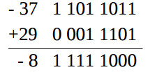

Reprezentacja liczb całkowitych i rzeczywistych w komputerze (system binarny,
szesnastkowy, zapis stało i zmiennoprzecinkowy).

---

# Reprezentacja liczb całkowitych

Opis systemu dwójkowego i szesnastkowego sobie darujemy.

Najczęściej stosowanym sposobem zapisu liczb całkowitych jest __Kod uzupełnieniowy do 2__ (zapis liczby na $k$ bitach):

$$
\textrm{uzp}_2(x) =
 \left\{
   \begin{array}{ll}
     x & \quad x \geq 0 \\
     2^k+x = 2^k - |x|& \quad x < 0
     \end{array}
  \right.
$$

Czyli:
1. Dla liczb dodatnich na początku dostawiamy 0.
2. Dla liczb ujemnych na początku dostawiamy 0, zamieniamy bity na przeciwne oraz dodajemy 1

Przykłady dla $k=8$:
1. $\textrm{uzp}_2(17) = 0001\ 0001$
2. $\textrm{uzp}_2(-17) = 1110\ 1111$
3. $\textrm{uzp}_2(1) = 0000\ 0001$
4. $\textrm{uzp}_2(-1) = 1111\ 1111$
5. $\textrm{uzp}_2(0) = 0000\ 0000$

Rozkodowywanie: dla liczb dodatnich bez zmian, dla ujemnych odejmujemy 1 i zamieniamy bity na przeciwne
6. $0111\ 1111 = \textrm{uzp}_2(127)$
7. $1000\ 0000 = \textrm{uzp}_2(-128)$
8. $1000\ 0001 = \textrm{uzp}_2(-127)$
9. $1111\ 1111 = \textrm{uzp}_2(-1)$
10. $0000\ 0000 = \textrm{uzp}_2(0)$

Zakres liczb:
$[-2^{k-1}, 2^{k-1}-1]$

Wiele systemów zapisu liczb całkowitych posiada problem dwóch sposobów zapisu zera, ten system omija ten problem.

W naturalny sposób działa tu dodawanie liczb (dodatnia + dodatnia, dodatnia + ujemna itd.): dodajemy normalnie, - w słupku, jeśli pojawi się przepełnienie to je ignorujemy. 

__Suma kodów liczb = kod sumy liczb__. 

Przykład:  

Nieuniknionym problemem jest możliwość wyjścia poza zakres poprzez dodawanie zbyt dużych liczb.

# Reprezentacja liczb rzeczywistych
## Kodowanie stałoprzecinkowe
* Ustalone miejsce rozdziału części całkowitej i ułamkowej.
* Liczbę całkowitą kodujemy kodem uzupełnieniowym do 2.
* Ułamek - zwykły zapis binarny.
* O znaku mówi znak części całkowitej.

### Przykłady kodowania
Podział rejestru: $4$ bity na część całkowitą, $4$ na część ułamkową.

$7 \frac{1}{2} = (0111\ 1000)_2$

$-3 \frac{3}{8} = (1101\ 0110)_2$

## Kodowanie zmiennoprzecinkowe
Reprezentacja liczby rzeczywistej $x$ (zapis naukowy):
$$
x = m \cdot p^c
$$
gdzie m - mantysa(x), c - cecha(x), p - podstawa systemu.  

W reprezentacji zmiennoprzecinkowej odległości między reprezentowalnymi liczbami maleje wraz rozmiarem liczby. Przykładowo większość dużych liczb całkowitych jest reprezentowalna jedynie w przybliżeniu.  

### Zapis liczby
Rejestr dzielimy na $3$ części:
* Bit znaku - 1 bit. $0$ dla liczb nieujemnych, $1$ dla ujemnych.
* Cecha: kod nadmiarowy -  $\textrm{ndm}(x) = k + x$, gdzie k to ustalony nadmiar.
* Mantysa: $|x| \in [1; 2)$, czyli liczby są w postaci $1,\dots$ Bit całości jest niekodowany - nie musimy go pamiętać. Sposób kodowania mantysy to __Znak moduł-prosty__:

 $$
 \textrm{zmp}(x) =
  \left\{
    \begin{array}{ll}
      x & \quad x \geq 0 \\
      2^{l-1}-x & \quad x \leq 0
      \end{array}
   \right.
 $$

Liczba $l$ dobierana jest do bitowej długości mantysty.

### Liczby pojedynczej precyzji (float)
 

### Zestawienie wielkości (bitowych) poszczególnych części w różnych typach:

| Typ | Znak | Cecha | Mantysa | Nadmiar w cesze |
|:-----------:|:----:|:-----:|---------|:---------------:|
| Single | $1$ | $8$ | $23$ | $2^7-1$ |
| Double | $1$ | $11$ | $52$ | $2^{10}-1$ |
| Long double | $1$ | $15$ | $64$ | $2^{14}-1$ |

### Przykład kodowania
Kodujemy cechę na $4$ bitach, mantysę na $7$ bitach.

$30.25 = (11110.01)_2 = 2^4*1.111001$.

Cecha: kod nadmiarowy, nadmiar = 7). 

Cecha = $4 + 7 = 11 = (1011)_2$.

Mantysa = $(1.111\ 0010)_2$. Ignorujemy bit całości.

Wynik: $0\ 1011\ 1110010$.
