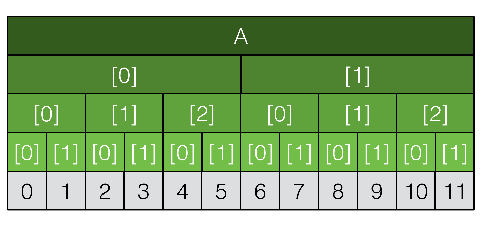

Zmienne typu adresowego (wskaźniki). Związek między tablicami i wskaźnikami w języku C++. Arytmetyka wskaźników.

---

# Wskaźniki
Wskaźnik jest zmienną zawierającą adres pamięci. Może to być adres do innej zmiennej, do środka tablicy, do niczego (*null pointer*), lub do czegoś, co już nie istnieje (*dangling pointer*).

Jego rozmiar zależy od architektury procesora. Obecnie, przeważnie są to 32 lub 64 bity, ale de facto rozmiar może być dowolny. Na danej maszynie jest jednak stały - wszystkie wskaźniki mają taki sam rozmiar.

### Deklaracja
Aby utworzyć zmienną wskaźnikową, po typie zmiennej dopisujemy `*`. Przykładowo, wskaźnik na liczbę typu `int` deklarujemy następująco:

```cpp
int *pointer;
```

**Uwaga!** `int *a, b` Spowoduje zadeklarowanie jednego wskaźnika `a` i jednej zmiennej typu `int`. Każda zmienna, która ma być wskaźnikiem, musi być poprzedzona znakiem `*`.

### Referencja zmiennej
Aby przypisać adres do wskaźnika, musimy pobrać adres pewnej konkretnej zmiennej używając operatora `&`:

```cpp
int variable = 16;
pointer = &variable;
```

### Dereferencja wskaźnika
Dodanie `*` do zmiennej wskaźnikowej powoduje uzyskanie dostępu do wartości pod adresem pamięci wskazywanym przez tą zmienną:

```cpp
long long variable = 256;
long long *pointer = &variable;
cout << variable << endl; // 256
cout << *pointer << endl; // 256
```

Dereferencja powoduje zamianę *wskaźnika na zmienną* na *referencję do tej zmiennej*. Czyli dzięki dereferencji można również modyfikować wartość pod wskazywanym adresem:

```cpp
*pointer = 128;
cout << *pointer << endl; // 128
cout << variable << endl; // 128
```

### Nieprawidłowy adres
Jeżeli nie zadbamy o przypisanie wskaźnikowi adresu, można popełnić błąd.

```cpp
int *pointer;
*pointer = 666;
```

Nie wiemy gdzie (pod jakim adresem) umieszczona jest wartość `666`. Kompilator będzie starał się umieścić wartość `666` pod takim właśnie adresem. Co jeżeli jednak adres ten będzie już zajęty przez program? Wtedy po prostu spróbujemy nadpisać losowe dane: **bardzo źle**. To co najczęsciej się widzi to dereferencja wskaźnika wskazującego na stronę pamięci nie należącą do procesu, co skutkuje błędem *segmentation fault*.

# Tablice a wskaźniki
Wskaźnik na tablicę jest wskaźnikiem na pierwszy jej element:

```cpp
int array[] = { 1, 2, 3, 4, 5, 6, 7, 8, 9, 10 };

cout << &array << endl; // 0x7745dbae0230
cout << &array[0] << endl; // 0x7745dbae0230
```

Wskaźniki na zmienną `array` i na zmienną `array[0]` są takie same. Dzieje się tak dlatego, że wskaźnik na zmienną `array` wskazuje na początek wszystkich danych w `array`, a pierwszym elementem jest `array[0]`.

### Operator *subscript* - `[]`
Zgodnie z definicją `a[i]` jest identyczne z `*((a)+(i))`. Zatem wszystkie poniższe operacje są równoważne:

```cpp
cout << *(array + 3) << endl; // 4
cout << *(3 + array) << endl; // 4
cout << array[3] << endl; // 4
cout << 3[array] << endl; // 4
```

### Arytmetyka wskaźników
W języku C++ jest dość mocne podobieństwo pomiędzy arytmetyką wskaźników i sposobie przedstawienia tablic. Przykładowo:

```cpp
int array[] = { 1, 2, 3, 4, 5, 6, 7, 8, 9, 10 };

int *pointer = array;
```

`pointer` jest wskaźnikiem na tablicę `array`. Wskazuje na pierwszy bajt pierwszego elementu (`array[0]`). Możemy za jego pomocą iterować się po tablicy:

```cpp
pointer += 1;
```

Spowoduje to zmianę wskazywanego adresu na kolejny, dalszy o rozmiar typu tablicy (w tym przypadku `int` - 4 bajty). Podobnie działa to również w przypadku struktur, gdzie przeskok następuje o rozmiar całej pojedynczej struktury.

Teraz `pointer` wskazuje już na drugi w kolejności (`array[1]`) element. `*pointer` spowoduje zwrócenie wartości `2`.

### Dodawanie wskaźników
Dodanie dwóch wskaźników jest niepoprawne, ponieważ możliwy jest overflow. Przykładowo, wyszukiwanie binarne trzeba pisać `(end - begin) / 2 + begin` zamiast `(end + begin) / 2`.

### Odejmowanie wskaźników
W przeciwieństwie do dodawania wskaźników, ma sens odejmowanie ich. Przykładowo, jeżeli `p1` i `p2` wskazują na dwa elementy tej samej tablicy `array` o indeksach odpowiednio `i1` i  `i2`, to wyrażenie `p2 - p1` jest równe odległości między adresami zmiennych wskazywanych przez `p1` i `p2` mierzonej w jednostkach równych długości pojedynczej zmiennej w tablicy. A zatem `p2 - p1` ma tę samą wartość co `i2 - i1`.

### Tablice wielowymiarowe
Jeśli `A` jest `n`-wymiarową tablicą `i × j × ... × k`, to `*A` zwraca wskaźnik do `n-1`-wymiarowej tablicy `j × ... × k`. Przykładowo:

```cpp
int A[3][5];
```

`A` jest tablicą rozmiaru `3 × 5` typu `int`. Jeśli tablica `A` wystąpi w jakimś wyrażeniu, to zostaje skonwertowana na wskaźnik do pierwszej z trzech pięcioelementowych tablic integerów. Następnie, jeżeli jest określony operator `[i]`, wyrażenie `A[i]` zwróci adres dalszy o `i * rozmiar obiektu, na który wskazuje A`. Czyli zwrócony zostanie adres początku `i`-tej pięcioelementowej tablicy.

Tablice `n`-wymiarowe trzymane są w porządku wierszy jako jeden spójny blok pamięci. Struktura, po której się poruszamy, jest hierarchiczna. Przykładowo, tablica zadeklarowana jako `int A[2][3][2]` jest reprezentowana następująco:


