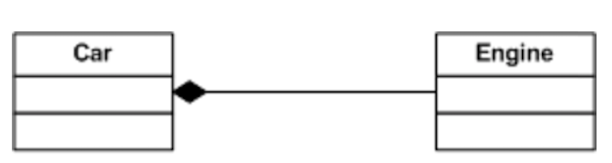

Co to jest kompozycja jako obiektowa technika programowania? Podaj przykłady kompozycji w dwóch obiektowych językach programowania.

---

## Wstęp

Kompozycja jako technika programowania obiektowego jest sposobem na składanie mniejszych obiektów w większe, bardziej złożone.
Jest podstawą budowania niemalże wszystkich istotnych struktur danych jak np drzewo binarne czy graf.
Kompozycja reprezentuję relację "posiada", dla przykładu obiekt $dom$ posiada obiekt $kuchnia$.

Kompozycja oznacza, że dana część może należeć tylko do jednej całości. Oznacza również, że część nie może istnieć bez całości, a usunięcie całości powoduje automatyczne usunięcie wszystkich jej części, związanych z nią związkiem kompozycji.

Na diagramach UML kompozycję oznacza się wypełnionym rombem.



## Przykłady

Poniższy przykład pozwalający rozróżnić kompozycję od agregacji.

* Dom jest **kompozycją** pomieszczenia, gdyż pomieszczenie może należeć tylko do jednego domu, nie może ponadto istnieć po usunięciu (wyburzeniu) czy niezależnie od domu.

* Dom jest **agregacją** ulicy, gdyż ulica może zarówno istnieć bez konkretnego domu, wyburzenie domu nie spowoduje jej usunięcia oraz jest jedna dla wielu domów przy niej usytuowanych.


### Java

Klasa **House**
```java
import java.util.*;
public class Room{
};
public class House{
    List<Room> rooms;
    House(int rooms_num){
        this.rooms = new LinkedList<>();
        for(int i=0;i<rooms_num; i++){
            this.rooms.add(new Room());
        }
    }
};

```

### c++

```c++
#include<vector>
class Room{
};
class House{
public:
    std::vector<Room> rooms;
    House(int rooms_num){
        for(int i=0;i<rooms_num;i++){
            this->rooms.push_back(Room());
        }
    }
};
```
