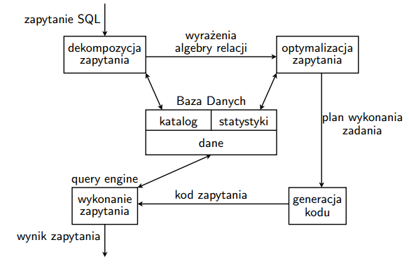
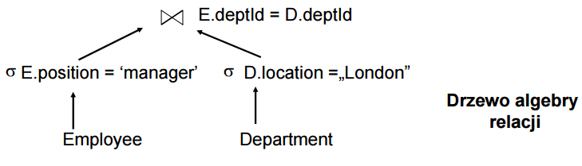

Przedstaw podstawowe techniki stosowane w procesie optymalizacji zapytań w bazach danych.

---

# Optymalizacja zapytań

## Fazy wykonania zapytania SQL



## Klasyfikacje optymalizacji zapytań
* Optymalizacja statyczna i dynamiczna
	* Optymalizacja statyczna - odbywa się przed wykonaniem zapytania i w trakcie wykonania zapytanie nie ulega zmianie.
	* Optymalizacja dynamiczna - także działa przed rozpoczęciem wykonywania zapytania, ale może tez zmieniać zapytanie w trakcie wykonywania.
* Optymalizacja pojedynczego zapytania lub wielu zapytań równocześnie

## Proces optymalizacji zapytania
* Przekształcenie zapytania do drzewa algebry relacji (przykład poniżej).
* Identyfikacja bloków w zapytaniu (zagnieżdżonych zapytań).
* Odrzucenie (pod)zapytań sprzecznych.
* Przekształcenie zapytania do postaci koniunkcyjnej lub dysjunkcyjnej (normalizacja zapytania).
* Upraszczanie zapytania
	* Identyfikacja wyrażeń redundantnych.
	* Eliminacja wspólnych podwyrażeń.
	* Zastosowanie znanych reguł logiki, np.: $p \vee p = p$, $p \wedge false = false$ itd.
	* Przesuwanie operacji *unarnych* (projekcja, selekcja) w dół drzewa zapytania, czyli wykonywanie ich w pierwszej kolejności - bo często powodują duży spadek ilosci danych do dalszego przetwarzania.
	* Przesuwanie operacji *binarnych* (np. JOIN) jak najbardziej w górę drzewa, w kierunku korzenia.
	* Operacje grupowania i agregacji zwykle wykonywane na końcu.
* Dostęp do krotek za pomocą skanowania całej relacji lub za pomocą indeksu założonego na relacji.
* Transformacje algebraiczne oraz szacowanie kosztów i rozmiarów częściowych wyników zapytania (więcej poniżej).
* Przepisywanie (pod)zapytań - zamiana na operację JOIN, nie zawsze możliwe.
* Znajdowanie optymalnego drzewa wykonania operacji.

### Przykład konstrukcji drzewa algebry relacji

```sql
SELECT *
FROM Employee E, Department D
WHERE E. deptId = D. DeptId AND E.position = ‘manger‘ AND D.location = ‘London‘;
```



### Transformacje algebraiczne i szacowanie kosztów
Optymalizator może zastosować wiele reguł algebraicznych, np. $(R\,\, JOIN\,\, S)\,\, JOIN\,\, T = R\,\, JOIN\,\, (S\,\, JOIN\,\, T),\,\, R\,\, JOIN\,\, S = S\,\, JOIN\,\, R$ itd. Często pozwala to zredukować rozmiary wyników pośrednich zapytań.

Szacowanie kosztu odbywa się dla każdego rozpatrywanego planu zapytania. 

Moduł optymalizacji musi oszacować koszt wykonania każdej operacji w zapytaniu (zależny oczywiście od rozmiarów wejściowych relacji) oraz szacunkowy rozmiar wyniku całego zapytania. Na przykład dla operacji JOIN dwóch relacji $R$ i $S$ Pesymistyczny rozmiar (liczba krotek) wyniku zapytania to $|R| * |S|$, gdzie $|F|$ to rozmiar relacji $F$.

Podczas wykonywania tego procesu korzysta z danych statystycznych oraz z rozmiarów poszczególnych relacji - wszystkie dane zgromadzone są w katalogu bazy danych.

### Inne techniki stosowane w optymalizacji
* Rozproszenie bazy danych - pozwala istotnie zredukować rozmiary relacji.
* Agregowanie informacji. Zapytania, które są wykonywane często, można przeliczyć raz i zapisać (np. przeliczać statystyki raz dziennie). Taka technika stoi w sprzeczności z zasadami normalizacji bazy danych, ale często jej stosowanie jest niezbędne aby utrzymać responsywność systemu.