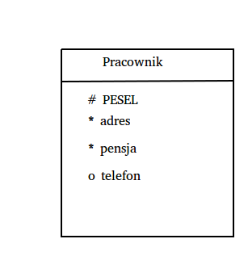
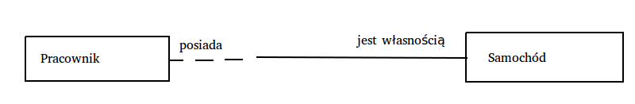
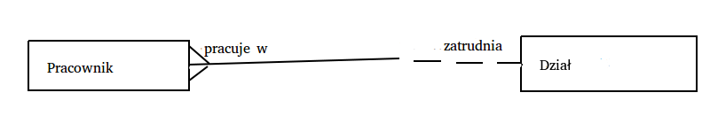
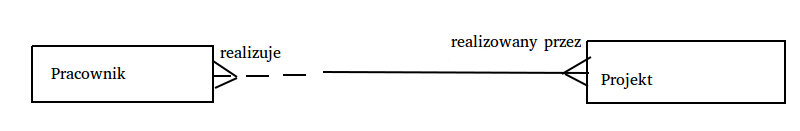
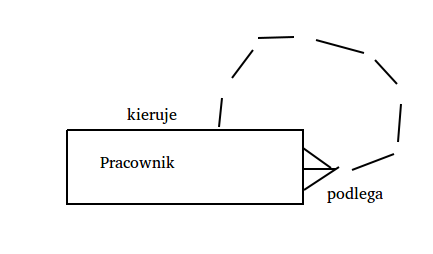
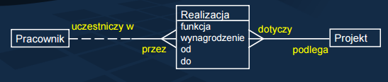
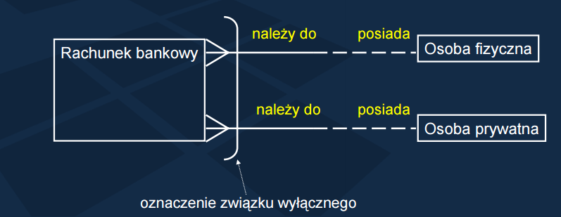

Omów sposób modelowania baz danych za pomocą modelu związków encji.

---
# Model związków encji
Sposób graficznego przedstawienia związków pomiędzy encjami używany w modelowaniu systemów informacyjnych. *Modelowanie* rozumiane jest jako odwzorowanie obiektów świata rzeczywistego w systemie informatycznym (bazie danych).

### Odwzorowanie
* Obiekt świata rzeczywistego -> encja.
* Konkretny obiekt świata rzeczywistego -> instancja encji.
* Powiązania między obiektami -> związki pomiędzy encjami.

### Cechy
* Dowolny obiekt może być reprezentowany tylko przez jedną encję.
* Encja posiada unikalną nazwę i zbiór atrybutów.

### Przyład encji

* `#` - klucz podstawowy,
* `*` - obowiązkowy atrybut,
* `o` - opcjonalny atrybut.

## Związki między encjami
Związki między encjami mają dwie cechy:

* **Opcjonalność** - mówi o tym, czy każda encja musi, czy też może wystąpić równocześnie z inną.
* **Krotność** - określa ile encji wchodzi w skład związku (związki unarne, binarne, ternarne, ...).
* **Typ asocjacji** (1 : 1, 1 : M, M : N).

### 1 : 1 (jeden do jednego)

* Pracownik może posiadać samochód.
* Samochód musi posiadać właściciela (*związek jednostronnie obowiązkowy*).

### 1 : M (jeden do wielu)

* Pracownik musi pracować w jakimś dziale (dokładnie jednym) - *związek jednostronnie obowiązkowy*.
* Dział może (ale nie musi) zatrudniać wielu pracowników.
* Oczywiście możliwy jest związek 1 : M obustronnie obowiązkowy, tak samo jak 1 : 1.

### M : N (wiele do wielu)

* Pracownik może brać udział w wielu projektach.
* Mogą istnieć pracownicy, którzy nie biorą udziału w żadnym projekcie.
* Projekt musi posiadać co najmniej jednego realizującego pracownika.
* W jednym projekcie może brać udział wielu pracowników.

### 1 : M (unarny rekursywny)

* Określa powiązanie pomiędzy określonym wystąpieniem encji a **innym wystąpieniem tej samej encji**.
* Przydaje się do modelowania zależności służbowych. Niektórzy pracownicy mają nad sobą kierowników, a niektórzy nie.
* Podobnie niektórzy maja podwładnych a inni nie.
* Tego typu związek modelujący zależności hierarchiczne musi być opcjonalnym z obu stron. W przeciwnym przypadku powstałby tzw. *związek niedozwolony* oraz hierarchia nieskończona.

## Związek z atrybutami

### Przykład
  * Pracownik może brać udział w jednym lub wielu projektach; może też nie brać udziału w żadnym projekcie.
  * Każdy projekt realizuje przynajmniej jeden pracownik.
  * Dla pracowników, którzy biorą udział w projektach należy zapamiętać ich funkcję, wynagrodzenie oraz daty początku i końca ich udziału w projekcie.

* Związek jako taki może mieć również swoje atrybuty (cechy), które nie występują dla pojedynczej encji.
* Narzuca się tutaj utworzenie związku Pracownik - Projekt typu M : N opcjonalnego od strony pracownika i obowiązkowego od strony projektu. Dodatkowo należy zapamiętać (dla każdego powiązania Pracownik - Projekt) funkcję pracownika, wynagrodzenie i daty początku i końca udziału w projekcie.
* Rozwiązaniem jest wprowadzenie dodatkowej encji - tzw. **encji słabej** - w tym przykładzie o nazwie Realizacja.
* Do encji słabej dochodzą obowiązkowe związki typu "wiele", co oznacza, że nie może istnieć realizacja bez pracownika i projektu oraz jeśli istnieje realizacja, to musi dotyczyć jakiegoś pracownika i projektu.

## Związki wyłączne

* Mają zastosowanie, gdy dane wystąpienie encji może wchodzić tylko w jeden ze związków.
* W tym przykładzie oznacza to, że konkretny rachunek może być własnością albo osoby fizycznej albo osoby prawnej, ale nigdy obu naraz.
