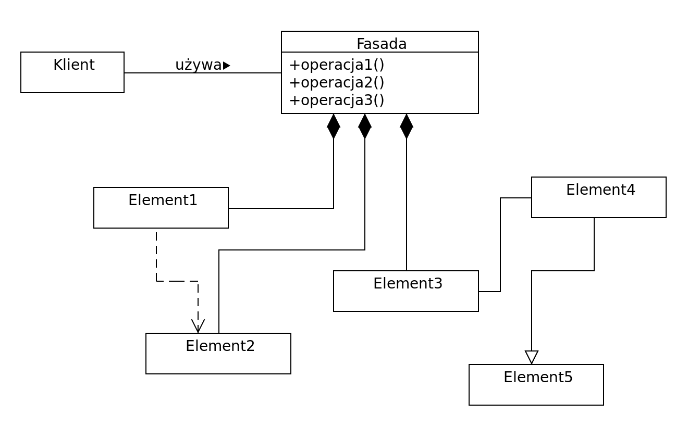

Co to są wzorce projektowe? Wymień podstawowe i omów krótko trzy z nich.

---

# Wzorzec projektowy
Uniwersalne, sprawdzone w praktyce rozwiązanie często pojawiających się, powtarzalnych problemów projektowych. Pokazuje powiązania i zależności pomiędzy klasami oraz obiektami i ułatwia tworzenie, modyfikację oraz pielęgnację kodu źródłowego. Jest opisem rozwiązania, a nie jego implementacją. Wzorce projektowe stosowane są w projektach wykorzystujących programowanie obiektowe.

## Podstawowe wzorce
Jednym z najpopularniejszych sposobów klasyfikacji wzorców jest ten zaproponowany przez *Gang of Four*.

  * **Kreacyjne** - opisujące proces tworzenia nowych obiektów; ich zadaniem jest tworzenie, inicjalizacja oraz konfiguracja obiektów, klas oraz innych typów danych.    

  * **Strukturalne** - opisujące struktury powiązanych ze sobą obiektów.

  * **Behawioralne** - opisujące zachowanie i odpowiedzialność współpracujących ze sobą obiektów.

## Przykłady

### 1. Singleton (kreacyjny)
Celem singletonu jest ograniczenie możliwości tworzenia obiektów danej klasy do **jednej instancji** oraz zapewnienie **globalnego dostępu** do stworzonego obiektu.

Niektórzy programiści uznają go za **antywzorzec**, ponieważ:
 * Sprowadza się do stworzenia obiektowego zamiennika dla zmiennej globalnej. To z kolei ukrywa zależności w kodzie (te powinny być jawnie przedstawione w interfejsach).
 * Łamie zasadę jednej odpowiedzialności - kontroluje sposób tworzenia siebie i utrzymywania.
 * Powoduje, że moduły / fragmenty kodu są ze sobą mocno związane. To z kolei utrudnia testowanie.
 * Przechowuje stan na cały czas działania aplikacji. Kolejna przeszkoda w testowaniu, ponieważ doprowadza do sytuacji, w której testy muszą być odpalane w odpowiedniej kolejności. To ogromna wada. Testy jednostkowe nie mogą od siebie zależeć, w szczególności w nowych frameworkach do testowania, gdzie standardem jest uruchamianie ich równolegle.

```java
public final class Singleton {
    private static final Singleton INSTANCE = new Singleton();

    private Singleton() {}

    public static Singleton getInstance() {
        return INSTANCE;
    }
}
```

Ciekawostka: [Robert C. Martin o singletonie](https://blog.8thlight.com/uncle-bob/2015/06/30/the-little-singleton.html).

### 2. Fasada (strukturalny)
Służy do ujednolicenia dostępu do złożonego systemu poprzez wystawienie uproszczonego, uporządkowanego interfejsu programistycznego, który ułatwia jego użycie.



Fasada może:
  * Ułatwić korzystanie z biblioteki. Sprawić, że jest bardziej czytelna, łatwiejsza do zrozumienia i do testowania.
  * Wrappnąć kolekcję kiepskich API jednym, dobrze zaprojektowanym API.

Ten wzorzec projektowy jest często używany gdy system jest bardzo złożony lub trudny do zrozumienia (wiele zależności między drobniejszymi elementami). Typowo, sprowadza się to do jednej, wysokopoziomowej klasy, która ukrywa szczegóły implementacji.

```java
/* Complex parts */

class CPU {
    public void freeze() { ... }
    public void jump(long position) { ... }
    public void execute() { ... }
}

class Memory {
    public void load(long position, byte[] data) { ... }
}

class HardDrive {
    public byte[] read(long lba, int size) { ... }
}

/* Facade */

class ComputerFacade {
    private CPU processor;
    private Memory ram;
    private HardDrive hd;

    public ComputerFacade() {
        this.processor = new CPU();
        this.ram = new Memory();
        this.hd = new HardDrive();
    }

    public void start() {
        processor.freeze();
        ram.load(BOOT_ADDRESS, hd.read(BOOT_SECTOR, SECTOR_SIZE));
        processor.jump(BOOT_ADDRESS);
        processor.execute();
    }
}

/* Client */

class You {
    public static void main(String[] args) {
        ComputerFacade computer = new ComputerFacade();
        computer.start();
    }
}
```

### 3. Odwiedzający (behawioralny)
Zobacz [Odwiedzający](III.2.4 Odwiedzający.md).
