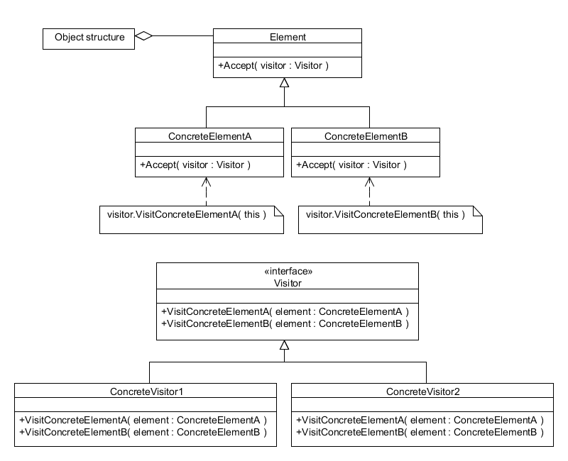

Omów wzorzec projektowy Odwiedzający oraz podaj hipotetyczny przykład zastosowania.

---

# Wizytator (odwiedzający)

## Ogólne informacje
  * **Co to?** Wzorzec projektowy.
  * **Zadanie?** Odseparowanie algorytmu od struktury, na której operuje.
  * **Co to daje?** Umożliwia zmianę operacji wykonywanych na elementach klasy bez ingerencji w jej kod.
  * **Czyli?** Możliwość dodawania nowych operacji do aktualnych struktur obiektów bez konieczności ich modyfikacji.

### Zalety
  * Łatwo dodawać nowe operacje na strukturze.
  * Klasy mogą być mniejsze, bo rzadko wykonywane operacje można wyciągnąć do zewnętrznych obiektów.
  * Obiekty wizytatorów mogą zbierać np. informacje o stanie w czasie odwiedzania kolejnych elementów. Po co? Po to, że mamy "mobilnego agenta", który zdalnie odwiedza serwery baz danych i buduje złożony wynik na podstawie zawartości rozproszonej bazy danych. Algorytm wstrzykuje user. Niezłe, nie?
  * Zamknięte na modifykacje, otwarte na rozszerzanie.

### Wady
  * *Boilerplate code* w implementacji metod `accept`.


## Struktura wzorca



## Przykład zastosowania
Czytając opis tego wzorca sam nasuwa się sposób jego wykorzystania - publiczne API. Ktoś pisze jakąś bibliotekę. Żeby nie musiał modyfikować kodu źródłowego klas w bibliotece po prostu umożliwia klientom wstrzykiwanie swoich własnych algorytmów poprzez "wizytatora".

Kanonicznym przykładem jest chodzenie po strukturze drzewiastej, gdzie węzły drzewa są różnych typów dziedziczących po wspólnym typie `Node`. Najfajniejszym przykładem tego typu jest chyba dostarczanie AST tak jak to przy C++ robi clang: węzły są różnorakie, np. wyrażenia, deklaracje, ... Każdy węzeł ma funkcję `accept(Visitor v)`, a cała struktura dostarcza sposób chodzenia po poszczególnych węzłach. Teraz każdy z zewnątrz może napisać swojego odwiedzającego, który analizuje lub robi inne rzeczy (zlicza użycia, robi strukturę klas, ...).

Często wzorzec Odwiedzającego jest jednak oparty na niezrozumieniu - że jest on związany do struktury drzewiastej. Nie jest to jednak prawda - zastosowania mogą być różne i pokażemy jeden z nich.

### Kod

```java
interface ICarElementVisitor {
    void visit(Wheel wheel);
    void visit(Engine engine);
    void visit(Body body);
    void visit(Car car);
}

interface ICarElement {
    void accept(ICarElementVisitor visitor);
}
```

I cztery obiekty implementujące interfejs `ICarElement`:

```java
class Wheel implements ICarElement {
    private String name;

    public Wheel(String name) {
        this.name = name;
    }

    public String getName() {
        return this.name;
    }

    public void accept(ICarElementVisitor visitor) {
        visitor.visit(this);
    }
}

class Engine implements ICarElement {
    public void accept(ICarElementVisitor visitor) {
        visitor.visit(this);
    }
}

class Body implements ICarElement {
    public void accept(ICarElementVisitor visitor) {
        visitor.visit(this);
    }
}

class Car implements ICarElement {
    ICarElement[] elements;

    public Car() {
        this.elements = new ICarElement[] {
          new Wheel("front left"),
          new Wheel("front right"),
          new Wheel("back left") ,
          new Wheel("back right"),
          new Body(),
          new Engine()
        };
    }

    public void accept(ICarElementVisitor visitor) {    
        for (ICarElement elem : elements) {
            elem.accept(visitor);
        }
        visitor.visit(this);    
    }
}
```

OK, mamy już strukturę przygotowaną do tego, żeby ktoś wstrzykiwał nam algorytm do wykonania na samochodzie. Operacja zostanie wykonana na wszystkich podzespołach maszyny. Więc zaimplementujmy proste printowanie na konsolę:

```java
class CarElementPrintVisitor implements ICarElementVisitor {
    public void visit(Wheel wheel) {      
        System.out.println("Visiting " + wheel.getName() + " wheel");
    }

    public void visit(Engine engine) {
        System.out.println("Visiting engine");
    }

    public void visit(Body body) {
        System.out.println("Visiting body");
    }

    public void visit(Car car) {      
        System.out.println("Visiting car");
    }
}
```

Teraz uruchamiając poniższy kod:

```java
ICarElement car = new Car();
car.accept(new CarElementPrintVisitor());
```

Otrzymamy następujący wynik:

```
Visiting front left wheel
Visiting front right wheel
Visiting back left wheel
Visiting back right wheel
Visiting body
Visiting engine
Visiting car
```
