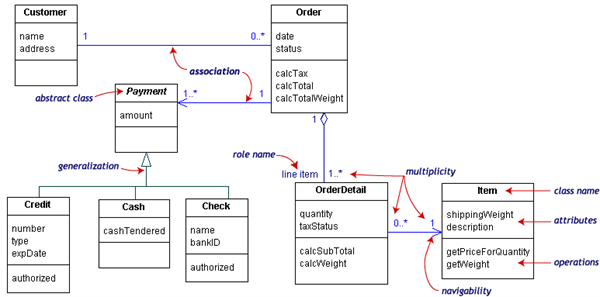

Omów składniki diagramu klas budując odpowiedni przykład.

---

# Diagram klas
Statyczna struktura opisująca klasy systemu, ich atrybuty, metody, oraz powiązania pomiędzy obiektami. Jako diagram struktur, przedstawia przedmioty i sposoby ich interakcji. Nie opisuje natomiast przebiegu tych interakcji.

## Klasa
**Klasa** w modelu UML jest reprezentowana przez prostokąt z umieszczoną wewnątrz nazwą klasy. Oddzielona część prostokąta pod nazwą klasy może zawierać atrybuty klasy, czyli metody (funkcje), właściwości lub pola (zmienne). Każdy atrybut pokazywany jest przynajmniej jako nazwa, opcjonalnie także z typem, wartością i innymi cechami.

**Metody** klasy mogą znajdować się w osobnej części prostokąta. Każda metoda jest pokazywana przynajmniej jako nazwa, a dodatkowo także ze swoimi parametrami i zwracanym typem.

**Atrybuty** (zmienne i właściwości) oraz metody mogą mieć też oznaczoną widoczność (zakres znaczenia ich nazw) jak następuje:

* `+` dla `public` – publiczny, dostęp globalny
* `#` dla `protected` – chroniony, dostęp dla pochodnych klasy (wynikających z generalizacji)
* `−` dla `private` – prywatny, dostępny tylko w obrębie klasy (przy atrybucie statycznym) lub obiektu (przy atrybucie zwykłym)
* `~` dla `package` – pakiet, dostępny w obrębie danego pakietu, projektu.

## Związki
  

### Zależność (dependency)
Związek polegający na tym, że zmiana w jednym, niezależnym elemencie (np. serwer), pociąga zmianę w drugim, zależnym elemencie (np. klient).

Na diagramie klas oznaczany przerywaną linią zakończoną strzałką wskazującą kierunek zależności.

### Asocjacja (association)
Wskazuje na trwałe powiązanie pomiędzy obiektami danych klas (np. firma zatrudnia pracowników).

Na diagramie oznaczana ciągłą linią ze strzałką. Linia asocjacji bez strzałek oznacza, że zachodzi w obie strony. Asocjacja posiada dwa końce. Jeden z końców zwykle posiada *nazwę roli*, która precyzuje jaka relacja zachodzi między klasami.

#### Krotność
Krotność jednej z końcówek linii asocjacji charakteryzuje ilość możliwych instancji klasy dla danego związku. Są to zwykle pojedyncze liczby bądź zakresy.  

|   Krotność |          Znaczenie         |
|:----------:|:--------------------------:|
|    0..1    | zero lub jedna instancja   |
| 0..* lub * | dowolna liczba instancji   |
|     1      | dokładnie jedna instancja  |
|    1..*    | conajmniej jedna instancja |

### Agregacja (aggregation)
Reprezentuje związek typu całość-część. Występuje tutaj relacja posiadania — co oznacza, że elementy częściowe mogą należeć do większej całości, jednak również mogą istnieć bez niej. Przykładem agregacji jest związek pomiędzy silnikiem a samochodem, którego ten silnik jest częścią.

Na diagramie agregację oznacza się za pomocą linii zakończonej pustym rombem.

### Kompozycja (composition)
Związek typu całość-część. W relacji kompozycji, części należą tylko do jednej całości, a ich okres życia jest wspólny — razem z całością niszczone są również części. Dobrym przykładem kompozycji jest relacja między klasami `Pracownik` i `Ubezpieczenie`: pracownik może, lecz nie musi posiadać ubezpieczenia, natomiast ubezpieczenie nie może istnieć bez pracownika.

Przyjęto, że, kompozycja zachodzi dla przypadków, w których  byt podrzędny jest usuwany razem z bytem nadrzędnym. Wynika z tego, że byt podrzędny nie może być powiązany z więcej niż jednym bytem nadrzędnym.

Na diagramie, kompozycję oznacza się za pomocą linii zakończonej wypełnionym rombem.

### Generalizacja (inheritance)
Związek opisujący dziedziczenie po klasach.

Na diagramie generalizację oznacza się za pomocą niewypełnionego trójkąta symbolizującego strzałkę (skierowaną od klasy pochodnej do klasy bazowej).

### Realizacja (realization)
Zachodzi gdy element realizuje (implementuje lub wykonuje) zachowanie specyfikowane przez drugi element.

Oznaczana przez przerywaną linię z pustym trójkątem na końcu.

## Przykład

Powyższy schemat ilustruje sposób budowania diagramów klas na przykładzie systemu sklepowego do składania zamówień. Centralną klasą w tym diagramie jest klasa __Order__. Powiązane klasy to __Customer__ i __Payment__. Klasa __Payment__ reprezentuje jeden z trzech możliwych typów płatności: __Credit__, __Cash__ i __Check__. Zamówienia zawierają pewną ilość pozycji: __OrderDetails__. Każda pozycja określa przedmiot zakupu i ilość egzemplarzy w zamówieniu.

Przykładowo instancje  klasy __OrderDetails__ występują w charakterze pozycji (_line item_) dla instancji klasy __Order__. Strzałka na linii asocjacji wskazuje kierunek zależności: __OrderDetail__ musi posiadać wiedzę o klasie __Item__ natomiast nie na odwrót. Kierunek strzałki wskazuje również która klasa posiada kod odpowiedzialny za zwiazek.

W naszym przykładzie może być tylko jeden klient dla każdego zamówienia, natomiast klient może posiadać wiele zamówień. Uznaje się, że klasy, asocjacje i krotności są podstawowymi elementami diagramów. Strzałki i role są opcjonalne.
