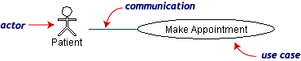
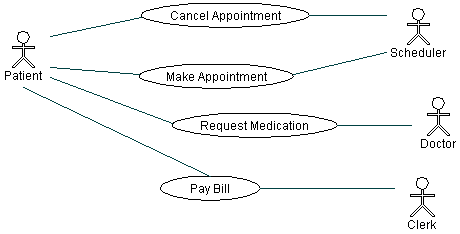
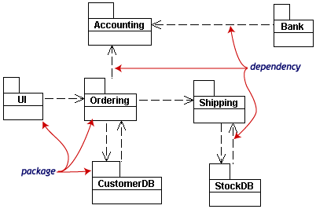
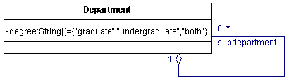
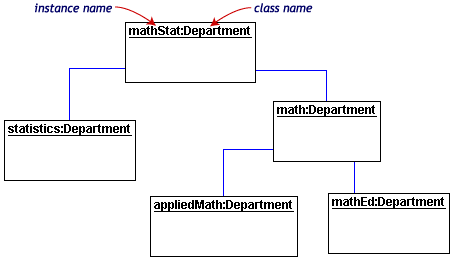
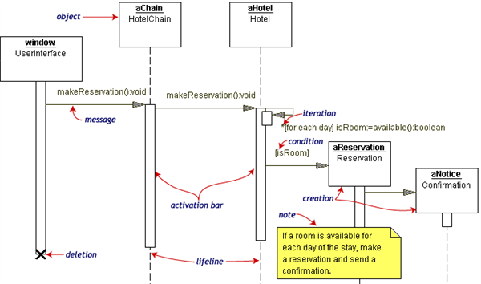
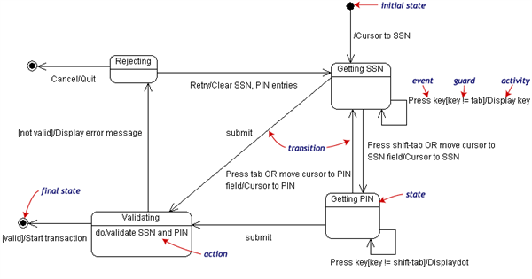
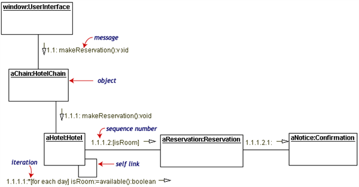
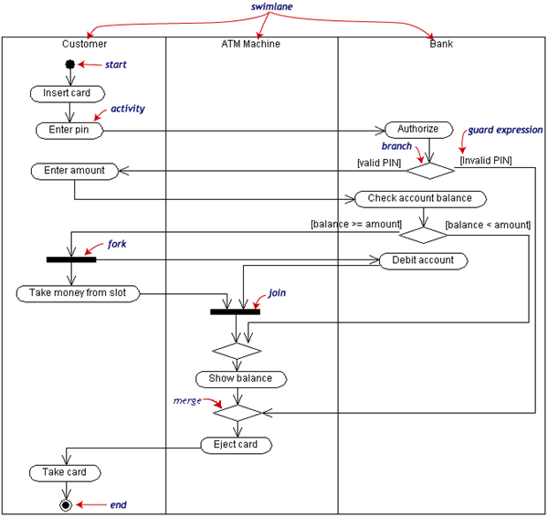
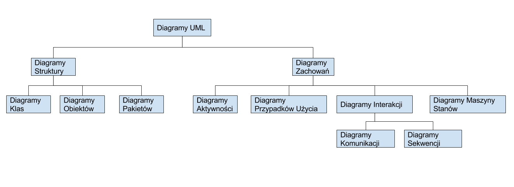

Co to jest UML? Omów podstawowe typy diagramów i ich taksonomię.

---

# UML

## Co to jest UML?

Istotą podejścia obiektowego do problemów jest konstruowanie modeli. Model ma za zadanie odzwierciedlić rzeczywistość w uproszczony sposób tak aby była ona opisywalna narzędziami danego języka. UML, czyli Unified Modeling Language, to język służący do projektowania i opisu takich modeli.  

U podstaw języka UML leżą zasady konstrowania ośmiu typów diagramów:

### Diagram Przypadków Użycia (Use Case Diagram)
Opisuje jakie ma być zachowanie systemu z punktu widzenia zewnętrznego obserwatora. Kładzie nacisk na to __"co?"__ robi system a nie __"jak?"__. Diagramy Przypadków użycia bardzo są bliskie _scenariuszom_ (termin UML). Scenariusz to przykład tego, co może się dziać gdy ktoś wchodzi w interakcję z projektowanym systemem. Przykład scenariusza:
>"Pacjent dzwoni do kliniki aby zarejestrować się na coroczną wizytę kontrolną. Recepcjonista znajduje najbliższy wolny termin w kalendarzu i umawia pacjenta na tę godzinę."

Diagramy te składają się z _przypadków użycia_ (_use cases_), _aktorów_ (_actors_) i _związków_ (_communication associations_):

  

Przykład Diagramu Przypadków Użycia:

### Diagram Klas (Class Diagram)

Wyczerpująca odpowiedź na to pytanie znajduje się w sekcji [__III.2.5 Diagram Klas__](#Diagram_Klas)

### Diagramy Pakietów i Obiektów (Packages and Objects Diagrams)
Aby uprościć diagramy klas, klasy grupuje się w _pakiety_(_packages_). Pakiety to zbiory logicznie związanych elementów diagramów klas.  

  
Pakiety są reprezentowane przez prostokąty z małymi zakładkami na górze. Poniżej znajduje się nazwa pakietu. Przerywane linie oznaczają zależności (_dependencies_). Pakiet zależy od innego, gdy zmiany w tym drugim moga potencjalnie prowadzić do zmian w pierwszym.  

Diagramy obiektów (_object diagrams_) przedstawiają instancje zamiast klas. Używa się ich przy opisywaniu mniejszych fragmentów funkcjonalności ze skomplikowanymi związkami (np. rekurencyjnymi). Poniższy diagram klas (na razie to dopiero diagram klas) ilustruje, że dana katedra uniwersytecka (_Department_) może zawierać kolekcje innych (pod)katedr.   

  

Diagram obiektów realizujący taką zależność może wyglądać w następujący sposób:  

  

Każdy prostokąt w diagramie obiektów odpowiada pojedynczej instancji. Instancje w diagramach UML są zawsze podkreślone.

### Diagram Sekwencji (Sequence Diagram)
Diagramy obiektów i klas odzwierciedlają statyczną strukturę modelu. _Diagramy Interakcji_ (_Interaction Diagrams_) są dynamiczne. Takim diagramem jest diagram sekwencji. Przedstawia w jaki sposób i kiedy dane operacje zachodzą. Pionowe położenie zdarzeń na diagramie odpowiada chronologii. Wykorzystywane obiekty są listowane od lewej do prawej zgodnie z tym jaką rolę pełnią w sekwencji wiadomości.  
 Poniżej znajduje się diagram sekwencji dla hotelowego systemu rezerwacji. Obiekt, który rozpoczyna przedstawiony proces to __window__.  

 __window__ wysyła wiadomość `makeReservation()` do obiektu __aChain__. Następnie __aChain__ wysyła wiadomość do __aHotel__. Jeżeli __aHotel__ posiada wolne pokoje, wówczas tworzy obiekt __aReservation__ oraz __aNotice__.  

 Pionowe, przerywane linie na diagramie to  linie życia obiektów. Białe prostokąty umieszczone na linii życia obiektu (_activation bar_) oznaczają, że obiekt jest zajęty wykonywaniem pewnej czynności (natomiast nie mają bezpośredniego związku z istnieniem obiektu).

 Na naszym diagramie, hotel sprawdza czy pokój jest dostępny. Jeśli tak jest, hotel tworzy rezerwację i potwierdzenie  

### Diagram Maszyny Stanów (State Machine Diagram)

Diagram Maszyny Stanów opisuje możliwe stany, w których może znajdować się model oraz przejścia między nimi, które prowadzą do zmian tych stanów. Poniższy przykład przedstawia Diagram Maszyny Stanów systemu bankowego. Na logowanie składa się wpisanie numeru bezpieczeństwa (_social security number_), numeru id oraz wysłanie tych informacji w celu potwierdzenia. Logowanie można podzielić na cztery odrębne stany: __Getting SSN__, __Getting PIN__, __Validating__ i __Rejecting__. Każdy stan wiąże się z innymi za pomocą _przejść_, które określają możliwe zmiany stanów.  

  

Stany reprezentowane są przez zaokrąglone prostokąty. Przejścia to strzałki łączące stany. Zdarzenia i warunki, które powodują przejścia są zapisywane obok strzałek.  

Operacje, które wykonywane są jako rezultat zdarzeń lub spełnionych warunów opisywane są w formacie `/akcja`. Przykładowo, jeśli obiekt jest w stanie __Validating__, wówczas nie oczekuje on na zewnętrze zdarzenie aby zaszło przejście, natomiast wykonuje on taką operację. Wynik tej operacji decyduje o następnym stanie.  

Stan początkowy i końcowy zaznacza się tak, jak na rysunku.

### Diagram Komunikacji

Przedstawia sposób wymiany informacji pomiędzy obiektami (aktorami, klasami), które wchodzą ze sobą w interakcję. Przekazuje te same informacje co diagram sekwencji, lecz z innego punktu widzenia.

Każda etykieta komunikatu ma postać liczb oddzielonych kropkami połączonych z krótkim opisem komunikatu. Liczby określają kolejność wysyłania komunikatów. Rozdzielenie sterowania oznaczane jest kropką i ponowioną numeracją komunikatów zgodnie z kolejnością w danym bloku sterowania. Pomimo, że diagram komunikacji używa etykiet do ustalania kolejności komunikatów, w zdecydowanie mniejszym stopniu niż diagram sekwencji określa aspekty czasu.

Cele stosowania diagramów komunikacji:
* określenie komunikatów wymienianych pomiędzy obiektami,
* wskazanie relacji pomiędzy obiektami,
* ustalenie kolejności wysyłania komunikatów,
* ułatwienie zrozumienia interakcji.

### Diagram Czynności (Activity Diagram)

To graficzna reprezentacja przebiegu aktywności programu. Bardzo przypomina popularny schemat blokowy. Diagram pozwala na opisywanie wyborów, iteracji oraz wielowątkowości. Poniższy przykład diagramu oparto na scenariuszu:  

>Wypłać pieniądze z banku za pomocą bankomatu.  

Do realizacji wykorzystano trzy klasy: __Customer__, __ATM__ oraz __Bank__. Diagramy aktywności są podzielone na __tory__. Tory określają które obiekty są odpowiedzialnme za dane czynności. Aktywności zilustrowane są owalnymi prostokątami, zaś przejścia między nimi to strzałki. Przejścia mogą się rozgałęziać w rozłączne ścieżki wykonania. W kwadratowych nawiasach zapisuje się warunki wybrania danego przejścia. Operacje `fork` i `merge` dotyczące równoległego wykonywania się czynności oznacza się za pomocą pełnych, prostokątów, jak zaznaczono na diagramie.

## Taksonomia
Taksonomia to hierarchiczna klasyfikacja, która określa porządek poszczególnych kategorii – od kategorii najniższych do najwyższych.  

Taksonomia przedstawionych wyżej diagramów:

