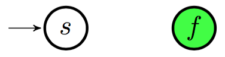
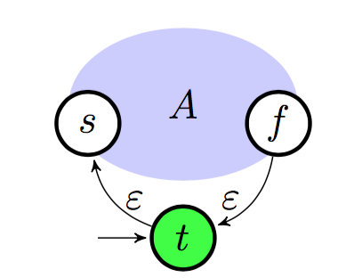

W jaki sposób języki regularne są charakteryzowane przez automaty skończone? Nakreśl ideę dowodu.

---

# Język regularny
Język regularny nad alfabetem $\Sigma$:

* $\emptyset$  jest językiem regularnym
* $\{a\}$ jest językiem regularnym dla każdego $a \in \Sigma$
* jeśli $L_{1}, L_{2}$ są językami regularnymi, to $L_{1} \cup  L_{2}$ też
* jeśli $L_{1},  L_{2}$ są językami regularnymi, to $L_{1} L_{2}$ też
* jeśli $L$ jest językiem regularnym, to $L^\ast$ też
* żaden inny język nie jest regularny nad $\Sigma$

# Wyrażenie regularne
Wyrażenie regularne nad alfabetem $\Sigma$ to język nad alfabetem
$\Sigma' = \Sigma \cup \{ 0, 1, +, \ast, (, ) \}$ zdefiniowany następująco:

* $0$ jest wyrażeniem regularnym
* $1$ jest wyrażeniem regularnym
* $a$ jest wyrażeniem regularnym dla każdego $a \in \Sigma$
* jeśli $\alpha_{1}, \alpha_{2}$ są wyrażeniami regularnymi, to $( \alpha_{1} + \alpha_{2})$ również
* jeśli $\alpha_{1}, \alpha_{2}$ są wyrażeniami regularnymi, to $( \alpha_{1} \alpha_{2})$ również
* jeśli $\alpha$ jest wyrażeniem regularnym, to $\alpha^\ast$ również
* (można pominąć zbędne nawiasy pamiętając o priorytecie $+ < · < \ast$)
* żadne inne słowo nad $\Sigma^′$ nie jest wyrażeniem regularnym nad $\Sigma$

# Automat skończony
Abstrakcyjny, matematyczny, iteracyjny model zachowania systemu dynamicznego oparty na tablicy dyskretnych przejść między jego kolejnymi stanami (diagram stanów).

Ze względu na charakter przejść między stanami, wyróżnia się deterministyczne i niedeterministyczne automaty skończone.

## DFA
Deterministyczny automat skończony może zostać jednoznacznie opisany przez piątkę $(Q, \Sigma, \delta, s, F)$, gdzie:
* $Q$ to skończony zbiór stanów
* $\Sigma$ to alfabet
* $\delta : Q \times \Sigma \rightarrow Q$ to funkcja przejścia
* $s \in Q$ to stan początkowy
* $F \subseteq Q$ to zbiór stanów końcowych (akceptujących)

### Akceptacja
Rozszerzamy funkcję przejścia:

$$\hat{\delta}(q,w) = \begin{cases}
 q \text{ dla } w = \epsilon  \\
 \delta(\hat{\delta}(q,x),a) \text{ dla } w = xa, x \in \Sigma^\ast, a \in \Sigma
\end{cases}$$

Język akceptowany (regularny) przez automat $A$ to

$$L(A) = \{w \in \Sigma : \hat {\delta} (s,w) \in F \}$$

## NFA
Niedeterministyczny automat skończony to piątka $(Q, \Sigma, \delta, S, F)$, gdzie:
* $Q$ to skończony zbiór stanów
* $\Sigma$ to alfabet
* $\delta : 2^Q \times \Sigma \rightarrow 2^Q$ to relacja przejścia
* $S \subseteq Q$ to zbiór stanów początkowych
* $F \subseteq Q$ to zbiór stanów końcowych (akceptujących)

### Akceptacja
Funkcja przejścia $\delta$ jest zdefiniowana dla zbioru stanów. Ze zbioru stanów $R$ po pewnej literce $a \in \Sigma$ idziemy do innego zbioru stanów. Rozszerzmy ją na całe słowa:

$$\hat{\delta}(R,w) = \begin{cases}
 R \text{ dla } w = \epsilon  \\
 {\delta}(\hat{\delta}(R,x),a) \text{ dla } w = xa, x \in \Sigma^\ast, a \in \Sigma
\end{cases}$$

Intuicyjnie, $\hat{\delta}(R,w)$ to zbiór wszystkich stanów osiągalnych po słowie $w$ z pewnego zbioru stanów $R$.

Słowo $w \in \Sigma^\ast$ jest akceptowane przez automat $A$, gdy: $\hat{\delta}(S,w) \cap F \neq \emptyset$, czyli istnieje pewna ścieżka z jakiegoś stanu $s \in S$ do stanu $f \in F$ po słowie $w$.

## $\epsilon$-NFA
Niedeterministyczne automaty z epsi przejściami są rozszerzeniem automatów niedeterministycznych przez $\epsilon$-przejścia. Funkcja przejścia wygląda w nich następująco:

$$\Delta : 2^Q \times (\Sigma \cup \{\epsilon\}) \rightarrow 2^Q$$

$\epsilon$-przejścia pozwalają na przemieszczenie się do innego stanu bez przeczytania przez automat kolejnego znaku słowa.

$\epsilon$-NFA rozpoznają dokładnie tę samą klasę języków (regularnych) co NFA.

# Języki regularne i automaty skończone
Pokażemy, że wyrażenia regularne i automaty skończone są równoważne i definiują dokładnie języki regularne.

Mamy trzy równoważne reprezentacje automatów skończonych: DFA, NFA, i $\epsilon$-NFA. Musimy pokazać, że dla każdego wyrażenia regularnego istnieje jakiś automat, który definiuje dokładnie ten sam język. Z kolei w drugą stronę musimy pokazać, że każdy język regularny jest zdefiniowany przez pewne wyrażenie regularne.

## RE $\rightarrow$ $\epsilon$-NFA
Dowód to indukcja po liczbie operatorów ($+$, $\cdot$, $\ast$) w wyrażeniu regularnym. Konstruując automaty będziemy tworzyć $\epsilon$-NFA z jednym stanem wejściowym i jednym akceptującym.

### Przypadki bazowe

#### $0$

#### $1$
Automat z jednym stanem, który jest jednocześnie stanem startowym i akceptującym. Alternatywnie, mogą być dwa stany (jeden startowy i jeden akceptujący) i $\epsilon$-przejście między nimi.

#### $a \in \Sigma$

### Indukcja

#### $\alpha_{1} + \alpha_{2}$
Stany końcowe automatów $A_1$ i $A_2$ nie są już akceptujące. Dodajemy nowy stan akceptujący $f$. Otrzymujemy nowy automat, który akceptuje język $L(\alpha_{1} + \alpha_{2})$.

#### $\alpha_{1}\alpha_{2}$
Dla katenacji nie dodajemy nowych stanów. Tworzymy automat, który akceptuje $L(\alpha_{1}\alpha_{2})$:

#### $\alpha^{\ast}$
Możemy zaakceptować słowo puste albo dowolną ilość $\alpha$. Zatem automat opisuje język $L(\alpha^{\ast})$.

## DFA $\rightarrow$ RE
Tym razem zaczniemy od DFA i zbudujemy wyrażenie regularne definiujące ten sam język. Metoda polega na liczeniu wyrażeń regularnych $\alpha_{pq}$ opisujących języki akceptowane przy przejściu ze stanu $p$ do stanu końcowego $q$.

Dla $p$, $q \in Q$ oraz $X \subseteq Q$ wyrażenie $\alpha^{X}_{pq}$ ma opisywać słowa $w$, dla których istnieje ścieżka w automacie $A$ od stanu $p$ do stanu $q$ po słowie $w$. Dodatkowo wszystkie stany pośrednie na ścieżce mają być zawarte w $X$. Formalnie, rozważamy języki $L^X_{pq}$ (jak się zaraz okaże wszystkie te języki są regularne, więc dla wygody używamy wyrażeń).

### Baza indukcji
$${\alpha}^\emptyset_{pq} = \sum_{a:\ q\ =\ \delta(p,a)} a+e_{pq}$$

gdzie:

$$e_{pq} = \begin{cases}
 1 \quad \text{ dla } p = q  \\
 0 \quad \text{ dla } p \neq q
\end{cases}$$

### Krok indukcyjny
Dla $X \neq \emptyset$ wybierzemy dowolny stan $r \in X$. Ścieżka z $p$ do $q$ po $w$ przez $X$

1. albo nie zahacza o $r$
2. albo zahacza i można ją podzielić na etapy (bez $r$ po drodze):
  * od $p$ do $r$
  * od $r$ do $r$ (ten etap może wystąpić dowolnie wiele razy)
  * od $r$ do $q$

Zatem:

$$\alpha^X_{pq} = \alpha^{X - \{r\}}_{pq} + \alpha^{X - \{r\}}_{pr} (\alpha^{X - \{r\}}_{rr})^\ast \alpha^{X - \{r\}}_{rq}$$

Możemy zatem rekurencyjnie policzyć wyrażenie dla $L(A)$:

$$\sum_{s \in S,\ f \in F} \alpha^Q_{sf}$$
