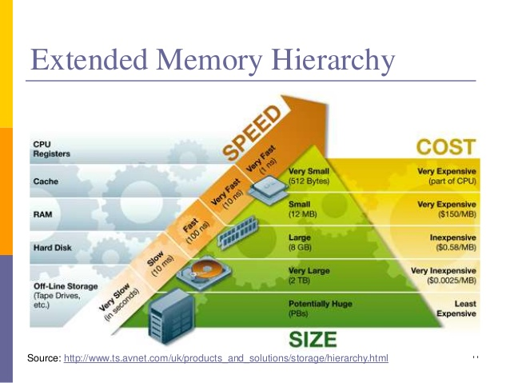

Czym jest hierarchia pamięci i jakie są konsekwencje jej istnienia dla wydajności programów?

---

# Wstęp
Idealny komputer powinien mieć jak największą i jak najszybsza pamięć. Nie jest to jednak możliwe, bo wraz ze wzrostem pojemności pamięci rosną jej fizyczne rozmiary, a to pociąga większy czas dostępu. Problem ten rozwiązuje się przez wyodrębnienie wielu warstw o zróżnicowanej pojemności i szybkości, tworzących razem hierarchię pamięci. Kolejne warstwy w miarę oddalania się od procesora mają coraz większe pojemności i coraz dłuższe czasy dostępu.

*Notka: Rzędy wielkości, które opisują czas dostępu, wielkość itp. na powyższym obrazku, są ważne i trzeba je znać.*

# Pamięć rejestrowa
Niewielkie, bardzo wydajne układy pamięci, które znajdują się wewnątrz procesora. Wykorzystywane są w bezpośrednich operacjach, które procesor wykonuje. Charakteryzuje się wysokim kosztem na bit.

# Pamięć podręczna (cache)
Cache procesora podzielony jest na kilka poziomów (zazwyczaj L1, L2, L3). Każdy kolejny ma większy rozmiar i czas dostępu. Razem jednak stanowią obszar pamięci o krótkim czasie dostępu. Służą do przechowywania rozkazów procesora oraz części danych, na których przeprowadzane są operacje. Charakteryzuje się wysokim kosztem na bit.

# Pamięć operacyjna (RAM)
Jest to główna pamięć komputera. Znajdują się tam dane oraz instrukcje aktualnie wykonywanych programów. Charakteryzuje się średnim czasem dostępu i pojemnością oraz niskim kosztem na bit.

# Pamięć dodatkowa (zewnętrzna)
Do tego rodzaju pamięci zaliczają się dyski twarde, dyski SSD, napędy optyczne. Charakteryzuje się bardzo dużą pojemnością, niskim kosztem na bit oraz bardzo długim czasem dostępu. Służy do przechowywania wszystkich danych użytkownika, czasem też wykorzystuje się ją jako _"dodatkową"_ pamięć operacyjną, jeśli wykorzystujemy **swap** (zobacz [stronicowanie i segmentacja](III.6.5 Segmentacja i stronicowanie.md)).

# Konsekwencje hierarchii pamięci
Z punktu widzenia wydajności programów ważne jest, aby odwołań do pamięci operacyjnej i zewnętrznej było jak najmniej. Takie odwołania w znacznym stopniu spowalniają działanie procesów. Popularnymi metodami radzenia sobie z opóźnieniami pamięci jest **zrównoleglanie** operacji oraz tzw. **prefetching**, czyli ładowanie danych do cache, zanim będą potrzebne. Dla programisty ważne jest, aby tworzone programy możliwie jak najlepiej zachowywały się według reguły **locality of reference**. Jej główne założenia:
* funkcje i dane, które często są używane wspólnie powinny zajmować obszar pamięci koło siebie
* dane oraz instrukcje powinny być wyrównane do słowa pamięci
* dane programu powinny być zorganizowane w sposób umożliwiający odczyt sekwencyjny
* jeśli to możliwe, to unikać dynamicznej alokacji pamięci, ponieważ proces alokacji jest kosztowny, powoduje fragmentację sterty oraz możliwy brak wyrównania pamięci.
