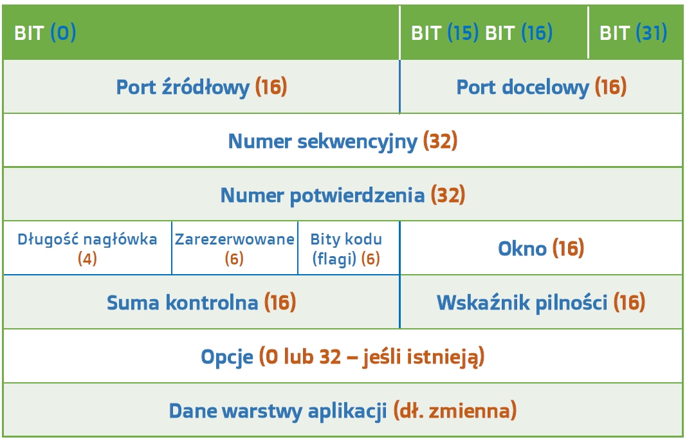
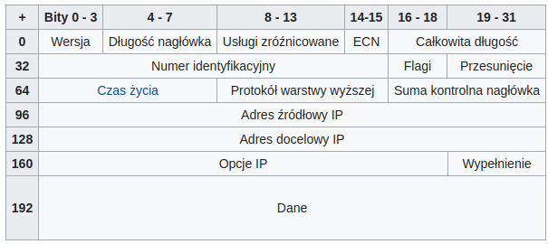
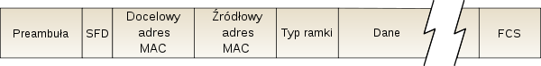
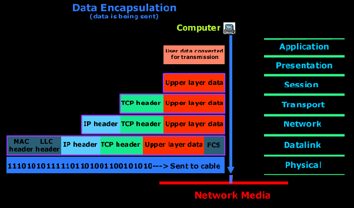

Warstwy. Jakie są konsekwencje warstwowej konstrukcji technologii sieciowych? Opisz jak jest fizycznie realizowana (np. w sieci 1000BASE-T) ramka Ethernet przesyłająca pakiet IPv4 zawierający fragment strumienia TCP podczas pobierania pliku z serwera
HTTP.

---

_1000Base-T_ - Sandard sieci Ethernet o przepływności $1$ Gb/s.

# Warstwy sieci
W latach 80-tych ISO przyjęło model **OSI**. Podstawowym jego założeniem był podział systemów sieciowych na 7 warstw współpracujących ze sobą w ściśle określony sposób. Każda z nich mogła być tworzona przez programistów zupełnie niezależnie, jeżeli narzucimy pewne protokoły według których wymieniają się one informacjami. Model **OSI** (*po prawej na rysunku*) nie odzwierciedlał jednak tak dobrze *prawdziwej* struktury Internetu jak wprowadzony później model **TCP/IP** (*po lewej na rysunku*). Jest obecnie stosowany i nim się zajmiemy.

## Warstwa aplikacji
W tej warstwie działają sieciowe aplikacje takie jak np. serwer WWW czy przeglądarka internetowa. Obejmuje ona zestaw gotowych protokołów, które aplikacje wykorzystują do przesyłania różnego typu informacji w sieci. Przykładowo: **HTTP**, **SMTP**, **FTP**, **DNS**.

Pakiety danych, którymi posługują się aplikacje w tej warstwie to **wiadomości**.

Model OSI zakładał dodatkowo istnienie warstwy prezentacji, która miała odpowiadać, za przedstawienie danych procesom działającym w warstwie aplikacji jako np. obrazki JPEG lub GIF oraz warstwę sesji, odpowiedzialnej za ustanowienie i utrzymanie połączenie między komunikującymi się hostami przez odpowiednie porty.

### HTTP
[HTTP](III.4.6 HTTP.md)

## Warstwa transportowa
Odpowiada za transport wiadomości z warstwy aplikacji, a także kieruje otrzymane wiadomości do odpowiednich aplikacji. Opiera sie na wykorzystaniu portów określonych dla każdego połączenia - może istnieć wiele połączeń pomiędzy dwoma komputerami i nie pomieszają się dzięki temu. To właśnie ta warstwa nawiązuje i zrywa połączenia między komputerami oraz zapewnia pewność transmisji.

Protokoły z tej warstwy to TCP oraz UDP. Pakiety w tej warstwie nazywane są **segmentami**.

TCP i UDP są głównymi protokołami warstwy transportowej. Odpowiadają za logiczne połączenie nadawcy z odbiorcą.

### TCP (Transmission Control Protocol)
Protokół ten zapewnia niezawodny transfer danych w porządku, z gwarancją, że zostaną one odebrane w takiej kolejności, w jakiej zostały wysłane. Zapewnia retransmisje uszkodzonych i utraconych pakietów. Zorientowany jest na połączenie, w wyniku czego wymiana danych może być dwustronna. W celu ustanowienia połączenia wykonywany jest tzw. handshaking. Ma również funkcję kontroli przeciążenia sieci __(congestion control)__ w celu jak najmniejszego niezbędnego obciążenia łączy. Wprowadza sumę kontrolną, która pomaga wykrywać uszkodzone dane.

## Warstwa sieci
Między warstwą sieci a medium transmicyjnym.

Sedno działania Internetu. Przetwarzane są tu datagramy posiadające adresy IP i ustalana jest odpowiednia droga do docelowego komputera w sieci. Protokoły z tej warstwy to między innymi **IPv4**, **IPv6**. Pakiety danych w tej warstwie nazywane są **datagramami**.

Główną rolę odgrywają tu **routery** - zajmują się kierowaniem ruchu w Internecie, bo znają topologię sieci. Proces odnajdywania przez routery właściwej drogi określa się jako **trasowanie**. Dla routerów warstwa sieci jest najwyższą. Przykładowe protokoły routowania: RIP, ARP, OSPF. 

IPv4 (ang. Internet Protocol version 4) – czwarta wersja protokołu komunikacyjnego IP przeznaczonego dla Internetu. Identyfikacja hostów w IPv4 opiera się na adresach IP. Dane przesyłane są w postaci standardowych datagramów. Wykorzystanie IPv4 jest możliwe niezależnie od technologii łączącej urządzenia sieciowe – sieć telefoniczna, kablowa, radiowa, itp. IPv4 znajduje się obecnie w powszechnym użyciu. 

## Warstwa łącza
Zajmuje się przekazywaniem danych przez fizyczne połączenia między urządzeniami sieciowymi (najczęściej są to karty sieciowe lub modemy). Protokoły to np. **Ethernet**, **WiFi**, **PPP**. Dodatkowo warstwa ta jest czasami wyposażona w protokoły do dynamicznego określania adresów IP.

Pakiety danych w tej warstwie nazywane są **ramkami** (frames).

### Ethernet
Technika, w której zawarte są standardy wykorzystywane w budowie głównie lokalnych sieci komputerowych. Obejmuje ona specyfikację przewodów oraz przesyłanych nimi sygnałów. Ethernet opisuje również format ramek i protokoły z dwóch najniższych warstw Modelu OSI. Jego specyfikacja została podana w standardzie IEEE 802.3.

 
## Warstwa fizyczna
Zadaniem warstwy fizycznej jest przesyłanie poszczególnych bitów danej ramki od jednego elementu sieci do kolejnego. Protokoły związane z konkretną metodą przesyłania danych, np. część fizyczna protokołów takich jak **IRDA**, czy **Bluetooth** lub zależne od technologii przewodzenia, np. **DSL**.

# Współdziałanie warstw
W momencie wysyłania wiadomości przez proces z warstwy aplikacji, dane są przekazywane warstwom niższego poziomu. Warstwy te dodają swoje własne nagłówki, dzięki którym mogą operować, po czym przesyłają dane. Następuje enkapsulajca. W momencie otrzymania wiadomości następuje proces odwrotny, a nagłówki są wykorzystane do scalenia pofragmentowanych wiadomości i przekazywane do góry.

# Konsekwencje (zalety) modelu warstwowego

Do podstawowych zalet modelu warstwowego należą:
* podział procesu komunikacji sieciowej na mniejsze, łatwiejsze do zarządzania elementy składowe
* możliwość niezależnego rozwoju poszczególnych warstw
* standaryzacja interfejsu
* zmniejszenie złożoności systemu, co pozwala na łatwiejsze jego zrozumienie
* możliwość prawidłowej diagnozy w przypadku awarii sieci
* utworzenie standardów składników sieci, dzięki czemu składniki te mogą być rozwijane i obsługiwane przez różnych producentów
* umożliwienie współpracy pomiędzy urządzeniami pochodzącymi od różnych producentów

# Alternatywny opis

5. Application layer: Message This layer consists of the connection protocols required for various network applications to communicate, such as HTTP, DHCP, SSH, FTP, SMTP, IMAP, and others. When you request a web page from a remote web site, a connection request is sent to the web server and the response is sent back to your host at this layer and then your browser displays the web page in its window.

4. Transport layer: TCP segment. The transport layer provides end-to-end data transport and flow management services that are independent of the data and types of protocols being transported. It uses ports such as 80 for HTTP and 25 for SMTP to make connections between the sending host and the remote host.

3. Internet layer: Packet. Packet routing is performed on the Internet layer. This layer is responsible for routing packets across two or more different networks in order to reach their final destination. This layer uses IP Addresses and the routing table to determine which device to send the packets to next. If sent to a router, each router is responsible for sending the data packets only to the next router in the series and not for mapping out the entire route from the local host to the target host. The Internet layer is mostly about routers talking to routers in order to determine the next router in the chain.

2. Data Link layer: Frame. The Link layer manages the direct connections between hardware hosts on a single, local, logical, physical network. This layer uses the Media Access Control (MAC) addresses embedded in the Network Interface Cards (NICs) to identify the physical devices attached to the local network. This layer cannot access hosts that are not on the local network.

1. Physical layer: Bits. This is the hardware layer and consists of the NICs and the physical Ethernet cable as well as the hardware level protocols used to transmit individual bits that make up the data frames between any two hosts or other network nodes that are locally connected.

