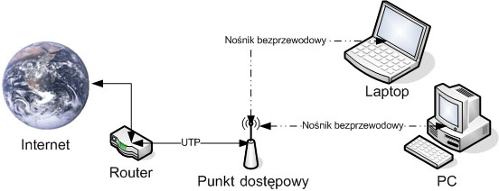

WiFi. Jaka jest rola punktu dostępowego w algorytmach współdzielenia
kanału komunikacji? Dlaczego WIFI nie korzysta z algorytmów type Carrier Sense?

---

## Definicja

WiFi to zestaw standardów stworzonych do budowy bezprzewodowych sieci komputerowych.

## Punkt dostępu, punkt dostępowy (ang. access point, AP) 
Urządzenie zapewniające hostom dostęp do sieci komputerowej za pomocą bezprzewodowego nośnika transmisyjnego, jakim są fale radiowe.

Punkt dostępowy jest zazwyczaj mostem łączącym bezprzewodową sieć lokalną (WLAN) z siecią lokalną (LAN). W związku z tym punkt dostępowy musi posiadać co najmniej dwa interfejsy sieciowe:

* bezprzewodowy działający w oparciu o standard IEEE 802.11 (Wi-Fi)
* przewodowy służący połączeniu PD z siecią standardu IEEE 802.3 (Ethernet) bądź modem standardu DSL

Większość współcześnie wytwarzanych punktów dostępowych wyposażonych jest w serwer DHCP, koncentrator sieciowy i router pełniący rolę bramy sieciowej. Niektóre modele wyposażone są dodatkowo w interfejs standardu USB, umożliwiając tym samym podłączenie i następnie współdzielenie np. drukarki.

# Role
* Access point w WiFi
* Stacja bazowa (w systemach łączności bezprzewodowej (w tym GSM) urządzenie wyposażone w antenę fal elektromagnetycznych, często na wysokim maszcie, łączące terminal ruchomy (telefon komórkowy, pager) z częścią stałą cyfrowej sieci telekomunikacyjnej) w GSM
* nawiązywanie połączenia
* sterowanie komunikacją
* przekazywanie połączeń
* bezpieczeństwo

## Carrier Sense
Carrier Sense (wykrywanie nośnej) określa fakt, iż nadajnik nasłuchuje ruchu w medium, zanim będzie próbował przesłać nim sygnał. Takie podejście pozwala na wykrycie obecności sygnału wysłanego z innego nadajnika i pozwala na bezkolizyjne przesłanie własnego sygnału. Jeśli medium jest zajęte, wszystkie nadajniki na nim pracujące muszą czekać na zwolnienie, czyli do momentu, gdy sygnał dotrze do celu.

W przypadku sieci Ethernet protokół wykrywa, kiedy kanał komunikacyjny jest zajęty, i czeka, aż będzie wolny, zanim wyśle dane (wykrywanie nośnej). Ethernet dodaje również protokół wykrywania kolizji jako optymalizację. Jeśli zostanie wykryta kolizja, węzły przestają wysyłać dane i wykorzystują losowy algorytm wycofywania, aby zdecydować, kiedy ponownie rozpocząć wysyłanie. Razem algorytmy te tworzą wielokrotny dostęp w sensie nośnym z algorytmem wykrywania kolizji (CSMA / CD).

WiFi wykorzystuje strategię podobną do Ethernet, ale jest ograniczony przez kanał komunikacyjny - nie ma niezawodnego sposobu na wykrycie kolizji za pomocą fal radiowych. Dlatego zamiast wykrywania kolizji WiFi wykorzystuje strategię unikania kolizji zdefiniowaną przez nośny dostęp wielokrotny z algorytmem unikania kolizji (CSMA / CA).

Bezprzewodowe urządzenia nadawczo-odbiorcze nie mogą jednocześnie wysyłać i odbierać tego samego kanału, więc nie mogą wykryć kolizji. Wynika to z faktu, że istnieje niewiarygodna różnica między mocą wysyłania (zwykle około 100 mw) a czułością odbioru (zwykle około 0,01 do 0,0001 mw). Wysyłanie ukryłoby każdą możliwą szansę otrzymania obcego sygnału, brak szansy na „Wykrywanie kolizji”. Z tego powodu konieczne jest unikanie kolizji z komunikatami kontrolnymi.

W większości sieci przewodowych (np. Ethernet) napięcie wynosi około 1 do 2,5 V; zarówno wysyłanie, jak i odbieranie mają w przybliżeniu to samo napięcie. Jeśli więc wysyłasz sygnał o napięciu 2,5 V, a ktoś inny zderzy się z sygnałem o napięciu -2,5 V, części „Wykrywanie” zobaczą sygnał gdzieś w pobliżu 0 V i wiedzą, że doszło do kolizji.
