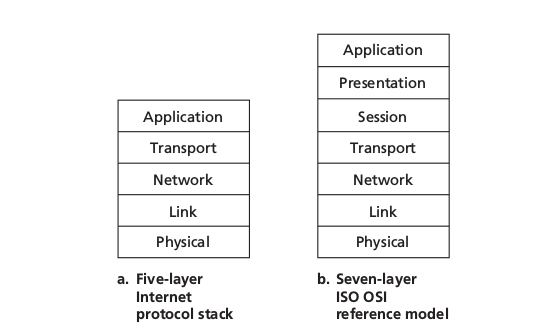
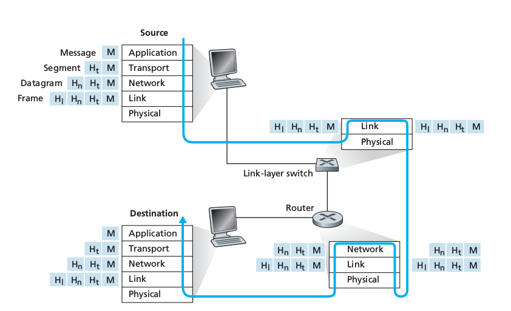

Model warstwowy sieci - omówienie warstw oraz mechanizmów współdziałania ze sobą.

---

# Warstwy sieci
W latach 80-tych ISO przyjęło model **OSI**. Podstawowym jego założeniem był podział systemów sieciowych na 7 warstw współpracujących ze sobą w ściśle określony sposób. Każda z nich mogła być tworzona przez programistów zupełnie niezależnie, jeżeli narzucimy pewne protokoły według których wymieniają się one informacjami. Model **OSI** (*po prawej na rysunku*) nie odzwierciedlał jednak tak dobrze *prawdziwej* struktury Internetu jak wprowadzony później model **TCP/IP** (*po lewej na rysunku*). Jest obecnie stosowany i nim się zajmiemy.

## Warstwa aplikacji
W tej warstwie działają sieciowe aplikacje takie jak np. serwer WWW czy przeglądarka internetowa. Obejmuje ona zestaw gotowych protokołów, które aplikacje wykorzystują do przesyłania różnego typu informacji w sieci. Przykładowo:

  * **HTTP**,
  * **SMTP**,
  * **FTP**,
  * **DNS**.

Pakiety danych, którymi posługują się aplikacje w tej warstwie to **wiadomości**.

Model OSI zakładał dodatkowo istnienie warstwy prezentacji, która miała odpowiadać, za przedstawienie danych procesom działającym w warstwie aplikacji jako np. obrazki JPEG lub GIF oraz warstwę sesji, odpowiedzialnej za ustanowienie i utrzymanie połączenie między komunikującymi się hostami przez odpowiednie porty.

## Warstwa transportowa
Odpowiada za transport wiadomości z warstwy aplikacji, a także kieruje otrzymane wiadomości do odpowiednich aplikacji. Opiera sie na wykorzystaniu portów określonych dla każdego połączenia - może istnieć wiele połączeń pomiędzy dwoma komputerami i nie pomieszają się dzięki temu. To właśnie ta warstwa nawiązuje i zrywa połączenia między komputerami oraz zapewnia pewność transmisji.

Protokoły z tej warstwy to TCP oraz UDP. Pakiety w tej warstwie nazywane są **segmentami**.

## Warstwa sieci
Sedno działania Internetu. Przetwarzane są tu datagramy posiadające adresy IP i ustalana jest odpowiednia droga do docelowego komputera w sieci. Protokoły z tej warstwy to między innymi **IPv4**, **IPv6**. Pakiety danych w tej warstwie nazywane są **datagramami**.

Główną rolę odgrywają tu **routery** - zajmują się kierowaniem ruchu w Internecie, bo znają topologię sieci. Proces odnajdywania przez routery właściwej drogi określa się jako **trasowanie**. Dla routerów warstwa sieci jest najwyższą. Przykładowe protokoły routowania: RIP, ARP, OSPF. 

## Warstwa łącza
Zajmuje się przekazywaniem danych przez fizyczne połączenia między urządzeniami sieciowymi (najczęściej są to karty sieciowe lub modemy). Protokoły to np. **Ethernet**, **WiFi**, **PPP**. Dodatkowo warstwa ta jest czasami wyposażona w protokoły do dynamicznego określania adresów IP.

Pakiety danych w tej warstwie nazywane są **ramkami** (frames).
 
## Warstwa fizyczna
Zadaniem warstwy fizycznej jest przesyłanie poszczególnych bitów danej ramki od jednego elementu sieci do kolejnego. Protokoły związane z konkretną metodą przesyłania danych, np. część fizyczna protokołów takich jak **IRDA**, czy **Bluetooth** lub zależne od technologii przewodzenia, np. **DSL**.

# Współdziałanie warstw
W momencie wysyłania wiadomości przez proces z warstwy aplikacji, dane są przekazywane warstwom niższego poziomu. Warstwy te dodają swoje własne nagłówki, dzięki którym mogą operować, po czym przesyłają dane. Następuje enkapsulajca. W momencie otrzymania wiadomości następuje proces odwrotny, a nagłówki są wykorzystane do scalenia pofragmentowanych wiadomości i przekazywane do góry.

