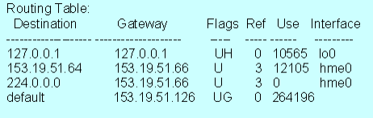

Trasowanie (routowanie) w Internecie.

---

# Wstęp
Trasowanie (Routing) to mechanizm wyznaczania trasy i przesyłania pakietów danych w intersieci, od stacji nadawczej do stacji odbiorczej. Intersieć to **minimum dwie** sieci fizyczne połączone ze sobą za pomocą routera.

Trasowaniem zajmuje się urządzenie zwane **routerem**: może to być zwykły komputer jak i urządzenie specjalnie dedykowane tylko do tego zadania, tzw. router sprzętowy.

Trasowanie umożliwia danym z jednej sieci lokalnej dotrzeć do innej sieci lokalnej, która może znajdować się w dowolnym miejscu na świecie. Trasa może prowadzić przez wiele sieci pośrednich, tak więc routing jest jakby spoiwem łączącym Internet w całość. Bez routowania cały ruch danych byłby ograniczony do jednej fizycznej sieci.

Trasowanie realizowane jest w warstwie sieci. Wyznaczane trasy pakietów danych musza być jak najbardziej **optymalne** – czyli możliwie najszybsze, ale umożliwiające dostarczenie wszystkich pakietów.

# Etapy trasowania
* Host generuje pakiety i decyduje, czy dostarczyć je bezpośrednio do adresata, czy przesłać do routera.
* Router obniża wartość TTL w otrzymanym datagramie. Jeśli TTL wynosi $0$, to pakiet należy odrzucić i odesłać do nadawcy informacje z kodem _TTL Exceeded_ (za pomocą protokołu **ICMP**).
* Router decyduje, czy pakiet należy przekazać bezpośrednio adresatowi, czy też wysłać do innego routera.

# Tablica routingu
Router przechowuje tzw. tablicę routingu. Zawiera ona informacje o adresach urządzeń połączonych bezpośrednio oraz adresy sieci wraz z adresami routerów, do których należy przekierowywać pakiety. Oprócz tego tablica ta zawiera takie informacje jak koszt danej ścieżki, interfejs, na który należy kierować pakiet, flagi określające drożność i bezpośredniość ścieżki, czas ostatniego uaktualnienia informacji o trasie.

# Rodzaje routingu
Pod względem sposobu wypełniania danymi tych tablic, dzielimy routing na statyczny i dynamiczny.

## Routing statyczny
Najprostszą formą budowania informacji o topologii sieci są ręcznie podane przez administratora trasy definiujące routing statyczny. Przy tworzeniu takiej trasy wymagane jest jedynie podanie adresu sieci docelowej, interfejsu, przez który pakiet ma zostać wysłany oraz adresu IP następnego routera na trasie.

Zaletami routingu statycznego jest to, że nie potrzebuje obliczać tras, co obniża czas obliczeniowy oraz nie wymaga zaawansowanego sprzętu. Zmniejsza również ilość przesyłanych pakietów, gdyż nie są wymieniane wiadomości związane z obliczeniem trasy. Zapewnia on też konfigurację tzw. bramki ostatniej szansy (gateway of the last resort) w przypadku, gdy żaden inny wpis w tablicy nie był odpowiedni.

Wadami jest konieczność nakładu pracy człowieka, podatność na błędy podczas wprowadzania oraz brak możliwości automatycznej rekonfiguracji w przypadku jakiejś awarii na raz wprowadzonej trasie.

## Routing dynamiczny
Korzysta z algorytmów, które automatycznie dostosowują trasy w zależności od usterek i natężenia ruchu w sieci. W wypadku, gdy aktualizujący komunikat trasowania wskazuje, że w sieci wystąpiły zmiany, oprogramowanie trasujące ponownie oblicza trasy i wysyła do routerów nowe komunikaty aktualizujące.

Popularne protokoły, które używane są w routowaniu dynamicznym to:
* **OSPF** - Open Shortest Path First - wybierana jest trasa względem najmniejszego kosztu
* **RIP** - Routing Information Protocol - stosowany w niewielkich sieciach, odległość jest mierzona w skokach, jakie należy wykonać, aby dotrzeć do adresata

# Miary trasowania
Popularne miary stosowane podczas obliczania algorytmów routingu to:
* długość ścieżki,
* niezawodność,
* opóźnienie,
* szerokość pasma (bandwidth) - teoretyczna miara, jak wiele danych można przesłać łączem w bitach (lub wielokrotności) na sekundę,
* przepustowość (throughput) - miara, ile faktycznie da się wysłać danych łączem,
* obciążenie łącza,
* koszt komunikacji (korzystanie z niektórych linii może być droższe).