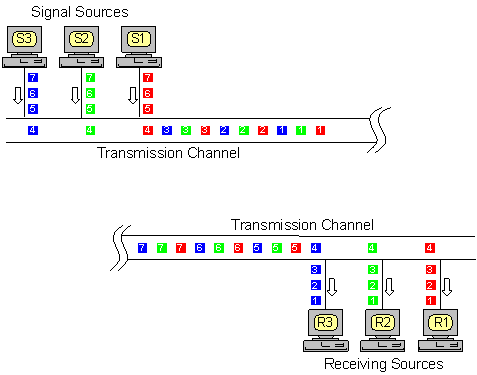

Multipleksacja i demultipleksacja.

---

# Wstęp
Multipleksacja i demultipleksacja to metody, które realizują komunikację wielu źródeł jednocześnie w jednym medium transmisyjnym. Obecne jest zarówno na poziomie **telekomunikacyjnym** (mechanicznym), jak i **warstwy transportowej** (TCP, UDP). Są to procesy wzajemnie odwrotne, pierwszy polega na połączeniu wielu źródeł do jednego kanału, drugie zaś rozdzielenie do hostów docelowych. Celem jest sprawienie, by użytkownicy nie odczuli współdzielenia kanału transmisyjnego.

# Przestrzenna (SDM - Space Division Multiplexing)
Wykorzystuje ograniczenia zasięgu fal elektromagnetycznych. Najprostszym przykładem tej multipleksacji jest telefonia komórkowa GSM. Chociaż aparatów telefonicznych na świecie jest zbyt wiele na jednoczesne połączenie, w zasięgu jednej komórki GSM ich liczba jest znacznie mniejsza.

# Podział czasu (TDM - Time Division Multiplexing)
Przesyłane sygnały dzielone są na części, którym później przypisywane są czasy transmisji tzw. szczeliny czasowe. Najpierw przesyłana jest pierwsza część pierwszego sygnału, potem pierwsza część drugiego sygnału itd. Gdy zostaną przesłane wszystkie pierwsze części, do głosu dochodzą drugie, a następnie kolejne. Wadą tego rozwiązania jest mała przepustowość - znaczna część czasu może być tracona, gdy jakieś urządzenie jest nieaktywne, a ma przypisany slot czasowy.

# Podział częstotliwości (FDM - Frequency Division Multiplexing)
Sygnały z różnych źródeł nadawane są na różnych częstotliwościach. Rozwiązuje to problem przepustowości, który powodował podział na szczeliny czasu, jednak sprawia kłopoty związane z szumami, szczególnie w wyższych częstotliwościach.

# Podział kodowy (CDM - Code Division Multiplexing)
Sposób ten polega na wykorzystaniu jednego pasma transmisyjnego, ale z wymaganiem, aby każdy pakiet był kodowany unikalnym identyfikatorem. Przykładem może być użycie tej idei w warstwie transportowej. Jednocześnie na maszynie może być uruchomionych kilka procesów, które komunikują się przez sieć. Wobec tego należy rozróżnić, docelowe procesy dla przychodzących pakietów. W _TCP_ oraz _UDP_ jest to rozwiązane poprzez dodanie nagłówka, który zawiera port źródłowy jak i docelowy.
