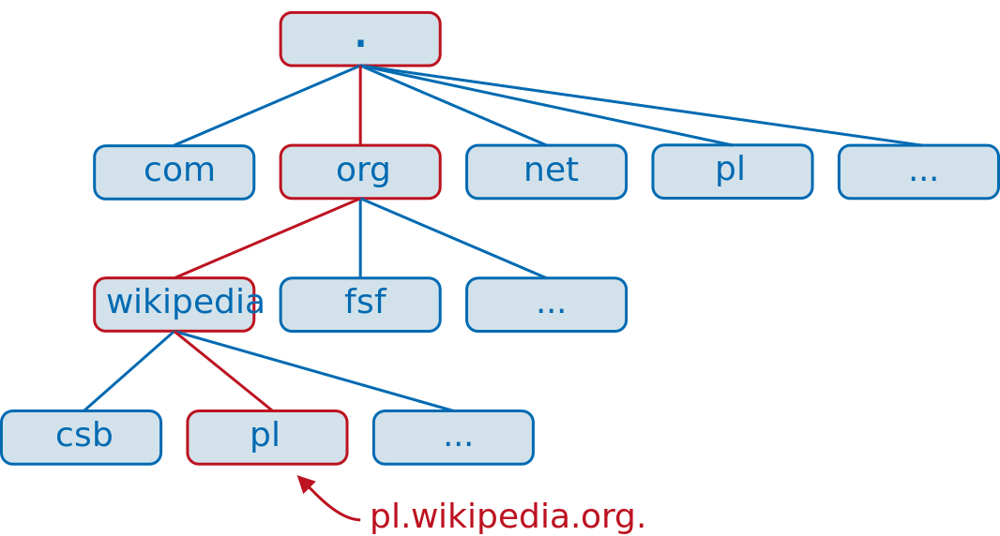

Organizacja domen w Internecie, translacja adresów symbolicznych na IP.

---

# Wstęp
Maszyny w Internecie adresowane są na dwa sposoby. Pierwszy z nich, **symboliczny** jest używany przez ludzi. Odpowiada on typowym domenom np. `www.google.com`. Z drugiego zaś, **numerycznego** w postaci **adresów IP**, korzystają głównie maszyny. Usługa zwana **DNS** służy do translacji adresów z języka ludzkiego na język maszynowy.

## Domena internetowa
Jest to ciąg nazw systemu **DNS**, który składa się z wyrazów umieszczonych w pewnym poddrzewie struktury DNS tj. zakończonych stałym sufiksem (np. `.wikipedia.org`).

# Organizacja domen
Domeny internetowe zorganizowane są w hierarchiczną strukturę korzenia DNS ('.'), która nie ma własnej nazwy. Pod korzeniem znajdują się domeny najwyższego poziomu (TLD - Top-Level Domains), do których należą domeny krajów: `pl`, `de`, `uk` oraz niezależne takie jak: `com`, `org`, `edu`, `net`, `name`. Pod nimi znajdują się domeny niższego poziomu.

# DNS (Domain Name Server)
Głównym jego zadaniem jest tłumaczenie adresów symbolicznych do adresów IP. DNS jest:
* rozproszoną bazą danych zaimplementowaną w hierarchii serwerów DNS
* protokołem warstwy aplikacji, który umożliwia hostom wysyłanie zapytań do tej bazy

## Zasada działania (przykład)
Użytkownik poprzez przeglądarkę chce dostać się do zasobu znajdującego się pod określonym adresem URL na przykład `http://www.example.com/index.html`. Następnie:
* uruchomiony zostaje klient protokołu DNS
* przeglądarka przekazuje domenę z adresu URL do procesu DNS
* klient DNS wysyła zapytanie do lokalnego serwera DNS
* po pewnym czasie klient otrzymuje odpowiedź od serwera w postaci adresu IP
* przeglądarka może ostatecznie nawiązać połączenie i przekazać zapytanie HTTP do docelowej maszyny

## Translacje adresów
Serwery DNS zorganizowane są w strukturę hierarchiczną. Klient kontaktuje się bezpośrednio z lokalnym serwerem DNS.

### Wersja iteracyjna
Jeśli ten serwer nie potrafi dostarczyć docelowego adresu IP, to odpytuje się jednego z tzw. root serwerów (lub innego name servera, jeśli zna adres odpowiadający dla danego sufiksu), który zwraca listę adresów IP serwerów odpowiedzialnych za TLD (lub odpowiednio kolejne części zapytania) zapytania. Następnie analogicznie odpytuje kolejne serwery o kolejne fragmenty domeny.

### Wersja rekurencyjna
Podobnie, jeśli serwer lokalny nie potrafi zmapować adresu, to odpytuje się roota, z tym że zapytanie wykonywane jest rekurencyjnie na kolejnych serwerach, a dopiero na koniec wynik zwracany do serwera lokalnego i potem klienta. Zaletą tego rozwiązania jest to, że większa liczba serwerów można poznać danych adres IP i wprowadzić go do cache'u.

W rzeczywistości oba sposoby mogą być mieszane ze sobą.