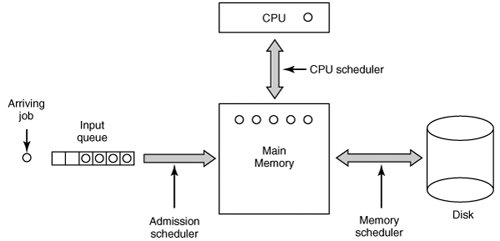

Porównaj mechanizmy szeregowania zadań na przykładzie serwera przetwarzającego zadania w trybie wsadowym, oraz systemu interaktywnego.

---

# Scheduler
Jego obowiązkiem jest szeregowanie zadań, decydowanie, który proces powinien jako następny uzyskać czas procesora oraz podejmowanie decyzji o wywłaszczaniu procesów.

# Wymagania dla schedulera
Wymagania dla schedulera różnią się w zależności od specyfiki systemu operacyjnego i jego przeznaczenia.

  ## Wspólne
  * Fairness - podobne procesy traktowane są jednakowo, dostają podobną ilość czasu procesora
  * Policy enforcment - uwzględnianie priorytetów procesów
  * Balance - balansowanie zadań pomiędzy części sytemu, tak aby wszystkie były zajęte.

  ## Systemy wsadowe (batch systems)
  Systemy te nie opierają się na interakcji z użytkownikiem. Ich jedynym celem jest maksymalna wydajność w realizacji zadań. Kluczowe jest utrzymanie jak największego obciążenia procesora.

  * Throughput - maksymalizacja wykonanych zadań na godzinę
  * Turnaround time - minimalizacja czasu pomiędzy pojawieniem się zadania, a jego ukończeniem
  * CPU utilization - utrzymywanie maksymalnie dużego obciążenia procesora

  ## Systemy interaktywne
  Systemy te obsługują wielu użytkowników równocześnie. Celem jest minimalizacja czasu odpowiedzi na zlecone zadanie. Należy też zapobiegać zajmowaniu czasu procesora przez jeden porces przez zbyt długi czas oraz zabezpieczyć się, aby  błąd jednego procesu nie miał wpływu na pozostale.

  * Response time - szybka reakcja na zapytania
  * Proportionality - opóźnienie reakcji systemu na dane zadanie proporcjonalne do długości czasu jego wykonania

# Algorytmy schedulowania dla systemów wsadowych

  ## First-Come First-Served
  Zadania, pojawiając się w systemie, wrzucane są na kolejkę. Kiedy proces blokuje się lub kończy działanie, zwalnia procesor, z kolejki ściągany jest kolejny proces, a poprzedni w przypadku przejścia ze stanu zablokowanego w gotowy, wrzucany jest z powrotem na koniec kolejki.

  ### Wady:
  * wiele procesów może pracować współbieżnie, co powoduje znaczne obciążenie pamięci
  * słabe wskaźniki wymagane od schedulera systemu wsadowego
  * jeśli wszystkie procesy są zablokowane na I/O, to dodawane są nowe, czas oczekiwania na I/O wydłuża się coraz bardziej

  ## Shortest Job First
  Załóżmy, że umiemy oszacować czas całkowity wykonania zadania (nie tylko sam czas pracy na CPU). Algorytm polega na wybraniu tego zadania, który ma najmniejszy czas.

  ### Zalety:
  * optymalny z punktu widzenia turnaround time, jednak jedynie w przypadku offline (znamy czas oraz moment pojawienie się wszystkich zadań przed rozpoczęciem pracy)

  ### Wady:
  * nie jest optymalny w przypadku online (zadania pojawiają się w systemie na bieżąco, nie znamy ich rozkladu wcześniej) - przykład: zadania A,B,C,D,E o wagach 2,4,1,1,1 przychodzą w chwilach 0,0,3,3,3. Średnia wynosi 4.6. W przypadku wykonania w kolejności B,C,D,E,A uzyskamy średnią 4.4
  * brak mechanizmów równoważących jednakowe obciążenie CPU i I/O

  ## Shortest Remaining Time Next
  Nieco rozbudowany algorytm Shortest Job First. Polega na wyborze procesu o najkrótszym pozostałym czasie do zakończenia zadania. Pozwala na wywłaszczanie procesu w przypadku pojawienia się zadania o krótszym czasie.

  ### Zalety:
  * krótkie zadanie realizowane są szybko
  * optymalny ze względu na turnaround time w wersji online (przy zaniedbaniu kosztu zmian kontekstu, schedulera i korzyści z równoważenia)

  ### Wady:
  * brak mechanizmów równoważących jednakowe obciążenie CPU i I/O
  * pesymistycznie turnaround time może być wysoki (jedno dłuższe zadanie cały czas wywłaszczane przez przychodzące krótsze, co dodatkowo zwiększa nakład zmian kontekstu)

  ## Three-Level Scheduling
  Algorytm ten jest oparty na trzech mniejszych schedulerach:
  * admission scheduler - decyduje które procesy przepuścić do systemu, minimalizuje turnaround time
  * memory scheduler - decyduje które procesy należy tymczasowo zeswapować na dysk, jeśli nie mieszczą się w pamięci operacyjnej
  * CPU scheduler - wybiera proces spośród gotowych zadań, któremu ma zostać przyznany czas procesora

  

# Algorytmy schedulowania dla systemów interaktywnych

  ## Round-Robin
  Każdy proces otrzymuje kwant czasu i trafia do kolejki. Gdy zostanie przydzielony do procesora, pracuje na nim tak długo, na ile pozwala mu przyznany kwant czasu. W przypadku gdy zużyje kwant czasu, zostaje wywłaszczony i trafia na koniec kolejki wraz z nowym kwantem czasu. Jeśli przed wykorzystaniem przyznanego kwantu czasu zablokuje się, to po ponownym przejściu w stan gotowości trafia na początek kolejki wraz z pozostałym kwantem czasu. 

  Ważnym parametrem do ustalenia w tym algorytmie jest wielkość kwantu czasu. Nie może być zbyt duży, aby nie zmniejszać czasu reakcji systemu, ale równocześnie zbyt mały, gdyż spory odsetek czasu procesora byłby tracony na zmiany kontekstu. W praktyce stosuje się ok. 20-50 msec.

  Wadą algorytmu jest to, że wszystkie procesy są traktowane równo, niezależnie od priorytetu.

  ## Priority Scheduling
  Algorytm ten jest uogólnieniem powyższego. Modyfikacje polegają na:
  * przyznany kwant czasu zależy od priorytetu procesu
  * dla każdego priorytetu jest przeznaczona osobna kolejka, poza tym wyższe priorytety mają pierwszeństwo
  * priorytet może być przydzielany statycznie lub dynamicznie (np. jeśli proces zużył $1/f$ swojego kwantu, to dostaje priorytet $f$)
  * dostępne kwanty czasu narastają wraz z niższym priorytetem

  ## Guaranteed scheduling
  * każdy proces ma zagwarantowany pewny procent czasu procesora
  * scheduler wybiera procesy tak, by wypełnić zobowiązanie

  ## Fair Share scheduling
  Bardzo podobny do poprzedniego algorytmu, z taką modyfikacją, że podział czasu procesora występuję pomiędzy poszczególnych użytkowników, a nie zadania. W ten sposób unikamy sytuacji, gdy użytkownik A wystartuje 9 procesów, a użytkownik B 1 proces, to ten pierwszy uzyska 90% czasu CPU.

  ## Lottery scheduling
  Algorytm ten jest randomizowany. Przed loterią każdy proces dostaje pewną ilość żetonów. Następnie losowany jest jakiś żeton, a jego właściciel dostaje pewien okres czasu obliczeniowego na CPU. Dodatkowo kooperujące procesy mogą wymieniać się żetonami. Zaletą tego algorytmu jest to, że nowo pojawiające się zadania otrzymują szansę uzyskania czasu na CPU już przy najbliższym losowaniu.
