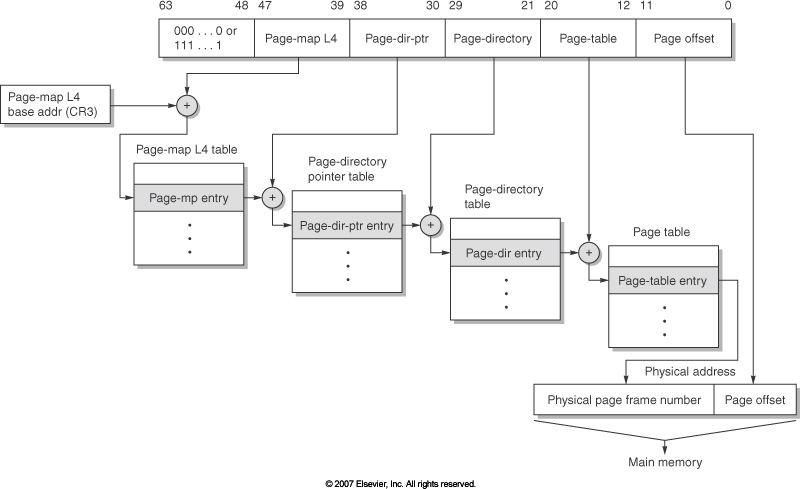
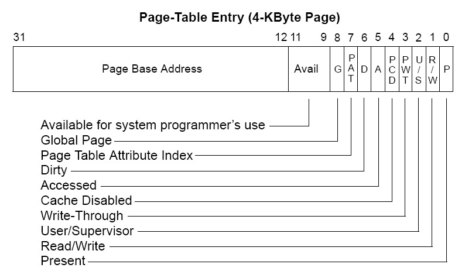

Segmentacja i stronicowanie - porównaj mechanizmy. Opisz jak te mechanizmy są
wykorzystywane na przykładzie wybranego systemu operacyjnego.

---

Szczegóły dotyczące obu tych mechanizmów zależą bardzo od architektury
procesora.

# Segmentacja

Segmentacja jest podziałem pamięci komputera na segmenty, którymi zarządza
system operacyjny i do których dostęp mają programy. W danym procesie segment
najczęściej identyfikuje jakąś logiczną część, na przykład wyróżniany jest
segment kodu, danych itp. Segmenty są dość duże i programy najczęściej mają
dostęp do ich niewielkiej ilości. Dwa segmenty są zwykle całkowicie rozłącznie,
ale mogą też na siebie nachodzić.

Segmentacja jest mechanizmem, który zamienia nam jedną dużą liniową przestrzeń
adresową na kilka odrębnych liniowych przestrzeni adresowych, którymi można
zarządzać oddzielnie.

## Implementacja

Każdy adres pamięci reprezentowany jest przez numer segmentu (który jest
przechowywany najczęściej w jednym ze specjalnych rejestrów segmentowych) oraz
przesunięcie w tym segmencie. Poszczególne segmenty mają określony rozmiar,
który może się zmieniać.

Za zamianę numeru segmentu i przesunięcia na adres fizyczny odpowiedzialny jest
MMU (memory management unit) w procesorze.

## Ochrona pamięci

Segmentacja jest mechanizmem ochrony pamięci. Każdy segment posiada ustalony
zbiór atrybutów takich jak:

  - read - pozwala na odczyt danych z segmentu
  - write - pozwala na zapis danych do segmentu
  - execute - pozwala na wykonywanie kodu zapisanego w segmencie

Każdy proces ma przypisany zbiór segmentów, których może używać. Przy próbie
odczytu danych z innych segmentów procesor wywołuje wyjątek `segmentation fault`.
Dzięki temu, procesy bez pozwolenia systemu operacyjnego nie mogą sobie nawzajem
czytać z ani pisać po pamięci.

## Segmentacja w amd64

W architekturze amd64 segmentacja nie jest w ogóle wspierana.

Jest tak dlatego, że segmentacja okazała się mechanizmem który jest mało
elastyczny w porównaniu do stronicowania. Ponieważ segmenty są duże, różnych
rozmiarów i zajmują pewien liniowy przedział pamięci fizycznej, efektywne
walczenie z fragmentacją pamięci staje się bardzo kłopotliwe.

Innym problemem jest fakt, że o ile sama koncepcja jest ciekawa, to żaden język
programowania nie dał programistom narzędzi, które pozwoliły by im w jakikolwiek
sposób ją wykorzystać.

Prawie wszystkie rozwiązania, które zapewnia segmentacja można dość łatwo
częściowo zapewnić używając stronicowania. Na przykład, jeśli chcemy kilka łatwo
rozszerzalnych liniowych przestrzeni adresowych, po prostu alokujemy bloki
pamięci tych przestrzeni bardzo daleko od siebie w gigantycznej 64 bitowej
wirtualnej przestrzeni adresowej.

## Uwagi

 - Można łatwo współdzielić pamięć pomiędzy procesami. Jakiś segment może być
   przypisany do więcej niż jednego procesu.

 - Można próbować zapisywać całe segmenty na dysku gdy nie są potrzebne, ale
obecnie ze względu na duży rozmiar segmentów jest to całkowicie niepraktyczne.

 - Ponieważ dostęp do pamięci segmentowej wymaga użycia rejestrów segmentowych,
   których jest mała ilość, używanie dużej ilości segmentów staje się
   kłopotliwe.

 - Kompilator generujący kod assemblera i programista assemblera muszą być
   świadomi istnienia segmentacji. Segmentacja nie jest mechanizmem
   przeźroczystym dla programów.

# Stronicowanie

Stronicowanie jest mechanizmem zarządzania pamięcią, który dzieli pamięć na
strony (najczęściej wielkości 4KB, aczkolwiek można spotkać strony wielkości od
512B do setek megabajtów), dzięki czemu system operacyjny może nią łatwiej
zarządzać. To, ile dany proces może mieć stron, zależy tylko i wyłącznie od tego,
ile pamięci używa. Wszystkie strony pamięci są stałych rozmiarów i nie mogą
na siebie nachodzić.

## Implementacja

Każdy adres którym operuje proces jest tak naprawdę adresem logicznym, więc gdy
proces próbuje z niego odczytać wartość, najpierw musi być on zamieniony na
adres fizyczny. Operacja ta jest przeprowadzana przez MMU, który korzysta z
tablicy stron (Page table).

Adres wirtualny składa się z dwóch części, numeru strony oraz przesunięcia
w tej stronie. Mając adres wirtualny, MMU jest w stanie poprzez odcięcie kilku
bitów, wyznaczyć numer strony, na przykład:

```
adres: 0x6F7E8621
strona: 0x6F7E8, przesunięcie: 0x621
```

Następnie MMU odczytuje z tablicy stron, pod jakim adresem fizycznym
znajduje się dana strona. Jeśli dana strona nie jest dostępna, to jest rzucany
wyjątek do systemu operacyjnego, który może albo przekazać ten wyjątek dalej do
procesu, albo wczytać stronę z dysku jeśli na przykład została ona tam
przeniesiona.

### TLB (translation lookaside buffer)

Ponieważ każdy odczyt z tablicy stron odnosi się do pamięci fizycznej, to MMU
używa TLB, który jest specjalnym cachem ze stronami pamięci, które są często
używane. Podobnie jak w przypadku cache procesora, TLB może być wielopoziomowe.

### Wielopoziomowa tablica stron

Tablica stron może być bardzo duża, i jest bardzo duża w przypadku na przykład
systemów 64 bitowych, tak więc często stosuje się wielopoziomowe tablice stron
by zaoszczędzić zużycie pamięci. Zamiana adresu logicznego na fizyczny wygląda
w nich w następujący sposób:



### Wpis w tablicy stron

*Komentarz: Ten podpunkt jest do zrozumienia, nie trzeba zdecydowanie tego umieć!*

Wpis w tablicy stron nie zawiera tylko adresu strony, ale też dodatkowe atrybuty.



Przykładowe atrybuty:

 - Read/Write - Określa czy do strony można pisać, czy tylko z niej czytać.
 - Dirty, Accessed - Ustawiane przez procesor gdy coś jest do strony odpowiednio
   zapisane lub czytane. Bardzo użyteczne dla systemu operacyjnego w celu
   ustalenia czy warto daną stronę swapować czy nie.
 - Write-Through - Każdy zapis do pamięci ma zawsze trafiać do RAMu. (normalne
   zapisy trafiają do cache i raz na jakiś czas cache jest flushowany do RAMu).
 - NX - Nie ma go w diagramie wyżej, lecz jest obecny w każdej nowej
   architekturze. Bit ten informuje czy można wykonywać kod z danej strony
   pamięci.

## Ochrona pamięci

Stronicowanie jest mechanizmem ochrony pamięci. Ponieważ każdy proces ma swoją
własną tablicę stron, nie ma on dostępu do pamięci fizycznej innych procesów.

Dodatkowo, tak jak każdy segment, każda strona pamięci ma atrybuty dostępu, 
dzięki którym MMU wie co dany proces może zrobić z daną stroną pamięci. Jeśli
proces próbuje wykonać coś nielegalnego, na przykład zapisać dane do strony
tylko do odczytu, procesor rzuca wyjątek `page exception`.

## Uwagi

- System operacyjny może bardzo łatwo dzięki stronicowaniu zapewnić
  współdzielenie pamięci pomiędzy dwoma procesami. Wystarczy, że w tablicy
  stron dwa procesy będą miały wpis, który odnosi się do tego samego obszaru
  w pamięci fizycznej.

- Stronicowanie jest mechanizmem całkowicie przeźroczystym dla programisty
  i kompilatora. Jedynym miejscem, w którym programista może się nią przejmować
  jest, gdy optymalizuje on na bardzo niskim poziomie wydajność aplikacji.

- Dzięki temu, że strony są dość małe można bardzo łatwo i szybko swapować
  je z i na dysk twardy.

# Segmentacja + Stronicowanie

Czasami implementuje się równocześnie segmentację i stronicowanie. W takim
przypadku najczęściej jest to realizowane tak, że najpierw pamięć jest dzielona
na segmenty, a następnie każdy segment dzielony jest na strony i posiada własną
tablicę stron.

# Wykorzystanie w systemie Linux

System Linux *prawie* nie używa segmentacji i całe zarządzanie pamięcią
przebiega używając stronicowania. Na architekturze x86-64 jest to wymuszone, a
na x86 rejestry segmentowe są po prostu ustawione na 0.

Linux nie używa segmentacji z powodów opisanych w nagłówku "Segmentacja w amd64"
Dodatkowym powodem jest fakt, że wspiera on też architektury na których
segmentacji tak po prostu nie ma.

Stronicowanie jest używane do zaimplementowania pamięci wirtualnej. Każda strona
pamięci może być też zapisana na dysku w pliku swap, albo partycji swap. (Proces
hibernacji jest na przykład zaimplementowany jako zapisanie w partycji swap
każdej strony pamięci procesów użytkownika do swapu.)

Współdzielenie pamięci pomiędzy procesami jest zaimplementowane używając
stronicowania. Kod bibliotek współdzielonych jest ładowany do pamięci raz,
a potem współdzielony pomiędzy wszystkimi procesami używając stronicowania.
(Więcej w pytaniu o [bibliotekach współdzielonych](III.6.7 Biblioteki współdzielone.md))

Stronicowanie w Linuxie jest używane do wielu optymalizacji. Na przykład,
gdy proces jest forkowany, to tylko jego tablica stron jest kopiowana, a nie
cała pamięć. Stosowany jest mechanizm copy-on-write, dopiero gdy forkowany
proces próbuje coś zapisać do strony to ta jest kopiowana.
