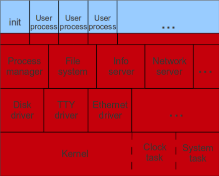
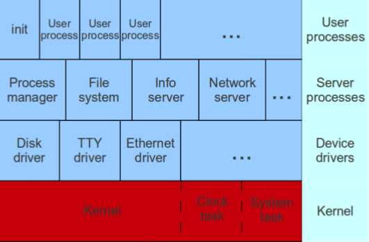

Porównaj monolityczną architekturę systemu operacyjnego z architekturą opartą na mikro jądrze.

---

# Jądro monolityczne
Przykładem systemu z jądrem monolitycznym jest Linux. Idea jądra monolitycznego jest starsza niż mikro jądra. Spowodowało to również wsparcie ze strony architektury hardwaru (bramki, przerwania programowe i specjalne instrukcje na procesorze), co sprawia również, że systemy monolityczne są zazwyczaj szybsze, niż te z mikro jądrem.

## Cechy charakterystyczne:
* duża część driverów jest wkompilowana w jądro
* wszystkie serwisy jądra operują w jednej, wspólnej przestrzeni adresowej
* sterowniki urządzeń (kod zewnętrzny) operują w trybie jądra, co zmniejsza bezpieczeństwo i niezawodność systemu
* do komunikacji międzyprocesowej często używana jest pamięć wspóldzielona (korzystanie z pamięci współdzielonej do komunikacji pomiędzy elementami systemu jest łatwiejsze)
* procesy użytkowników mogą pracować w trybie użytkownika lub w trybie jądra (gdy wywoływany jest syscall, proces przechodzi w tryb jądra by wywołać kod odpowiedzialny za syscall)

# Mikro jądro
Przykładem systemu pracującego w architekturze z mikro jądrem jest np. Minix. Idea ta przeniosła się również do tworzenia systemów informatycznych działających w internecie (mikroserwisy). Celem tej architektury jest podzielenie całej funkcjonalności na wiele niezależnych od siebie serwisów, działających w odrębnych przestrzeniach adresowych. Umotywowane jest to osiągnięciem większej niezawodności oraz bezpieczeństwa.

## Cechy charakterystyczne
* minimalny kod działający w trybie uprzywilejowanym
* podział systemu na wiele niezależnych funkcjonalności (serwerów) działających w odrębnych przestrzeniach adresowych
* komunikacja między serwerami odbywa się poprzez message passing
* procesy użytkownika nigdy nie działają w trybie jądra (gdy wywoływany jest syscall proces przechodzi w tryb jądra tylko po to, by wysłać wiadomość o syscallu do innego procesu który obsługuje ten syscall)
* większe bezpieczeństwo i niezawodność - bug w kodzie zewnętrznym (np. sterownik urządzenia) nie skutkuje natychmiastowym wyjątkiem/crashem w jądrze

