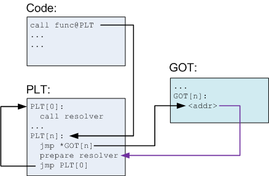

Przedstaw mechanizm współdzielenia bibliotek programistycznych (w systemie Linux), uwzględniając odpowiednie metody adresowania.

---

# Biblioteki współdzielone (Dynamic Shared Objects - DSO)
Biblioteki współdzielone to segmenty kodu, które są współdzielone przez wiele procesów. Biblioteki te mogą być dynamicznie linkowane (wymaga to obecności biblioteki w pamięci podczas fazy kompilacji/linkowania) lub dynamicznie ładowane (tzw. plug-in podczas wykonania programu).

Biblioteka współdzielona składa się z dwóch sekcji:
* Sekcja kodu - dzielona przez wiele procesów, ma w ich wirtualnych przestrzeniach różne adresy.
* Sekcja danych - oddzielna dla procesów korzystających z biblioteki, ale również znajduje się dla nich pod róznymi adresami w pamięci.

## PIC (Position Independent Code)
Konstrukcja i użycie bibliotek współdzielonych wymaga implementacji poprzez **PIC (Position Independent Code)** oraz załadowanie wszystkich sekcji biblioteki do wspólnego bloku w pamięci. Odwoływanie się do własnych danych następuje z wykorzystaniem **IP** (Instruction Pointer), czyli instruction pointera.

## PLT (Procedure Linkage Table)
Wywołanie funkcji spoza biblioteki wymaga przekierowania do odpowiedniego adresu w pamięci wirtualnej bieżącego procesu. Jest to osiągane poprzez **Procedure Linkage Table**. Dla każdej importowanej funkcji tworzone są odpowiednie informacje w tabeli **PLT** powiązane z **GOT**. Funkcje ładowane są przez dynamic-linekra i uzupełniane w razie potrzeby.

Przykładowy kod w NASM:
```nasm
call printf wrt ..plt
```



## GOT (Global Offset Table)
Dane publiczne (eksportowane) traktowane są, jak zewnętrzne. Przestrzeń dla nich jest alokowana na stercie, nie zależą od **IP**, a więc znajdują się w nieznanych miejscach w pamięci. Aby dostęp do nich był możliwy, tworzona jest tablica z adresami danych zewnętrznych. Jest ona uzupełniana przez dynamic-linkera i znajduje się w **sekcji danych** biblioteki.

Przykładowy kod w NASM:
```nasm
EXTERN ext_var
...
mov rax, [ext_var wrt ..got]
```


## Przykład

Poniżej znajduje się mapa pamięci programu cat czekającego na wejście. 

```
00400000-0040c000 r-xp 00000000 00:14 1270790                            /bin/cat
0060b000-0060c000 r--p 0000b000 00:14 1270790                            /bin/cat
0060c000-0060d000 rw-p 0000c000 00:14 1270790                            /bin/cat
02252000-02273000 rw-p 00000000 00:00 0                                  [heap]
2b210d475000-2b210d497000 r-xp 00000000 00:14 4723724                    /lib/x86_64-linux-gnu/ld-2.22.so
2b210d497000-2b210d4bb000 rw-p 00000000 00:00 0 
2b210d4d2000-2b210d4d4000 rw-p 00000000 00:00 0 
2b210d696000-2b210d697000 r--p 00021000 00:14 4723724                    /lib/x86_64-linux-gnu/ld-2.22.so
2b210d697000-2b210d698000 rw-p 00022000 00:14 4723724                    /lib/x86_64-linux-gnu/ld-2.22.so
2b210d698000-2b210d699000 rw-p 00000000 00:00 0 
2b210d699000-2b210d834000 r-xp 00000000 00:14 4723728                    /lib/x86_64-linux-gnu/libc-2.22.so
2b210d834000-2b210da33000 ---p 0019b000 00:14 4723728                    /lib/x86_64-linux-gnu/libc-2.22.so
2b210da33000-2b210da37000 r--p 0019a000 00:14 4723728                    /lib/x86_64-linux-gnu/libc-2.22.so
2b210da37000-2b210da39000 rw-p 0019e000 00:14 4723728                    /lib/x86_64-linux-gnu/libc-2.22.so
2b210da39000-2b210da3d000 rw-p 00000000 00:00 0 
2b210da3d000-2b210de70000 r--p 00000000 00:14 4742303                    /usr/lib/locale/locale-archive
7ffddfa17000-7ffddfa38000 rw-p 00000000 00:00 0                          [stack]
7ffddfa39000-7ffddfa3c000 r--p 00000000 00:00 0                          [vvar]
7ffddfa3c000-7ffddfa3e000 r-xp 00000000 00:00 0                          [vdso]
ffffffffff600000-ffffffffff601000 r-xp 00000000 00:00 0                  [vsyscall]
```

Widać, w adresach `2b210d699000-2b210d834000` znajduje się kod biblioteki `libc`.
`2b210da33000-2b210da37000` znajdują się dane tylko do odczytu tej biblioteki,
a `2b210da37000-2b210da39000` prywatne dane do zapisu tej biblioteki w tym
procesie.
