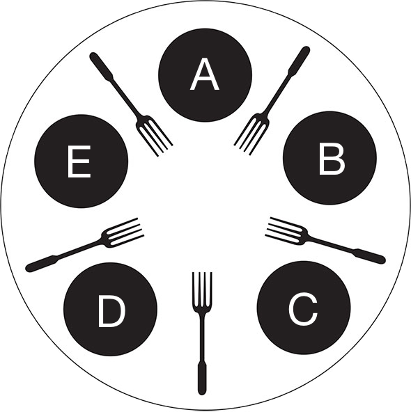

Na przykładzie problemu ucztujących filozofów przedyskutuj pojęcia poprawności pod względem bezpieczeństwa i żywotności. Zaproponuj rozwiązanie spełniające oba te warunki.

---

# Własności
Wyobraźmy sobie system jako model. Taki ze stanami. Alfabetem są akcje. W trakcie wykonywania danej akcji stan modelu się zmienia. Dla takiego modelu zdefiniujmy dwa pojęcia:

  * **Bezpieczeństwo** - nie istnieje możliwość znalezienia się w stanie z etykietą `error` (stan niepoprawny logicznie) lub `stop` (nie da się już zmienić tego stanu, deadlock).

  * **Żywotność** - z każdego stanu, w jakim znajdzie się model, każda akcja, którą chcemy wykonać, *kiedyś* zostanie wykonana. Czyli po prostu chcemy, żeby ramach pewnych akcji następował postęp.

# Ucztujący filozofowie
Pięciu filozofów siedzi przy okrągłym stole. Przed każdym stoi talerz ze spaghetti &#127837;. Między talerzami leżą widelce. Każdy filozof myśli. Gdy zgłodnieje, sięga po widelce znajdujące się po jego lewej i prawej stronie, po czym rozpoczyna posiłek. Gdy się już naje, odkłada widelce i ponownie oddaje się myśleniu.

## Model
  * **Alfabet** (zbiór akcji) - zawiera 20 elementów, po 4 akcje dla każdego filozofa: `weź/odłóż lewy/prawy widelec`.

  * **Stany** - wszystkie kombinacje, gdzie każdy z filozofów może wykonywać jedną z czynności: `myśl`, `jedz`, `trzymaj lewy/prawy widelec` ($4^{5}$ stanów).

## Poprawność

### Bezpieczeństwo
Model jest *bezpieczny* gdy nie znajdzie się w stanie z etykietą `error` lub `stop`. Jakie więc są to stany?

Przykładowe nieprawidłowe stany typu `error` to takie, w których pewien filozof próbuje jeść, chociaż nie ma obu widelców (przechodzi do stanu `jedz`, ale nie wykonał akcji wzięcia widelców). Inny przykład - próbuje myśleć gdy posiada oba widelce lub też próbuje odłożyć widelec chociaż go nie posiada.

Ciekawszymi stanami są te typu `stop`. Są to takie stan, w których żaden filozof nie może jeść (deadlock). Dzieje się tak w sytuacji, gdy każdy z filozofów zabierze lewy widelec i będzie czekał na prawy (lub na odwrót). Wówczas dochodzi do zakleszczenia - filozofowie będą tak trwać aż umrą z głodu (czyli szczególny przypadek zagłodzenia - umierają wszyscy).

### Żywotność
Chcemy, aby zawsze pewna akcja miała szansę się wykonać. *Postęp* jest przeciwieństwem *zagłodzenia* (sytuacji, w której pewna akcja nie zostanie nigdy wykonana).

W odniesieniu do problemu ucztujących filozofów - chcemy, aby niezależnie od stanu, w jakim znajduje się model, każdy z filozofów miał szansę jeszcze zjeść lub pomyśleć.

## Rozwiązanie

### Bezpieczeństwo
Prosimy kelnera o pomoc. Filozofowie będą go pytać o pozwolenie na wykonanie poszczegolnych akcji z alfabetu. Kelner, świadomy które widelce są aktualnie w użyciu, może nimi rozporządzać zapobiegając zakleszczeniom, a także wejściom w stan `error` (np. nie pozwoli filozofowi na myślenie gdy ten trzyma jakiś widelec).

Zakładamy, że filozofowie w pierwszej kolejności sięgają po widelec leżący po ich lewej stronie, a następnie po prawy.

Jeśli `A` i `C` jedzą, cztery widelce są w użyciu. `B` siedzi między `A` i `C`, więc nie ma w jego sąsiedztwie żadnego widelca, podczas gdy `D` i `E` mają jeden nieużywany widelec między sobą. Przypuśćmy, że `D` chciałby coś zjeść. Gdyby podniósł piąty widelec, zaistniałoby prawdopodobieństwo zakleszczenia. Gdyby natomiast spytał kelnera o widelec, dostałby od niego polecenie czekania. Dodatkowo po zwolnieniu widelców `D` byłby pierwszym, który dostanie komplet sztućców (najpierw bierze się lewy widelec). Dzięki takiemu podejściu zostało wyeliminowane zagrożenie zakleszczenia.

### Żywotność
Kelner dodatkowo posiada listę, na której zapisuje sobie kto kiedy ostatni raz jadł. W sytuacji gdy kilka osób może jeść, pozwolenie otrzymuje ten filozof, który jest najbardziej głodny.

Gdy `A` i `C` skończą jeść, pozwolenie na jedzenie od kelnera otrzyma filozof `D`. Zaraz później pozwolenie otrzyma również `B`. W takiej sytuacji będziemy w analogicznym stanie jak uprzednio, gdy jedli `A` i `B` - pierwszym w kolejce do jedzenia będzie `E`. Gdy zacznie jeść `E`, będą mogli jeść `B` lub `C`. Ale ponieważ `B` jadł przed chwilą, pozwolenie otrzyma `C`. Zaraz później pozwolenie otrzyma `A` i zatoczone zostanie koło. Zatem każdy z filozofów będzie jadł w nieskończoność.
