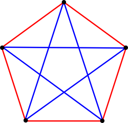

Własności podziałowe, twierdzenie Ramseya.

---

# Własności podziałowe

## Zasada szufladkowa Dirichleta
Twierdzenie mówiące, że jeżeli $m$ przedmiotów włożymy do $n$ różnych szufladek, przy czym $m > n$ i $n \neq 0$, to co najmniej w jednej szufladce znajdą się co najmniej dwa przedmioty.

Bardziej formalnie, jeżeli zbiór $X$ liczy $n$ elementów, $X=X_1\cup X_2\cup\dots \cup X_k$, i $n>k$, to któryś ze zbiorów $X_i$ musi liczyć przynajmniej dwa elementy.

## Uogólniona zasada szufladkowa
Jeśli $X = X_1 \cup \cdots \cup X_k$, oraz $|X| > q \cdot k$, to dla któregoś zbioru mamy $|X_i| > q$.

Przykładowo, komoda ma $10$ szuflad. Upchano w nie $34$ koszule. Dla następujących $q$ powyższa zasada jest spełniona: $1, 2, 3$.

## Zasada podziałowa
Niech $q_1, \ldots, q_k$ będzie ciągiem liczb naturalnych (pojemności szufladek). Jeśli $X = X_1 \cup \ldots \cup X_k$ oraz $|X| > (\sum_{i=1}^{k} q_i)$, to $|X_i| > q_i$ dla pewnego $i$.

Przykładowo, komoda ma $10$ szuflad. Pierwsza jest w stanie pomieścić $1$ koszulę, druga $2$ i w ogólności $i$-ta szuflada jest w stanie pomieścić $i$ koszul. Do przechowania jest $46$ koszul. Wtedy:
* Co najmniej jedna z szuflad będzie w pełni zapełniona.
* Któraś szuflada może być pusta.

# Twierdzenie Ramseya
Dla każdej liczby naturalnej $k$ istnieje taka liczba naturalna $n$, że wśród dowolnych $n$ osób zawsze znajdziemy $k$ osób, które znają się każda z każdą, lub $k$ osób, które nie znają się żadna z żadną. Wtedy $n=R(k)$ i jest $k$-tą liczbą Ramseya.

## Przedstawienie graficzne
Jeśli narysujemy $n$ punktów i połączymy je każdy z każdym dwoma kolorami, to $n$ jest $k$-tą liczbą Ramseya $\iff$ $n$ jest najmniejszą liczbą taką, że na takim grafie pełnym znajdziemy jednokolorową klikę o $k$ wierzchołkach.

## Liczba Ramseya
Liczbą Ramseya $R(q_1, q_2, q_3, \ldots, q_k)$ dla $k, q_1, q_2, \ldots, q_k \in \mathbb{N}$ i $k \geqslant 2$ nazywamy najmniejszą liczbę $n$ taką, że dla dowolnego $k$-pokolorowania krawędziowego $n-$wierzchołkowego grafu pełnego istnieje $i \in [1,k]$ takie, że w pokolorowanym grafie jest klika rozmiaru $q_i$, której wszystkie krawędzie są w kolorze $i$.

### Przykład
Aby znaleźć na przykład wartość $R(3,3)$, kolorujemy krawędzie grafów pełnych dwoma kolorami (np. czerwonym i niebieskim), szukając najmniejszego grafu pełnego, dla którego przy dowolnym kolorowaniu znajdziemy albo trójkąt czerwony, albo trójkąt niebieski. Okazuje się, że $R(3,3)=6$.

#### Dowód
Wybierzmy dowolny punkt grafu pełnego o sześciu wierzchołkach. Wychodzi z niego pięć krawędzi, więc przynajmniej trzy mają wspólny kolor (**zasada szufladkowa**). Załóżmy bez utraty ogólności, że są to trzy czerwone krawędzie (sytuacje te charakteryzują się pełną symetrią). Krawędzie te prowadzą do trzech różnych punktów; te trzy nowe punkty są połączone między sobą trzema krawędziami. Jeżeli choć jedna z nowych krawędzi jest czerwona, powstaje czerwony trójkąt, w przeciwnym przypadku powstaje niebieski trójkąt. Wobec tego $R(3, 3)$ nie może być większe od $6$. Rysunek poniżej dowodzi, że nie może być równe $5$ ani mniejsze, więc istotnie jest równe 6.

Ma to bardzo wygodną interpretację, mianowicie w zbiorze 6 osób zawsze znajdziemy 3 osoby znające się wzajemnie lub 3 osoby, które się nie znają.

