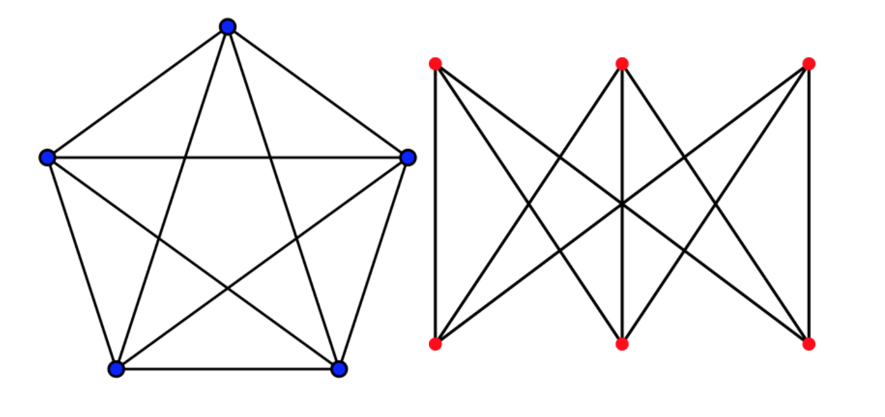

Grafy planarne i twierdzenie Kuratowskiego.

---

# Graf planarny
Graf, który można narysować na płaszczyźnie tak, by krzywe obrazujące krawędzie grafu nie przecinały się ze sobą. Graf planarny o zbiorze wierzchołków i krawędzi zdefiniowanym poprzez odwzorowanie go na płaszczyźnie nazywany jest grafem płaskim.

## Twierdzenie Kuratowskiego
Graf skończony jest planarny $\iff$ nie zawiera podgrafu homeomorficznego z grafem $K_5$ ani z grafem $K_{3,3}$.

Jakby co, to są dwa minimalne grafy, które nie są planarne:

### Homeomorfizm grafów
Relacja równoważności w zbiorze grafów. Dwa grafy są w relacji jeśli jeden można otrzymać z drugiego poprzez skończoną sekwencję operacji elementarnego podpodziału - czyli z jednej krawędzi robimy dwie (połączone dodatkowym wierzchołkiem pośrodku).

## Twierdzenie Eulera
Dowolny rysunek płaski grafu planarnego wyznacza spójne obszary płaszczyzny zwane ścianami. Dokładnie jeden z tych obszarów, zwany ścianą zewnętrzną, jest nieograniczony.

Zgodnie ze wzorem Eulera, jeżeli $|V| \geq 3$ oraz $G$ jest grafem spójnym i planarnym, to $|V|+|S|-|E|=2$.

* $V$ – zbiór wierzchołków,
* $E$ – zbiór krawędzi,
* $S$ – zbiór ścian dowolnego rysunku płaskiego grafu $G$.

### Wnioski ze wzoru Eulera
* Jeżeli $G$ jest planarny i posiada $k$ spójnych składowych, to $|V|+|S|-|E|=k+1$.
* Jeżeli $G$ jest planarny i $|V|\geq3$, to $|E|\leq3\cdot|V|-6$.
* Jeżeli $G$ jest planarny, to wierzchołek o najmniejszym stopniu jest stopnia co najwyżej $5$.

Każdy skończony graf planarny jest $4$-kolorowalny. Ciekawostka: nikt dotąd nie udowodnił twierdzenia o czterech barwach bez komputerowego wspomagania, choć wymyślono pewne uproszczenia oryginalnego dowodu. Przypadek ten stał się okazją do dyskusji na temat dopuszczalnych metod dowodowych w matematyce.
