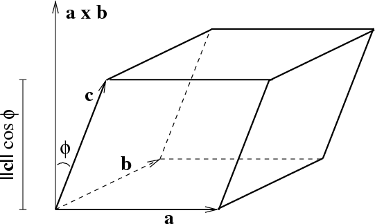

Wyznacznik jako objętość.

---

# Równoległościan wielowymiarowy
Równoległościan $n$-wymiarowy rozpięty na wektorach przestrzeni euklidesowej $\mathbb{V}$ to zbiór:

$$R(v_1, ... , v_n) = \{\sum_{i=1}^{n} \alpha_iv_i : \alpha_i \in [0, 1] \}$$

zauważmy, że dla $\alpha_i \in \{0, 1\}$ otrzymalibyśmy wierzchołki równoległościanu, czyli dla $\alpha_i \in [0, 1]$ otrzymamy całą bryłę wyznaczoną przez te wierzchołki.

## Objętość
Objętość równoległościanu $R(v_1, ... , v_n)$ to liczba $\operatorname{Vol}(v_1,\ldots,v_n)$ określona indukcyjnie.

### Baza
$\operatorname{Vol}(v_1) = ||v_1||$

### Kolejny wymiar
Podprzestrzeń generowaną przez wektory $v_1, \ldots, v_n$ oznaczamy przez $\operatorname{Lin}(v_1,\ldots,v_n)$. Niech $v_i'$ będzie rzutem wektora $v_i$ na podprzestrzeń $\operatorname{Lin}(v_1,\ldots,v_{i-1})$, czyli

$$v_i'= \Pi_{\operatorname{Lin}(v_1,\ldots,v_{i-1})}(v_i)$$

Zdefiniujmy teraz wysokość równoległościanu jako $h = ||v_n - v_n'||$. Wtedy objętość równoległościanu wyraża się wzorem:

$$\operatorname{Vol}(v_1,...,v_n) = \operatorname{Vol}(v_1,...,v_{n-1}) \cdot h$$

Zauważmy, że dla tak zdefiniowanej objętości:
* $\operatorname{Vol}(a)$ to długość wektora $a$.
* $\operatorname{Vol}(a, b)$ to pole równoległoboku rozpiętego przez wektory $a, b$.

# Przypadek 3D

W przestrzeni trójwymiarowej wektor $a \times b$ nazywamy iloczynem wektorowym. Iloczyn wektorowy ma następujące własności:
1. $||a \times b|| = ||a|| \cdot ||b||\ \text{sin}\ \alpha = \operatorname{Vol}(a,b)$
2. Wektor $a \times b$ jest prostopadły do wektorów $a$ i $b$

### Objętość
Zauważmy, że wysokość równoległościanu $h$ jest równa składowej wektora $c$ w kierunku wektora $a \times b$. Możemy obliczyć tę składową za pomocą iloczynu skalarnego:

$$h =\frac{a \times b}{||a \times b||} \cdot c$$

Czyli:

$$\begin{align}
\operatorname{Vol}(a, b, c) &= \operatorname{Vol}(a,b) \cdot h \\
&= ||a \times b|| \cdot h \\
&= ||a \times b|| \cdot \frac{a \times b}{||a \times b||} \cdot c \\
&= (a \times b) \cdot c
\end{align}$$

# Wyznacznik jako objętość
Interpretacją wyznacznika macierzy $A \in M_{n \times n}(\mathbb{R})$ jest objętość $n$-wymiarowego równoległoboku rozpiętego na wektorach będących wierszami (kolumnami) tej macierzy. Możemy więc używać metod liczenia wyznacznika, by poznawać objętości brył.

* $n = 1 \Rightarrow$ długość,
* $n = 2 \Rightarrow$ pole,
* $n = 3 \Rightarrow$ objętość trójwymiarowa.

Jeżeli wektory $v_1,\ldots, v_n$ są liniowo zależne to objętość i wyznacznik są zerowe:

$$\operatorname{Vol}(v_1,\ldots, v_n) = 0$$

Jeżeli są niezależne to wyznacznik pozostaje niezmieniony gdy dodaje się przeskalowane wiersze (kolumny) do siebie. To ma związek ze skośną translacją równoległościanu, która nie zmienia jego objętości. Poprzez skończoną liczbę takich operacji można przejść do postaci diagonalnej macierzy, gdzie relacja pomiędzy wyznacznikiem (iloczyn wyrazów na przekątnej) i objętość bryły (iloczyn boków) jest oczywisty.

Łatwo dostrzec też powiązanie odnosząc się do ortogonalizacji Grama-Schmidta. Stosując ten proces do wektorów $\{v_1, \ldots, v_n\}$, mamy:

$$\begin{align}
v_1 &= v_1 \\
v_2 &= c_{12}v_1 + v^{\vdash}_2 \\
v_3 &= c_{13}v_1 + c_{23}v_2 + v^{\vdash}_3 \\
\vdots
\end{align}$$

gdzie:
* $v^{\vdash}_2$ jest ortogonalny do $v_1$,
* $v^{\vdash}_3$ jest ortogonalny do $\operatorname{Lin}(v_1, v_2)$.

Wyznacznik jest wieloliniowy i antysymetryczny, więc:

$$\begin{align}
\det(v_1, \ldots, v_n) &= \det(v_1, c_{12}v_1 + v^{\vdash}_2, \ldots) \\
&= \det(v_1, v^{\vdash}_2, \ldots, v^{\vdash}_n) \\
&= \text{signed } \operatorname{Vol}(v_1,\ldots, v_n) \\
\end{align}$$
