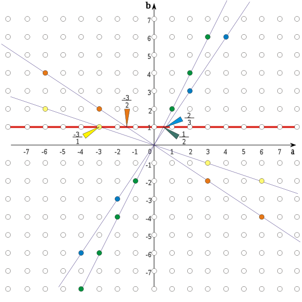

Konstrukcja liczb całkowitych. Działania na liczbach całkowitych. Konstrukcja liczb wymiernych i działania na nich.

----

# Liczby całkowite

## Konstrukcja

Zbiór liczb całkowitych konstruujemy jako przestrzeń ilorazową relacji równoważności $\sim$ określonej na zbiorze par liczb naturalnych, zdefiniowanej następująco:

$$(a,\,b) \sim (c,\,d) \iff a+d=b+c$$

Czyli liczbę całkowitą można skonstruować jako zbiór wszystkich par liczb naturalnych, które dałyby ten sam wynik przy odejmowaniu.

$$\mathbb{Z} =  \mathbb{N} \times\mathbb{N} /_ \sim$$

## Przykłady
* $2$: $\{(2,\;0),\;(3,\;1),\;(4,\;2),\;(5,\;3),\;\dots\;\}$
* $-3$: $\{(0,\;3),\;(1,\;4),\;(2,\;5),\;(3,\;6),\;\dots\;\}$

## Działania
| Pojęcie                     | Definicja                                         |
|-----------------------------|---------------------------------------------------|
| Dodawanie                   | $[(a,\; b)] + [(c,\; d)] = [(a+c,\; b+d)]$        |
| Element neutralny dodawania | $[(0,\; 0)]$                                      |
| Element przeciwny           | $-[(a,\; b)]=[(b,\; a)]$                          |
| Mnożenie                    | $[(a,\; b)] \cdot [(c,\; d)] = [(ac+bd,\;ad+bc)]$ |
| Element neutralny mnożenia  | $[(1,\; 0)]$                                      |

gdzie $[(a,\;b)]$ oznacza klasę abstrakcji odpowiadającą $(a,\; b)$.

# Liczby wymierne

## Konstrukcja

Zbiór liczb wymiernych $\mathbb Q$ konstruujemy jako przestrzeń ilorazową relacji równoważności $\sim$ określonej na $\left(\mathbb Z \times (\mathbb Z \setminus\{0\})\right)^2$, zdefiniowanej następująco:

$$(p,r) \sim (q, s) \iff p\cdot s=r\cdot q$$

Czyli liczby wymierne można skonstruować jako zbiór wszystkich takich par, gdzie pierwszy element pary jest liczbą całkowitą, a drugi niezerową liczbą całkowitą:

$$\mathbb Q = \mathbb Z \times (\mathbb Z \setminus \{0\}) / _ \sim$$

## Przykłady
* $\tfrac{1}{2}$: $\{\dots,(-1,-2),(1,2),(2,4),(3,6),\dots\}$
* $-3$: $\{\dots,(-6,2),(-3,1),(3,-1),(6,-2),\dots\}$

## Działania
| Pojęcie                     | Definicja                                         |
|-----------------------------|---------------------------------------------------|
| Dodawanie                   | $[(a,\; b)] + [(c,\; d)] = [(ad+bc,\; bd)]$       |
| Element neutralny dodawania | $[(0,\; 1)]$                                      |
| Element przeciwny           | $-[(a,\; b)]=[(-a,\; b)]$                         |
| Mnożenie                    | $[(a,\; b)] \cdot [(c,\; d)] = [(ac,\; bd)]$      |
| Element neutralny mnożenia  | $[(1,\; 1)]$                                      |
| Element odwrotny            | $[(a,\; b)]^{-1}=[(b,\; a)]$ dla $a \ne 0$        |
