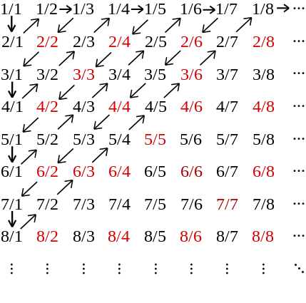

Zbiory przeliczalne i ich przykłady.

---

# Równoliczność
Zbiory są równoliczne $A \sim_m B$ gdy istnieje bijekcja $f:A\rightarrow B$.

# Przeliczalność
Zbiór jest przeliczalny gdy jest skończony lub równoliczny z $\mathbb{N}$.

To też taki, którego elementy można ustawić w ciąg (skończony bądź nie) i wypisać je po kolei.

## Własności
* Każdy jego podzbiór też jest przeliczalny.
* Suma przeliczalnie wielu zbiorów przeliczalnych jest zbiorem przeliczalnym.
* Iloczyn kartezjański skończonej liczby zbiorów przeliczalnych jest zbiorem przeliczalnym.

## Przykłady
* Zbiór pusty,
* Jakiś skończony $\{ a, b \}$,
* $\mathbb{N}$,
* Liczby nieparzyste,
* Liczby pierwsze,
* Liczby całkowite,
* Liczby wymierne.

### Ustawianie w ciąg
Liczby całkowite to np: $$0, 1, -1, 2, -2, 3, -3, 4, -4, 5, -5, ...$$

Dla liczb wymiernych wystarczy, że pokażemy dla dodatnich (dla wszystkich jest analogiczny jak dla całkowitych). Wystarczy wszystkie liczby wpisać do kwadratowej tablicy i będzie uporządkowanie. Dodatkowo, każda liczba wymierna pojawi się nieskończenie wiele razy. Mamy surjekcję z $\mathbb{N}^2$ w $\mathbb{Q}$.

