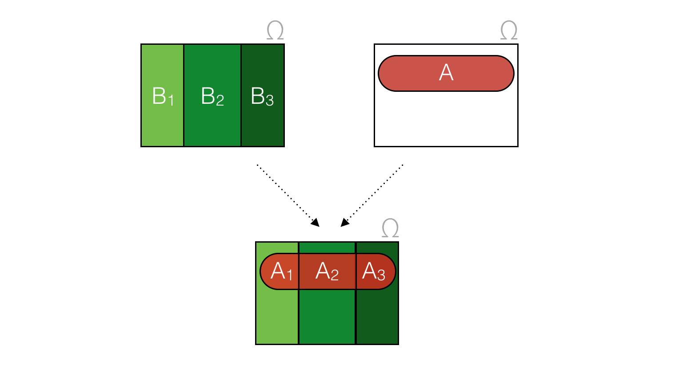

Prawdopodobieństwo warunkowe i całkowite - metody liczenia i przykładowe zastosowania.

---

# Prawdopodobieństwo warunkowe
Prawdopodobieństwo warunkowe zajścia zdarzenia $A$, pod warunkiem zajścia zdarzenia $B$, liczymy ze wzoru:

$$P(A|B) = \frac{P(A \cap B)}{P(B)}$$

gdzie $P(B) > 0$.

## Przykład

Rzucamy dwiema kostkami. Jakie jest prawdopodobieństwo, że suma oczek przekracza $6$, jeśli na pierwszej kostce wypadła $3$? Niech zdarzenia to:

* $A$ - suma oczek przekracza $6$,
* $B$ - na pierwszej kostce wypadło $3$.

Oczywiście, $P(B) = \frac{1}{6}$. Rozważmy zdarzenia elementarne, jakie mogą zajść, aby jednocześnie zaszły zdarzenia $A$ i $B$:

$$A \cap B = \{(3 \text{ i } 4), (3 \text{ i } 5), (3 \text{ i } 6)\}$$

Są to $3$ przypadki z $36$, a więc $P(A \cap B) = \frac{1}{12}$. Zatem:

$$P(A|B) = \frac{P(A \cap B)}{P(B)} = \frac{\frac{1}{12}}{\frac{1}{6}} = \frac{1}{2}$$

## Właśności

### Zdarzenia niezależne
Jeśli zdarzenia $A$ i $B$ są niezależne to:

$$P(A|B) = \frac{P(A \cap B)}{P(B)} = \frac{P(A) \cdot P(B)}{P(B)} = P(A) $$

# Prawdopodobieństwo całkowite

## Intuicja
Zacznijmy od prostego pytania:

> W pewnym kraju są trzy (rozłączne) prowincje: $B_1$, $B_2$, $B_3$. Interesuje nas powierzchnia całkowita lasów w tym kraju.

Odpowiedź jest prosta - wystarczy dodać powierzchnię lasu w każdej z prowincji, otrzymując powierzchnię dla całego kraju.

W twierdzeniu o prawdopdoobieństwie całkowitym (totalnym, sumarycznym) intuicja jest identyczna. Polem lasu jest *prawdopdobieństwo zajścia zdarzenia $A$*. W szczególności, jeżeli chcesz znaleźć $P(A)$, możesz popatrzeć na rozbicie $\Omega$ i zsumować prawdopodobieństwa zajścia $A$ w ramach każdego z rozłącznych podzbiorów.

## Twierdzenie
Jeśli $B_1, B_2, \ldots, B_n$ jest rozbiciem przestrzeni zdarzeń elementarnych $\Omega$, to dla dowolnego zdarzenia $A \subseteq \Omega$ zachodzi:

$$P(A) = \sum_{i = 1}^{n} P(A \cap B_i)$$

Równoważnie, z prawdopodobieństwa warunkowego:

$$P(A) = \sum_{i = 1}^{n} P(A|B_i) \cdot P(B_i)$$

## Zobrazowanie
Nawiązując do przykładu z lasami, przedstawmy:

* $A_1 = A \cap B_1$
* $A_2 = A \cap B_2$
* $A_3 = A \cap B_3$

$$P(A) = P(A_1) + P(A_2) + P(A_3)$$

## Przykład
Mamy $3$ worki, z których każdy zawiera $100$ kamieni:

* $B_1$ zawiera $75$ czerwonych i $25$ niebieskich kamieni,
* $B_2$ zawiera $60$ czerwonych i $40$ niebieskich kamieni,
* $B_3$ zawiera $45$ czerwonych i $55$ niebieskich kamieni.

Wybieramy losowo jeden z worków i losujemy kamień. Jakie jest prawdopodobieństwo, że wylosowany kamień jest czerwony?

### Rozwiązanie
Niech $R$ będzie zdarzeniem oznaczającym, że wybrany kamień jest czerwony. Niech $B_i$ będzie zdarzeniem, że wybrany zostaje worek $i$-ty. Wiemy już, że:

* $P(R|B_1) = 0.75$,
* $P(R|B_2) = 0.60$,
* $P(R|B_3) = 0.45$.

Dokonujemy rozbicia $\Omega$ na zbiory $B_1$, $B_2$, $B_3$. Jest to poprawne rozbcie, ponieważ wszystkie są rozłączne (tylko jeden worek może zostać wylosowany w losowaniu jednego worka), a ich suma daje całą przestrzeń (któryś worek zostanie wybrany na pewno, $P(B_1 \cup B_2 \cup B_3) = 1$).

Korzystając z twierdzenia o prawdopodobieństwie całkowitym, możemy zapisać:

$$\begin{align*}
P(R)
&= \sum_{i = 1}^{n} P(R|B_i) \cdot P(B_i) \\
&= (0.75)\frac{1}{3} + (0.60)\frac{1}{3} + (0.45)\frac{1}{3} \\
&= 0.60
\end{align*}$$

Obliczanie prawdopodobieństwa całkowitego jest niejako obliczaniem prawdopodobieństwa średniego ważonego. Chociaż w powyższym przykładzie wszystkie wagi są identyczne i uzyskaliśmy średnią arytmetyczną, pozwala nabyć dobrą intuicję.

## Zastosowanie
Powyższy wzór na prawdopodobieństwo całkowite pozwala nam na obliczanie prawdopodobieństw wielu zdarzeń nie tylko w doświadczeniach dwuetapowych. W doświadczeniach o większej liczbie etapów stosujemy ten wzór wielokrotnie.

Twierdzenie o prawdopodobieństwie całkowitym można zilustrować za pomocą tzw. drzewa stochastycznego. Wzór na prawdopodobieństwo całkowite to suma iloczynów po wszystkich drogach, które kończą się w $A$ (występuje w wielu liściach).
