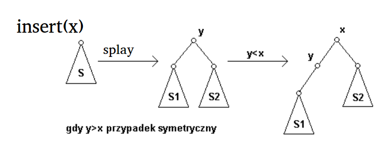

Analiza amortyzowana, nietrywialny przykład zastosowania.

---

# Analiza amortyzowana
Celem jest obliczenie kosztu zamortyzowanego danej operacji w ciągu operacji na strukturze danych. Może sie okazać, że wykonanie **całego ciągu** kosztuje mniej niż napałowe liczenie złożoności - tylko niektóre ciągi operacji są możliwe.

Koszt zamortyzowany operacji to średni czas jej wykonania w pesymistycznym ciągu.

## Metody
### Kosztu sumarycznego
Liczymy pesymistyczny koszt wykonania całego ciągu $n$ operacji $T(n)$, a potem dzielimy go przez $n$.

#### Przykład
Multistos. Zwykły stos, ale z operacją `multipop(k)`, która ściąga $k$ elementów ze stosu (jak zostało mniej to wszystkie).

Dla `push` i `pop` jest $O(1)$. `multipop(k)` ma $O(k)$. Wydawać by się mogło, że dla $n$ operacji mamy $O(nk) = O(n^2)$.

Ale zauważmy, że każdy element dokładnie raz jest wrzucony na stos i z niego zdjęty. Skoro było $n$ operacji, a wstawienie jednego elementu i jego usunięcie kosztuje $O(1)$, to koszt ciągu operacji wynosi $O(n)$. Czyli amortyzowany koszt wykonania każdej operacji będzie stały.

### Księgowania
Przypisujemy operacjom koszty, a jeśli przewyższają koszt rzeczywisty, to dostaje kredyt na później. Trzeba wykazać, że nigdy nie zabraknie kredytu na pokrycie wykonywanych operacji.

#### Przykład

|               |    Koszt rzeczywisty   | Koszt amortyzowany |
|:-------------:|:----------------------:|:------------------:|
|     `push`    |           $1$          |         $2$        |
|     `pop`     |           $1$          |         $0$        |
| `multipop(k)` | $\min(k, \text{size})$ |         $0$        |

Każdy element, aby móc go usunąć, musi zostać najpierw wstawiony i zapłacić $2$, więc zawsze mamy kredyt na pokrycie kosztu jego usunięcia i nigdy nie zabraknie nam kredytu.

Łączny koszt zamortyzowany $n$ operacji to $O(n)$, więc wszystkie operacje w amortyzowanym czasie stałym.

### Potencjału
* $\Phi_{i}$ - potencjał struktury po wykonaniu $i$-tej operacji.
* $D_0$ - początkowy stan struktury.
* $c_i$ - koszt faktyczny $i$-tej operacji.
* $D_i$ - stan struktury po $i$-tej operacji.
* $\Phi(D_i)$ - funkcja potnecjału, przypisuje stanowi potencjał.

Koszt zamortyzowany $i$-tej operacji:

$$\widehat{c_i} = c_i + \Phi(D_i) - \Phi(D_{i-1})$$

$n$ operacji:

$$\begin{align}
\sum_{i=1}^n \widehat{c_i} &= \sum_{i=1}^n c_i + \Phi(D_i) - \Phi(D_{i-1}) \\
&= \left( \sum_{i=1}^n c_i \right) + \Phi(D_n) - \Phi(D_0)
\end{align}$$

Funkcja potencjału ma być tak zdefiniowana, żeby potencjał po $n$ operacjach nam nie zmalał. Wygodnie jest ustalić $\Phi(D_0) = 0$ i pokazać, że $\Phi(D_n) \geq 0$.

#### Przykład
Funkcja:
* $\Phi(D_0) = 0$
* $\Phi(D_i) = \text{liczba elementów na stosie}$

Zmiana potencjału:
* `push`: $+1$
* `pop`: $-1$
* `multipop`: $-\min(k,\text{size})$

Koszt amortyzowany:
* `push`: $\widehat{c_i} = c_i + \Phi(D_i) - \Phi(D_{i-1}) = 1 + 1 = 2$
* `pop`: $\widehat{c_i} = 1 - 1 = 0$
* `multipop`: $\widehat{c_i} = k - k = 0$

Oczywiście, po wykonaniu $n$ operacji $\Phi(D_n) \geq \Phi(D_0)$. Analiza jest poprawna. Oszacowanie $O(n)$.

# Drzewa splay
Splay to BST. Operacja splay przy każdej, wierzchołek do korzenia, robimy to za pomocą rotacji.

## Rotacje w drzewie splay
### Zig
Ostatni krok procedury `splay`.

### Zig-Zag

### Zig-Zig

## Operacje słownika w drzewie splay

### `Splay(v)`
Ciąg rotacji.

### Insert(x)
1. Szukamy $x$ jak w BST.
2. Jak znaleźliśmy to `splay(x)` i koniec.
3. Nie było w drzewie, ale skończyliśmy przeszukiwanie w jakimś węźle $y$. Robimy na nim `splay(y)`.
4. Wstawiamy $x$ do korzenia i odpowiednio układamy drzewo.

### `Delete(x)`
1. `splay(x)`.
2. Jeśli do korzenia przyszło co innego to koniec.
3. Jeśli w korzeniu jest $x$ to usuń go i popraw drzewo. Łatwo to zrobić robiąc `splay(x)` na lewym poddrzewie - dostaniemy największy wierzchołek, którym można zastąpić korzeń.

## Analiza złożoności
Metodą potencjału. Niech:
* $\text{size}(r)$ - rozmiar drzewa zaczepionego w wierzchołku $r$.
* $\text{rank}(r) = \lfloor \lg(\text{size}(r)) \rfloor$.
* $\Phi(T) = \sum_{v \in T} \text{rank}(v)$.

Dobrze zbalansowane drzewa będą miały mniejsze $\Phi$. Ponieważ wszystkie operacje opierają się na splay, wystarczy oszacować koszt amortyzowany dla tej operacji.

### Wynik
$\leq 3 \log n + 1$, gdzie $n$ jest liczbą węzłów w drzewie.

### Idea
Rozbijamy operacje splay na ciąg rotacji i szacujemy pojedyncze koszty amortyzowane poprzez różnicę rzędów wierzchołka przesuwanego do góry (przed i po rotacji).

Suma kosztów zamortyzowanych ciagu rotacji jest kosztem zamortyzowanym operacji splay.

### Zalety i wady
Dobre do cache i algorytmów odśmiecania. Często używane elementy bliżej korzenia. Jednak jeśli pewne elementy nie są częściej sprawdzane niż inne, to w praktyce lepsze są zrównoważone BST: czerwono-czarne lub AVL.
