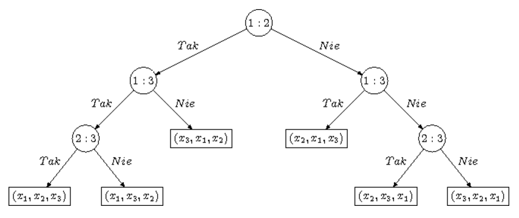

Złożoność sortowania, dolne ograniczenia w przypadku pesymistycznym i średnim.

---

# Złożoność sortowania
Sortujemy $n$ elementów. Porządek ustalamy porównaniami. Wynik sortowania jest permutacją, więc możliwych wyników jest $n!$. Każdy algorytm sortowania przez porównania można zapisać za pomocą drzewa decyzyjnego.

## Drzewo decyzyjne
Drzewo binarne, każdy węzeł wewnętrzny ma dwoje dzieci. W węźle mamy $i : j$ i pytamy czy $A[i] < A[j]$.

### Przykład

Sortowanie to przejście od korzenia do pewnego liścia, gdzie jest permutacja wyznaczająca nasz porządek.

## Dolne ograniczenie na pesymistyczny czas sortowania
Pesymistycznie pójdziemy do najgłębszego liścia, czyli sprawdźmy wysokość drzewa.

Dla $n$ elementów liścy mamy **co najmniej** $n!$ (może być więcej, ale mogą być nieosiągalne).

Skoro najmniejsza wysokość drzewa binarnego o $k$ liściach to $\lceil \log k \rceil$, to każdy algorytm wykona pesymistycznie nie mniej niż $\lceil \log n! \rceil$ porównań.

Można pokazać, że $\lceil \log n! \rceil \ge n\log n - 1.45n$.

## Dolne ograniczenie na średni czas sortowania
Pytamy o średnią liczbę porównań, każda permutacja możliwa z jednakowym prawdopodobieństwem. Odpowiedź to średnia głębokość liścia w drzewie decyzyjnym. W najlepszym przypadku będziemy mieć drzewo pełne binarne.

> Dla dowolnego drzewa pełnego binarnego o $k$ liściach średnia głębokość liścia $\geq \log k$.

Czyli nie mniej niż $\log n!$ porównań. A to znowu ograniczamy jak wcześniej.
