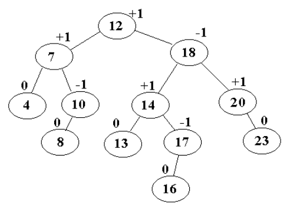
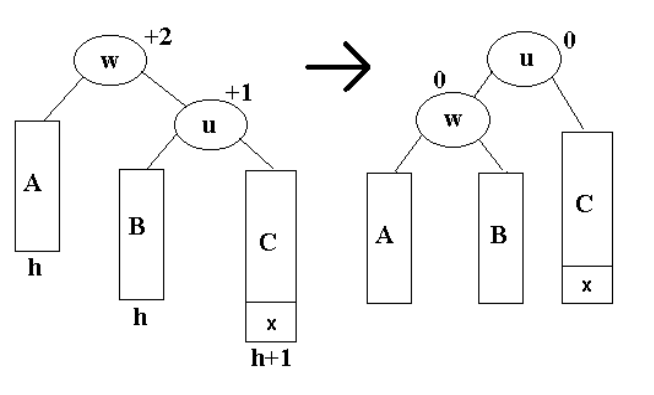
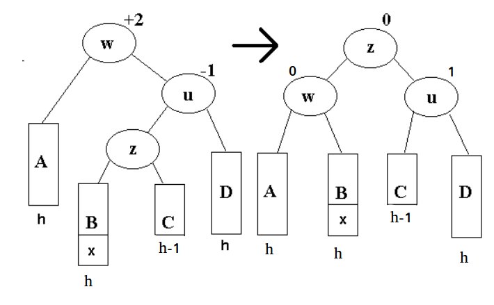

Zrównoważone drzewa wyszukiwań binarnych na przykładzie drzew AVL lub drzew czerwono-czarnych.

---

# Zrównoważone BST
BST to drzewo binarne, w którym lewe poddrzewo zawiera elementy $\leq$, a prawe poddrzewo $\geq$. Koszt wykonania podstawowych operacji jest proporcjonalny do wyskości $h$.

Dla $n$ kluczy, minimalną wysokością jest $\Theta(\log n)$ - gdy jest zrównoważone. Bardzo łatwo zrobić brzydkie drzewo, np. wstawiając elementy w kolejności posortowanej (będzie wysokość liniowa).

Drzewo zrównoważone zapewnia, że niezależnie od wstawianych elementów wysokość drzewa będzie zawsze rzędu $\Theta(\log n)$. Przykładową realizacją drzew zrównoważonych są drzewa AVL.

# Drzewo AVL
Jest to drzewo BST, w którym dla każdego wierzchołka wysokości jego poddrzew różnią się co najwyżej o $1$.

## Reprezentacja
Wskaźnikowo, jak w BST. Dodatkowo przechowujemy `balance`. $0$ gdy są równe, $+1$ gdy prawe poddrzewo dłuższe o $1$, $-1$ gdy lewe poddrzewo jest dłuższe.

## Wysokość
Dla AVL o $n$ wierzchołkach wysokość nie przekracza $1.45 \log n = \Theta(\log n)$.

### Dowód
Niech $N(h)$ będzie najmniejszą możliwą liczbą **liści zewnętrznych** (zerowych wskaźników) w drzewie AVL o wysokości $h$. Zachodzi:

$$N(h) = N(h-1) + N(h-2)$$

Chcąc stworzyć minimalne drzewo o wysokości $h$ bierzemy korzeń i dodajemu mu jako dziecko minimalne drzewo o wysokości $h-1$. Ale żeby AVL działał musi coś być w lewym - najmniej możemy dać drzewo wysokości $h-1$. Liście zewnętrzne się sumują.

* $N(0) = 2$
* $N(1) = 3$
* $N(2) = 5$
* ...

Czyli mamy liczby Fibonacciego, tylko lekko przesunięte. Korzystając ze złotego podziału $\Phi = \frac{1 + \sqrt 5}{2}$ wyjdzie nam górne ograniczenia na wysokość $1.45 \log n$.

## Operacje

### Search(x)
Jak w BST.

### Insert(x)
1. Wstawiamy jak w BST (będzie liściem).
2. Idziemy od $x$ do korzenia aktualizując współczynniki. Dodajemy albo odejmujemy $1$ w zależności od tego, w którą stronę skręcaliśmy.
3. Jeśli nowy współczynnik zrównoważenia to $0$, możemy zakończyć. Jeśli natomiast wyjdzie $2$ lub $-2$ to robimy rotację.

### Delete(x)
1. Upewniamy się, że $x$ jest liściem (i usuwamy). Jeśli nie jest, to musi zostać zastąpiony elementem $w$ największym lewego poddrzewa lub najmniejszym prawego (oczywiście tam trzeba przepiąć ewentualne dziecko $w$ do jego ojca $p$).
2. Przechodzimy drogę do korzenia (od $x$ jeśli był liściem lub od ojca $p$ znalezionego $w$) i aktualizujemy współczynniki.
3. Jeśli gdzieś wyjdzie $2$ lub $-2$ to rotacje.

Złożoność wszystkich operacji wynosi $O (\log n)$.

## Rotacje
### Pojedyncza w lewo

### Pojedyncza w prawo
Symetrycznie.

### Podwójna

