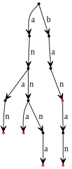
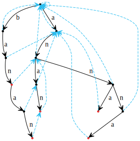

Wyszukiwanie wzorca metodą prefikso-sufiksów (KMP), uogólnienie na wiele wzorców

---

# Knuth-Morris-Pratt
<iframe width="560" height="315" src="https://www.youtube.com/embed/2ogqPWJSftE" frameborder="0" allowfullscreen></iframe>

## Uogólnienie na wiele wzorców
Aho-Corasic. *KMP* jest szczególnym przypadkiem *AC*. *AC* na jednym wzorcu będzie działał dokładnie tak samo, jak *KMP*.

### Wzorce jako drzewo
Pierwszym krokiem w algorytmie *AC* jest zbudowanie ze wzorców drzewa *trie*. Poniżej znajduje się drzewo *trie* dla słów: "anna", "banan", "ban", "anan" i "annna".

W takiej reprezentacji, jeśli jakieś dwa słowa mają wspólny prefiks, to mają wspólną ścieżkę w drzewie od korzenia, więc możemy bardzo łatwo zidentyfikować zbiór wszystkich słów, które mają dany prefiks, poprzez odpowiedni wierzchołek w drzewie.

### Funkcja fail
Zastanówmy się, co tak naprawdę daje nam tablica *KMP*. Daje nam ona informację o tym, jakie jest następne miejsce we wzorcu, do którego powinniśmy spróbować dopasować kolejną literę tekstu, jeśli nie udało się przedłużyć aktualnie najdłuższego pasującego prefiksu do dłuższego. Nazwijmy funkcję która ma taką charakterystykę funkcją *fail*. Tak więc tablica *KMP* jest funkcją *fail* dla jednego wzorca.

Okazuje się, że możemy wyznaczyć funkcję *fail*, również w przypadku, gdy operujemy na wielu wzorcach - dla każdego wierzchołka drzewa. Funkcja *fail* dla wierzchołka, wskazuje na inny wierzchołek, który jest najlepszym miejscem, by spróbować przypasować kolejną literę, jeśli nie udało się dołożyć litery do aktualnego miejsca. Przez najlepsze miejsce będziemy rozumieć, analogicznie jak w *KMP*, najdłuższy prefiks w drzewie *trie*, który pasuje do tekstu na rozważanej pozycji.

Poniżej znajduje się drzewo *trie* wraz z obliczoną funkcją fail.

### Algorytm wyszukiwania wielu wzorców
Załóżmy, że mamy już zbudowane drzewo *trie* (możemy je zbudować w czasie liniowym od sumy długości wzorców, po prostu wrzucając kolejne słowa do drzewa *trie*) i wyznaczoną funkcję fail. Szukanie wzorców w tekście, sprowadza się do chodzenia po drzewie *trie* i skakanie funkcją *fail*, jeśli nie możemy iść dalej w głąb.

Warto zauważyć, że chodzenie po drzewie *trie* jest tak naprawdę chodzeniem po automacie skończonym. Dla danej litery z danego wierzchołka, zawsze przejdziemy do innego konkretnego wierzchołka.

### Wyznaczanie funkcji fail
Funkcję *fail* buduje się schodząc *BFS*-em w dół drzewa trie. Istotnym spostrzeżeniem jest to, że funkcja *fail* zawsze wskazuje na wierzchołki, które są wyżej.

Tak samo jak w przypadku *KMP*, szukanie wzorca i budowanie funkcji *fail* są do siebie operacjami w pewien sposób podobnymi.

Jeśli mamy stworzone drzewo *trie* dla wzorców i dodamy do niego $\#T$, następnie obliczymy na całości funkcję *fail*, to funkcja *fail* na odnodze $\#T$ będzie wskazywała na dokładnie te wierzchołki drzewa *trie* które były by odwiedzone przez procedurę *AC_algorithm*.

### Szkic analizy algorytmu *Aho-Corasic*
Wyszukiwanie wzorca (pomijając wypisywanie), mając już zbudowane drzewo trie, jest w oczywisty sposób liniowe. Schodzenie funkcją fail do odpowiedniego wierzchołka amortyzyje się podobnie jak schodzenie prefikso-sufiksami w *KMP*. Budowanie funkcji *fail*, też jest liniowe i wynika to z praktycznie tego samego faktu.
